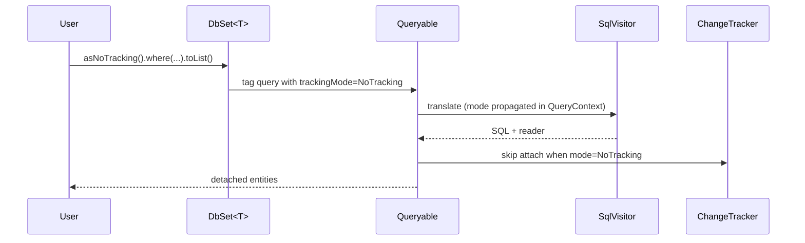

# AsNoTracking, AsTracking & QueryTrackingBehavior

## 1. Why (problem statement)

EF Core defaults to tracking every entity returned by a query so that `SaveChanges()` can detect mutations. For read-only scenarios (reports, list views, projection-heavy APIs) tracking is wasted CPU and memory: the change tracker has to snapshot every property and identity-resolve every key. `ts-linq` today eagerly attaches everything materialized through `DbSet<T>` to the `ChangeTracker` in `@ts-linq/orm`, with no opt-out and no per-query override. EF developers will reflexively type `.AsNoTracking()` and expect 30-60% faster reads; without it `ts-linq` looks slow on benchmarks it should win.

## 2. EF Core reference syntax (must be preserved verbatim)

```csharp
var users = ctx.Users.AsNoTracking().Where(u => u.IsActive).ToList();

var withIdentity = ctx.Users
  .AsNoTrackingWithIdentityResolution()
  .Include(u => u.Orders)
  .ToList();

ctx.ChangeTracker.QueryTrackingBehavior = QueryTrackingBehavior.NoTracking;

var tracked = ctx.Users.AsTracking().First(u => u.Id == 1);
```

TypeScript shape that `ts-linq` must mirror:

```ts
export enum QueryTrackingBehavior {
  TrackAll = 'TrackAll',
  NoTracking = 'NoTracking',
  NoTrackingWithIdentityResolution = 'NoTrackingWithIdentityResolution',
}

export interface IQueryable<T> {
  asNoTracking(): IQueryable<T>;
  asTracking(): IQueryable<T>;
  asNoTrackingWithIdentityResolution(): IQueryable<T>;
}

export class ChangeTracker {
  queryTrackingBehavior: QueryTrackingBehavior;
}
```

> Hard rule: the public TypeScript names, chaining order, and semantics MUST match EF Core.

## 3. Architecture Decision Record (ADR)



- **Decision**: Carry `trackingMode` on a `QueryContext` that travels with the `Queryable` chain; the materializer reads it instead of mutating shared state.
- **Context**: `Queryable` in `@ts-linq/query` is already immutable per operator. Adding one field is cheap and stays threadsafe.
- **Consequences**:
  - (+) Per-query override matches EF semantics.
  - (+) Identity resolution path opens reuse pool without attach.
  - (−) Materializer needs a branch for the three modes.

## 4. Technical & architectural description

- **Affected packages**: `@ts-linq/query`, `@ts-linq/orm`, `@ts-linq/core`
- **New types / files**:
  - `packages/core/src/QueryTrackingBehavior.ts`
  - `packages/query/src/QueryContext.ts` — already partially present; extend with `trackingMode`.
  - `packages/orm/src/IdentityMap.ts` — light-weight scratch map for identity resolution.
- **Touch-points**:
  - `packages/query/src/Queryable.ts` — add `asNoTracking()`, `asTracking()`, `asNoTrackingWithIdentityResolution()` returning cloned queryable with updated context.
  - `packages/orm/src/DbSet.ts` — inherit default from `DbContext.ChangeTracker.queryTrackingBehavior`.
  - `packages/orm/src/ChangeTracker.ts` — expose `queryTrackingBehavior` field; materialization helper consults it.
  - Materialization site (currently inside `EntityLoader`) — branch on mode: attach / skip / scratch-identity-map.
- **Data flow**: tracking mode is resolved at terminal operator (`toList`, `first`, etc.). NoTracking skips the change-tracker snapshot; NoTrackingWithIdentityResolution allocates a per-query map keyed by primary key to deduplicate graph nodes.

## 5. Implementation options

### Option A — Per-query QueryContext field (recommended)
- Pros: immutable, composable, matches EF semantics exactly, threadsafe.
- Cons: small touch in every terminal operator.
- Effort: M

### Option B — Mutable flag on DbContext, reset between calls
- Pros: tiny code change.
- Cons: breaks composition (`var q = ctx.Users.AsNoTracking(); ctx.Users.Where(...)` would be unsafe), violates EF semantics.
- Effort: S

### Option C — Wrap queryable in a NoTrackingDecorator class
- Pros: clear types.
- Cons: doubles the queryable surface; clashes with operator return types.
- Effort: L

### Recommendation
Option A. EF Core itself threads tracking through `QueryCompilationContext`; we mirror that pattern.

## 6. Related problems / follow-up tasks

- [P0-01](./P0-01-fluent-api-modelbuilder.md) — `OnModelCreating` won't change tracking semantics but `ModelBuilder` may eventually expose a default per entity type.
- [P0-12](./P0-12-interceptors.md) — `IMaterializationInterceptor` runs regardless of tracking mode; coordination required.

## 7. Acceptance criteria

- [ ] Public API mirrors EF Core signature.
- [ ] Unit tests cover: tracked vs untracked materialization, identity resolution dedup, override of context default.
- [ ] Integration test against postgres confirms no rows are attached when `asNoTracking()`.
- [ ] Benchmark shows ≥ 30% faster read for 10k rows with `asNoTracking()`.
- [ ] Docs in `apps/docs/` updated.
- [ ] No regressions in `pnpm typecheck`, `pnpm arch:deps`, `pnpm arch:cycles`, `pnpm arch:dead`.

## 8. Pre-PR sweep (mandatory)

Before opening the PR for this task:

1. Re-read every `dev-plans/*.md` whose `status != done`.
2. For each, decide whether assumptions changed because of this task. If yes — update the affected sections (especially **Implementation options**, **depends_on**, **ts_linq_packages_touched**).
3. Record sweep results in the PR description under `## Cross-task sweep` with the bullet list:
   - `P?-??` — no change / updated section X / status moved to `blocked` because Y
4. Only after the sweep is recorded, open the PR.
