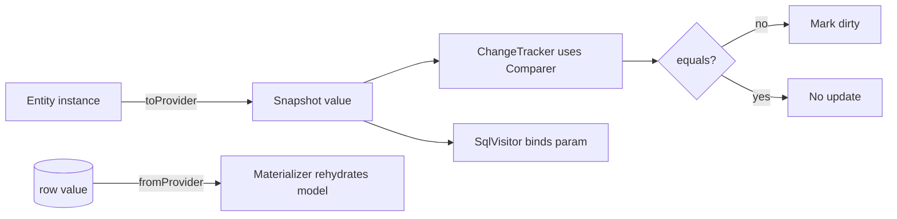

# Value Converters and Comparers

## 1. Why (problem statement)

Real schemas store enums as strings, money as decimals, dates as ISO text, booleans as `0/1`, and complex objects as JSON. EF Core users handle this with `HasConversion(...)`: a pair of pure functions `(model→provider, provider→model)`, optionally backed by a `ValueComparer` to detect mutations on reference types. `ts-linq` today maps types 1:1 via decorators with no conversion hook. Without converters every greenfield team writing `enum Role { Admin = "ADMIN" }` either hand-rolls columns or gives up. This task introduces the converter+comparer registry that the Fluent API (P0-01) hangs off, and that owned-types (P0-06), computed defaults (P0-14) and JSON columns (P0-15) all reuse.

## 2. EF Core reference syntax (must be preserved verbatim)

```csharp
modelBuilder.Entity<User>()
  .Property(u => u.Role)
  .HasConversion<string>();

modelBuilder.Entity<Order>()
  .Property(o => o.Total)
  .HasConversion(
    v => v.Amount,
    v => new Money(v));

modelBuilder.Entity<Settings>()
  .Property(s => s.Tags)
  .HasConversion(
    v => JsonSerializer.Serialize(v, null),
    v => JsonSerializer.Deserialize<string[]>(v, null),
    new ValueComparer<string[]>(
      (a, b) => a.SequenceEqual(b),
      a => a.Aggregate(0, (h, s) => HashCode.Combine(h, s.GetHashCode())),
      a => a.ToArray()));

modelBuilder.Properties<DateOnly>().HaveConversion<DateTime>();
```

TypeScript shape that `ts-linq` must mirror:

```ts
export class ValueConverter<TModel, TProvider> {
  constructor(
    public toProvider: (v: TModel) => TProvider,
    public fromProvider: (v: TProvider) => TModel,
  );
}

export class ValueComparer<T> {
  constructor(
    public equals: (a: T, b: T) => boolean,
    public hash: (v: T) => number,
    public snapshot: (v: T) => T,
  );
}

export class PropertyBuilder<TProp> {
  hasConversion<TProvider>(): this;
  hasConversion<TProvider>(
    toProvider: (v: TProp) => TProvider,
    fromProvider: (v: TProvider) => TProp,
    comparer?: ValueComparer<TProp>,
  ): this;
}

export class ModelBuilder {
  properties<T>(typeMarker: TypeMarker<T>): PropertiesConfigBuilder<T>;
}
```

> Hard rule: public TypeScript names and chaining order MUST match EF Core.

## 3. Architecture Decision Record (ADR)



- **Decision**: Converters live on `PropertyMetadata`. Two hot paths consume them: (1) materializer (`fromProvider`), (2) parameter binder (`toProvider`). The change-tracker consults the `ValueComparer` for mutation detection.
- **Context**: `@ts-linq/metadata` already keys properties by name; adding a `converter` slot is non-breaking.
- **Consequences**:
  - (+) Enables JSON, owned types, decimal-as-string, enum-as-string.
  - (+) Comparers fix a real change-tracking bug for reference-typed properties.
  - (−) Predicate translation must apply `toProvider` to literal values inside `where(e => e.role === Role.Admin)`. Visitor needs a lifting pass.

## 4. Technical & architectural description

- **Affected packages**: `@ts-linq/orm`, `@ts-linq/metadata`, `@ts-linq/query`, `@ts-linq/sql-visitor`
- **New types / files**:
  - `packages/metadata/src/ValueConverter.ts`
  - `packages/metadata/src/ValueComparer.ts`
  - `packages/metadata/src/builtins/EnumToStringConverter.ts`
  - `packages/metadata/src/builtins/BoolToZeroOneConverter.ts`
  - `packages/metadata/src/builtins/DateOnlyToStringConverter.ts`
  - `packages/orm/src/builders/PropertiesConfigBuilder.ts`
- **Touch-points**:
  - `packages/metadata/src/PropertyMetadata.ts` — add `converter?` and `comparer?`.
  - `packages/orm/src/builders/PropertyBuilder.ts` — add `hasConversion` overloads.
  - `packages/orm/src/ChangeTracker.ts` — call `comparer.equals/snapshot` instead of `===` when present.
  - `packages/sql-visitor/src/ParameterBinder.ts` — call `converter.toProvider` before binding.
  - `packages/sql-visitor/src/visitors/PredicateVisitor.ts` — lift converter onto constants compared with a converted property.
  - Materialization site — call `converter.fromProvider` per converted column.
- **Data flow**: registry → metadata snapshot → consumed at three hot paths (materialize / bind / compare). Comparers are invoked by the change tracker only.

## 5. Implementation options

### Option A — Converter slot on PropertyMetadata + per-call lift in visitor (recommended)
- Pros: clean, predictable, mirrors EF.
- Cons: predicate visitor must learn about converter lifting.
- Effort: L

### Option B — Wrap entity properties in proxies that convert on read/write
- Pros: transparent at runtime.
- Cons: terrible perf, breaks `JSON.stringify`, makes debugging painful.
- Effort: M

### Option C — Compile-time codegen converters via the existing `@ts-linq/transformer`
- Pros: zero runtime cost.
- Cons: only works for `whereCompiled`-style queries; non-compiled queries still need a runtime path.
- Effort: XL

### Recommendation
Option A as primary; optionally layer Option C later for `whereCompiled` fast paths.

## 6. Related problems / follow-up tasks

- [P0-01](./P0-01-fluent-api-modelbuilder.md) — `PropertyBuilder.hasConversion` is part of the Fluent surface.
- [P0-06](./P0-06-owned-entity-types.md) — owned types may reuse converter pipeline for table-splitting.
- [P0-14](./P0-14-computed-default-check.md) — default values must round-trip through converters.
- [P0-15](./P0-15-json-columns.md) — JSON storage is fundamentally a converter.

## 7. Acceptance criteria

- [ ] Public API mirrors EF Core signature including `Properties<T>().HaveConversion<U>()`.
- [ ] Built-ins shipped: `EnumToString`, `EnumToNumber`, `BoolToZeroOne`, `DateOnlyToString`.
- [ ] Predicate lift: `where(u => u.role === Role.Admin)` emits the converted string literal.
- [ ] Comparer drives dirty-tracking for array/object props (test with mutating an array in place).
- [ ] Integration test on postgres for enum-as-text round trip.
- [ ] No regressions in `pnpm typecheck`, `pnpm arch:deps`, `pnpm arch:cycles`, `pnpm arch:dead`.

## 8. Pre-PR sweep (mandatory)

Before opening the PR for this task:

1. Re-read every `dev-plans/*.md` whose `status != done`.
2. For each, decide whether assumptions changed because of this task. If yes — update the affected sections (especially **Implementation options**, **depends_on**, **ts_linq_packages_touched**).
3. Record sweep results in the PR description under `## Cross-task sweep` with the bullet list:
   - `P?-??` — no change / updated section X / status moved to `blocked` because Y
4. Only after the sweep is recorded, open the PR.
