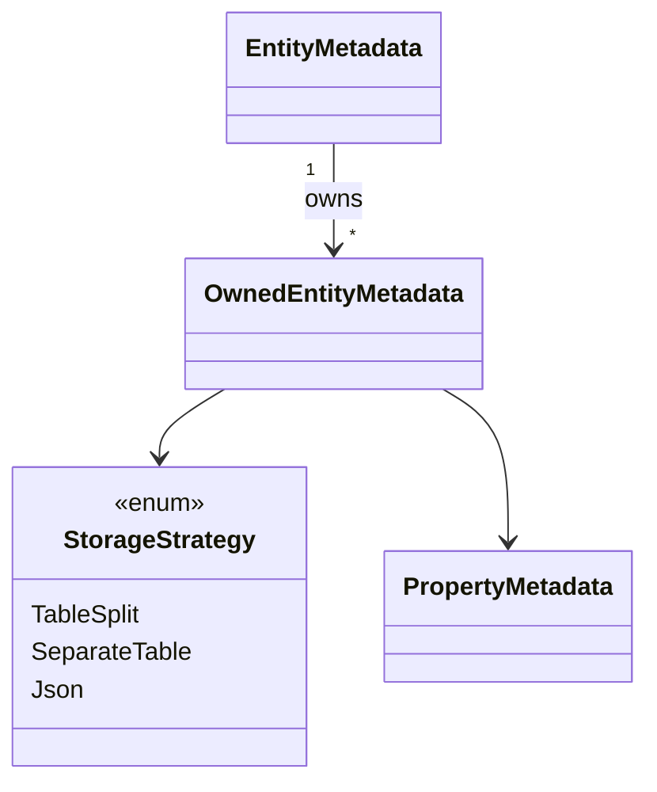

# Owned Entity Types

## 1. Why (problem statement)

Value-object modelling — `Address`, `Money`, `Audit` — is core DDD practice. EF Core supports it through "owned entity types" with two storage strategies: table-splitting (columns are inlined onto the owner's table, prefixed) and JSON (the owned graph is serialised into a single column). `ts-linq` today has only top-level entities; there is no notion of a non-aggregate, ownership-coupled child. Without it, users have to lift every value object into a separate table with a synthetic FK, polluting their domain. Landing this also gives us the test-bed for the JSON columns task (P0-15).

## 2. EF Core reference syntax (must be preserved verbatim)

```csharp
modelBuilder.Entity<Order>().OwnsOne(
  o => o.ShippingAddress,
  a => {
    a.Property(p => p.Street).HasMaxLength(200);
    a.Property(p => p.City).HasMaxLength(100);
    a.ToTable("orders");      // table splitting
  });

modelBuilder.Entity<User>().OwnsOne(
  u => u.Preferences,
  b => b.ToJson());           // JSON storage

modelBuilder.Entity<Invoice>().OwnsMany(
  i => i.LineItems,
  li => {
    li.WithOwner(x => x.Invoice).HasForeignKey("InvoiceId");
    li.HasKey("InvoiceId", "Idx");
  });
```

TypeScript shape that `ts-linq` must mirror:

```ts
export class EntityTypeBuilder<T> {
  ownsOne<TOwned>(
    selector: (e: T) => TOwned | undefined,
    configure?: (b: OwnedNavigationBuilder<T, TOwned>) => void,
  ): OwnedNavigationBuilder<T, TOwned>;

  ownsMany<TOwned>(
    selector: (e: T) => TOwned[],
    configure?: (b: OwnedNavigationBuilder<T, TOwned>) => void,
  ): OwnedNavigationBuilder<T, TOwned>;
}

export class OwnedNavigationBuilder<TOwner, TOwned> {
  property<K extends keyof TOwned>(s: (e: TOwned) => TOwned[K]): PropertyBuilder<TOwned[K]>;
  withOwner(selector?: (e: TOwned) => TOwner): this;
  hasForeignKey(...props: string[]): this;
  hasKey(...props: string[]): this;
  toTable(name: string): this;
  toJson(columnName?: string): this;
}
```

> Hard rule: public TypeScript names and chaining order MUST match EF Core.

## 3. Architecture Decision Record (ADR)



- **Decision**: Model owned types as a special `OwnedEntityMetadata` that references the owner and carries a `StorageStrategy`. Materialization and DDL branch on strategy.
- **Context**: We already have `EntityMetadata`; owned types are entities with constrained semantics (no DbSet, no standalone identity).
- **Consequences**:
  - (+) Reuses the existing column/DDL machinery for table-splitting (just prefix columns).
  - (+) JSON path piggybacks on value converters (P0-05) and feeds P0-15.
  - (−) `Include`-style traversal must understand owned navigations are always eager.

## 4. Technical & architectural description

- **Affected packages**: `@ts-linq/orm`, `@ts-linq/metadata`, `@ts-linq/sql-visitor`, `@ts-linq/migrations`
- **New types / files**:
  - `packages/metadata/src/OwnedEntityMetadata.ts`
  - `packages/metadata/src/StorageStrategy.ts`
  - `packages/orm/src/builders/OwnedNavigationBuilder.ts`
- **Touch-points**:
  - `packages/orm/src/builders/EntityTypeBuilder.ts` — `ownsOne`, `ownsMany`.
  - `packages/sql-visitor/src/visitors/SelectVisitor.ts` — flatten owned columns in projection / handle JSON path.
  - `packages/migrations/src/SchemaComparator.ts` — emit owner-column DDL for split, single JSON column for `ToJson`.
  - Materialization — rebuild owned graph from flat columns or parsed JSON.
- **Data flow**: at metadata-finalize time, `OwnedEntityMetadata` is collapsed into the owner's column list (for split) or registered as a JSON column owning a sub-schema. Queries always emit owned columns automatically (no explicit `Include` needed).

## 5. Implementation options

### Option A — Three storage strategies on one metadata node (recommended)
- Pros: matches EF; minimal new code paths in queries.
- Cons: visitor needs a JSON branch.
- Effort: L

### Option B — Treat owned types as syntactic sugar over normal entities + auto-include
- Pros: small implementation.
- Cons: forces a separate table; loses table-splitting and JSON entirely.
- Effort: S

### Option C — Implement only table-splitting now, defer JSON to P0-15
- Pros: tight scope.
- Cons: pushes API churn to P0-15.
- Effort: M

### Recommendation
Option A. JSON storage is the only "owned" mode some users will ever use; landing it together prevents reshaping the API twice.

## 6. Related problems / follow-up tasks

- [P0-01](./P0-01-fluent-api-modelbuilder.md) — builder hosts `ownsOne/ownsMany`.
- [P0-05](./P0-05-value-converters.md) — JSON owned types are implemented atop converters.
- [P0-15](./P0-15-json-columns.md) — extends `ToJson` to LINQ querying into JSON paths.

## 7. Acceptance criteria

- [ ] Public API mirrors EF Core signature.
- [ ] Table-splitting emits prefixed columns on the owner's table (DDL test).
- [ ] `ToJson()` stores the graph in a single JSON column.
- [ ] Materialization rebuilds nested instance correctly for both strategies.
- [ ] `ownsMany` correctly persists collections (separate table with composite key).
- [ ] No regressions in `pnpm typecheck`, `pnpm arch:deps`, `pnpm arch:cycles`, `pnpm arch:dead`.

## 8. Pre-PR sweep (mandatory)

Before opening the PR for this task:

1. Re-read every `dev-plans/*.md` whose `status != done`.
2. For each, decide whether assumptions changed because of this task. If yes — update the affected sections (especially **Implementation options**, **depends_on**, **ts_linq_packages_touched**).
3. Record sweep results in the PR description under `## Cross-task sweep` with the bullet list:
   - `P?-??` — no change / updated section X / status moved to `blocked` because Y
4. Only after the sweep is recorded, open the PR.
