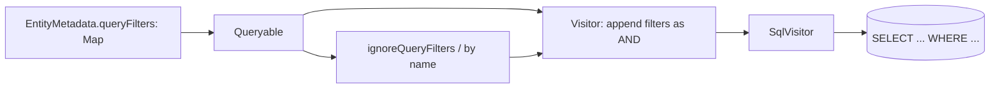

# Global Query Filters

## 1. Why (problem statement)

Soft-delete (`!IsDeleted`) and multi-tenant scoping (`TenantId == currentTenant`) are predicates that must be present on *every* query against an entity, on pain of bug or breach. EF Core formalises this as `HasQueryFilter`: a predicate added to the model and auto-appended to every SELECT, with explicit opt-out via `IgnoreQueryFilters()`. EF9 also added *named* filters so multiple independent scopes can be composed and disabled individually. `ts-linq` solves a subset today via the soft-delete plugin, but it's bolt-on, not part of the model, and not multi-tenant-aware. Adding model-level filters lets us delete the special plugin and unifies a recurring requirement.

## 2. EF Core reference syntax (must be preserved verbatim)

```csharp
modelBuilder.Entity<Post>()
  .HasQueryFilter(p => !p.IsDeleted);

// EF9 named filters
modelBuilder.Entity<Post>()
  .HasQueryFilter("softDelete", p => !p.IsDeleted)
  .HasQueryFilter("tenant",     p => p.TenantId == _currentTenant);

var all = ctx.Posts.IgnoreQueryFilters().ToList();
var tenantOnly = ctx.Posts.IgnoreQueryFilters("softDelete").ToList();
```

TypeScript shape that `ts-linq` must mirror:

```ts
export class EntityTypeBuilder<T> {
  hasQueryFilter(predicate: (e: T) => boolean): this;
  hasQueryFilter(name: string, predicate: (e: T) => boolean): this;
}

export interface IQueryable<T> {
  ignoreQueryFilters(): IQueryable<T>;
  ignoreQueryFilters(...names: string[]): IQueryable<T>;
}
```

> Hard rule: public TypeScript names and chaining order MUST match EF Core.

## 3. Architecture Decision Record (ADR)



- **Decision**: Filters are stored per entity in a named map. At query-build time the planner appends every filter not in the ignore-set as a top-level conjunction. Predicates capture closure state (e.g. `currentTenantId`) via a `QueryFilterContext` resolved from `DbContext`.
- **Context**: The AST and visitor already compose predicates; adding implicit predicates is mechanical.
- **Consequences**:
  - (+) Replaces the soft-delete plugin with a first-class feature.
  - (+) Multi-tenant becomes one line.
  - (−) Filter closures must use a context object — we forbid capturing arbitrary outer scope.

## 4. Technical & architectural description

- **Affected packages**: `@ts-linq/metadata`, `@ts-linq/orm`, `@ts-linq/query`, `@ts-linq/sql-visitor`
- **New types / files**:
  - `packages/metadata/src/QueryFilterMetadata.ts`
  - `packages/orm/src/QueryFilterContext.ts`
- **Touch-points**:
  - `packages/orm/src/builders/EntityTypeBuilder.ts` — `hasQueryFilter` overloads.
  - `packages/query/src/Queryable.ts` — `ignoreQueryFilters(...names?)`.
  - `packages/query/src/planner.ts` — when materialising a queryable for a known entity, look up filters and inject them as wrapping `Where` nodes.
  - `packages/sql-visitor/src/visitors/PredicateVisitor.ts` — already handles AND; filters compose transparently.
- **Data flow**: Filter lambdas are stored as deferred AST. At terminal-operator time, planner reads the entity's filter map, removes any in the ignore-set, and conjoins them with user predicates. Context-bound parameters resolve via the active `DbContext`.

## 5. Implementation options

### Option A — Named filter map with per-query ignore-set (recommended)
- Pros: EF9 parity, replaces soft-delete plugin, multi-tenant fits naturally.
- Cons: planner must run filter-injection on every queryable creation.
- Effort: M

### Option B — Single anonymous filter (pre-EF9 behavior)
- Pros: smaller surface.
- Cons: can't compose soft-delete with tenant scoping cleanly.
- Effort: S

### Option C — Apply filters at materialisation (client-side)
- Pros: no SQL changes.
- Cons: scans whole table; wrong choice.
- Effort: S

### Recommendation
Option A. Going straight to EF9 semantics avoids a future breaking API change.

## 6. Related problems / follow-up tasks

- [P0-01](./P0-01-fluent-api-modelbuilder.md) — builder host.
- [P0-07](./P0-07-inheritance-tph-tpt-tpc.md) — filters must compose with discriminator predicates; ensure single WHERE conjunction.
- [P0-12](./P0-12-interceptors.md) — interceptors observe filtered queries.

## 7. Acceptance criteria

- [ ] Public API mirrors EF Core signature, including named-filter overload (EF9).
- [ ] Filter is appended to every query targeting the entity, including via `include`.
- [ ] `ignoreQueryFilters()` (all) and `ignoreQueryFilters("name")` (single) work.
- [ ] Soft-delete plugin can be reimplemented on top of this API.
- [ ] Integration test verifies row visibility under tenant scoping.
- [ ] No regressions in `pnpm typecheck`, `pnpm arch:deps`, `pnpm arch:cycles`, `pnpm arch:dead`.

## 8. Pre-PR sweep (mandatory)

Before opening the PR for this task:

1. Re-read every `dev-plans/*.md` whose `status != done`.
2. For each, decide whether assumptions changed because of this task. If yes — update the affected sections (especially **Implementation options**, **depends_on**, **ts_linq_packages_touched**).
3. Record sweep results in the PR description under `## Cross-task sweep` with the bullet list:
   - `P?-??` — no change / updated section X / status moved to `blocked` because Y
4. Only after the sweep is recorded, open the PR.
