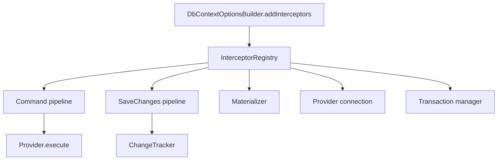

# EF-Style Interceptors

## 1. Why (problem statement)

EF Core's interceptor surface is the canonical extension point: command-level interception (log, mutate, short-circuit), connection lifecycle, transaction lifecycle, SaveChanges pipeline hooks, and materialization (post-rehydration). `ts-linq` today has bespoke `AuditInterceptor` and `SoftDeleteInterceptor` classes in `@ts-linq/orm` that are direct, hard-coded calls; there is no documented protocol for users to register custom interceptors. This task formalises the protocol, ships the five EF interfaces, refactors the existing two interceptors onto `ISaveChangesInterceptor`, and exposes registration through `DbContextOptionsBuilder`.

## 2. EF Core reference syntax (must be preserved verbatim)

```csharp
public class LoggingCommandInterceptor : DbCommandInterceptor {
  public override InterceptionResult<DbDataReader> ReaderExecuting(
      DbCommand command, CommandEventData eventData,
      InterceptionResult<DbDataReader> result) {
    _log.LogDebug(command.CommandText);
    return result;
  }
}

services.AddDbContext<AppDbContext>(opt => opt
  .UseNpgsql(cs)
  .AddInterceptors(new LoggingCommandInterceptor(), new AuditSaveChangesInterceptor()));
```

TypeScript shape that `ts-linq` must mirror:

```ts
export interface IDbCommandInterceptor {
  readerExecuting?(cmd: DbCommand, ev: CommandEventData): InterceptionResult<DbReader>;
  readerExecuted?(cmd: DbCommand, ev: CommandEventData, result: DbReader): DbReader;
  nonQueryExecuting?(cmd: DbCommand, ev: CommandEventData): InterceptionResult<number>;
  nonQueryExecuted?(cmd: DbCommand, ev: CommandEventData, result: number): number;
}

export interface ISaveChangesInterceptor {
  savingChanges?(ev: SaveChangesEventData, result: InterceptionResult<number>): InterceptionResult<number>;
  savedChanges?(ev: SaveChangesEventData, result: number): number;
  saveChangesFailed?(ev: SaveChangesEventData, err: Error): void;
}

export interface IMaterializationInterceptor {
  initializing?(ev: MaterializationInterceptionData, instance: object): object;
  initialized?(ev: MaterializationInterceptionData, instance: object): object;
}

export interface IDbConnectionInterceptor { /* opened, opening, closing, closed */ }
export interface IDbTransactionInterceptor  { /* started, committed, rolledBack, savepoint... */ }

export class DbContextOptionsBuilder {
  addInterceptors(...interceptors: object[]): this;
}
```

> Hard rule: public TypeScript names MUST match EF Core. Async variants collapse into promise-returning versions.

## 3. Architecture Decision Record (ADR)



- **Decision**: Single `InterceptorRegistry` per `DbContext`. Pipelines call into the registry at well-defined points and respect `InterceptionResult.SuppressWithResult(...)` semantics.
- **Context**: We already have call sites in the provider (execute), ChangeTracker (saveChanges), and EntityLoader (materialize). Inserting registry calls is mechanical.
- **Consequences**:
  - (+) Public extension model; existing audit / soft-delete classes become library code.
  - (+) Migration path: legacy `AuditInterceptor`/`SoftDeleteInterceptor` re-exported as `ISaveChangesInterceptor` implementations with deprecation notice.
  - (−) Each interception point is an indirection; benchmark with no registered interceptors must show ~0 overhead (registry fast-path on empty).

## 4. Technical & architectural description

- **Affected packages**: `@ts-linq/orm`, `@ts-linq/core`, `@ts-linq/provider-*`, `@ts-linq/plugins-audit`, `@ts-linq/plugins-soft-delete`
- **New types / files**:
  - `packages/core/src/interceptors/` — all five interfaces + result types.
  - `packages/orm/src/interceptors/InterceptorRegistry.ts`
- **Touch-points**:
  - `packages/orm/src/DbContext.ts` — accept `DbContextOptions`; pass registry to provider and tracker.
  - `packages/provider-postgres|mysql|mssql/src/*.ts` — call command + connection + transaction interceptors at execute boundaries.
  - `packages/orm/src/ChangeTracker.ts` — invoke `savingChanges` / `savedChanges` / `saveChangesFailed`.
  - `packages/orm/src/services/AuditInterceptor.ts` — refactor to implement `ISaveChangesInterceptor`.
  - `packages/orm/src/services/SoftDeleteInterceptor.ts` — same.
  - Materializer (`EntityLoader`) — call `initializing` / `initialized`.
- **Data flow**: registry exposes `forEach(type, fn)` helpers; pipelines iterate; short-circuits stop further calls. Empty-registry path skips iteration via a boolean cached at construction.

## 5. Implementation options

### Option A — Registry + five interfaces matching EF (recommended)
- Pros: parity, replaces ad-hoc plugins with composable contract.
- Cons: refactor of existing audit/soft-delete files.
- Effort: L

### Option B — Generic event-bus (subscribe to "command.executing" etc.)
- Pros: less type surface.
- Cons: loses static typing of EF interfaces; doesn't match docs developers know.
- Effort: M

### Option C — Per-pipeline single hook (only SaveChanges and Command)
- Pros: smaller.
- Cons: leaves materialization gap that audit-on-load scenarios need.
- Effort: M

### Recommendation
Option A. Aligns with developer mental models from EF Core docs.

## 6. Related problems / follow-up tasks

- [P0-02](./P0-02-as-no-tracking.md) — `IMaterializationInterceptor` must run regardless of tracking mode.
- [P0-03](./P0-03-from-sql-interpolated.md) — `FromSql` commands flow through `IDbCommandInterceptor`.
- [P0-04](./P0-04-execute-update-delete.md) — bulk DML commands must also be intercepted.
- [P0-10](./P0-10-concurrency-tokens-rowversion.md) — `saveChangesFailed` is the canonical surface for retry on concurrency exceptions.

## 7. Acceptance criteria

- [ ] All five EF interfaces ship with parity method names.
- [ ] `addInterceptors(...)` registers in declared order; iteration order is stable.
- [ ] `InterceptionResult.SuppressWithResult` short-circuits as in EF.
- [ ] Existing `AuditInterceptor`/`SoftDeleteInterceptor` rewritten on `ISaveChangesInterceptor`, with the old re-export path marked deprecated.
- [ ] Benchmark: empty-registry overhead < 1% on a 10k-row read.
- [ ] No regressions in `pnpm typecheck`, `pnpm arch:deps`, `pnpm arch:cycles`, `pnpm arch:dead`.

## 8. Pre-PR sweep (mandatory)

Before opening the PR for this task:

1. Re-read every `dev-plans/*.md` whose `status != done`.
2. For each, decide whether assumptions changed because of this task. If yes — update the affected sections (especially **Implementation options**, **depends_on**, **ts_linq_packages_touched**).
3. Record sweep results in the PR description under `## Cross-task sweep` with the bullet list:
   - `P?-??` — no change / updated section X / status moved to `blocked` because Y
4. Only after the sweep is recorded, open the PR.
