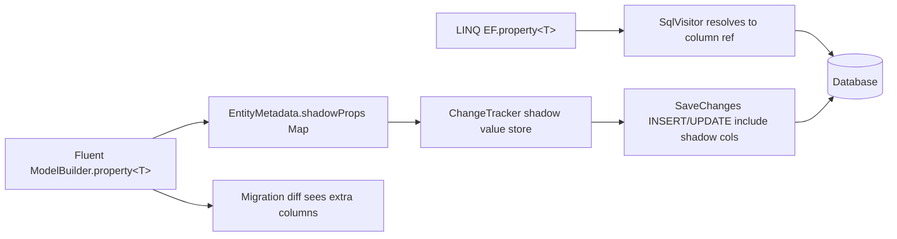

# Shadow Properties

## 1. Why (problem statement)

EF Core lets users declare properties that exist in the model and database but have no CLR field on the entity class — typically `CreatedAt`, `UpdatedAt`, `TenantId`, `RowVersion`, soft-delete flags, and FK columns generated by convention. `ts-linq` today requires every persisted property to be a real TypeScript field decorated with `@Column`, which forces audit/timestamp/tenant data to leak into the domain model and prevents the AuditInterceptor and SoftDeleteInterceptor from working cleanly on user-defined types. Closing this gap means infrastructure columns can live entirely inside the metadata layer and the ChangeTracker, while user entities stay clean.

## 2. EF Core reference syntax (must be preserved verbatim)

```csharp
modelBuilder.Entity<Post>()
    .Property<DateTime>("CreatedAt")
    .HasDefaultValueSql("CURRENT_TIMESTAMP");

modelBuilder.Entity<Post>()
    .Property<string>("TenantId")
    .IsRequired();

// Access at runtime
var entry = context.Entry(post);
var createdAt = entry.Property("CreatedAt").CurrentValue;
entry.Property("CreatedAt").CurrentValue = DateTime.UtcNow;

// LINQ access
var recent = context.Posts
    .Where(p => EF.Property<DateTime>(p, "CreatedAt") > cutoff)
    .OrderBy(p => EF.Property<DateTime>(p, "CreatedAt"));
```

TypeScript shape that `ts-linq` must mirror:

```ts
modelBuilder.entity<Post>(Post)
  .property<Date>("createdAt")
  .hasDefaultValueSql("CURRENT_TIMESTAMP");

modelBuilder.entity<Post>(Post)
  .property<string>("tenantId")
  .isRequired();

const entry = context.entry(post);
const createdAt = entry.property("createdAt").currentValue;
entry.property("createdAt").currentValue = new Date();

const recent = context.posts
  .where(p => EF.property<Date>(p, "createdAt") > cutoff)
  .orderBy(p => EF.property<Date>(p, "createdAt"));
```

> Hard rule: the public TypeScript names, chaining order, and semantics MUST match EF Core. Internal implementation is free to deviate.

## 3. Architecture Decision Record (ADR)



- **Decision**: store shadow values in a side-table on `ChangeTracker` keyed by `(entity, propertyName)`; expose `EntityEntry.property(name)` accessor; resolve `EF.property` at expression-tree time.
- **Context**: `@ts-linq/metadata` already keys columns by JS property name. Adding a parallel `shadowProperties: Map<string, ShadowPropertyMetadata>` keeps the change additive. ChangeTracker holds tracked entities in a `WeakMap` today; a parallel `WeakMap<object, Map<string, unknown>>` for shadow values mirrors that pattern.
- **Consequences**:
  - +: Audit/SoftDelete/Tenant interceptors stop polluting domain types.
  - +: FK shorthand (`hasOne(...).withMany(...)`) can synthesize FK shadow column without requiring user field.
  - −: All cross-package code that reads "the entity's columns" must consult both real and shadow registries.
  - ~: `EF.property` is a magic marker; transformer must recognize it like `EF.Functions`.

## 4. Technical & architectural description

- **Affected packages**: `@ts-linq/metadata`, `@ts-linq/orm`, `@ts-linq/query`, `@ts-linq/sql-visitor`, `@ts-linq/migrations`, `@ts-linq/transformer`.
- **New types / files**:
  - `packages/metadata/src/ShadowPropertyMetadata.ts`
  - `packages/orm/src/EntityEntry.ts` (extend `property(name)` overload)
  - `packages/query/src/EF.ts` (export `EF.property<T>(entity, name)`)
  - `packages/transformer/src/visitors/EFPropertyVisitor.ts`
- **Touch-points**:
  - `packages/metadata/src/EntityMetadata.ts` — add `shadowProperties` map.
  - `packages/orm/src/ChangeTracker.ts` — extend snapshot/current value stores to merge shadow values.
  - `packages/orm/src/services/SaveChangesPipeline.ts` — INSERT/UPDATE column lists include shadow props.
  - `packages/sql-visitor/src/visitors/MemberAccessVisitor.ts` — handle `EF.property(...)` call form.
  - `packages/migrations/src/diff/SchemaDiff.ts` — emit shadow columns in DDL diff.
- **Data flow**: model build registers shadow descriptor → ChangeTracker initializes shadow store on attach → SaveChanges merges shadow values into parameter list → LINQ uses `EF.property` to read them back.

## 5. Implementation options

### Option A — Parallel WeakMap store on ChangeTracker
- Pros: zero impact on user entity shape; works with frozen / class-based entities; matches EF Core semantics 1:1.
- Cons: must serialize/deserialize via metadata in every persist path; reflection-free implementation needed.
- Effort: M

### Option B — Symbol-keyed hidden field on entity
- Pros: simple snapshot diff; no parallel store.
- Cons: pollutes user object; breaks immutable/record-like entities; harder for proxies.

### Recommendation
Option A — preserves EF Core's "not on the CLR type" guarantee and aligns with the existing `WeakMap`-based tracker.

## 6. Related problems / follow-up tasks

- [P1-28](./P1-28-track-graph-detect-changes.md) — DetectChanges must scan shadow store.
- [P1-30](./P1-30-value-generators-sentinel.md) — value generators commonly target shadow PKs / timestamps.
- [P0-01](./P0-01-fluent-configuration-api.md) — fluent builder is the entry point for declaring shadows.
- AuditInterceptor / SoftDeleteInterceptor refactors (existing code) can drop their CLR-field requirement once this lands.

## 7. Acceptance criteria

- [ ] Public API mirrors EF Core signature (`property<T>(name)`, `EF.property<T>(...)`, `entry.property(name)`).
- [ ] Unit tests cover: shadow read/write via EntityEntry, INSERT includes shadow column, UPDATE detects shadow change, LINQ filter on shadow column produces correct SQL.
- [ ] Integration test against at least one dialect (PostgreSQL) verifying shadow columns appear in migration DDL.
- [ ] Docs in `apps/docs/` updated with shadow-property guide.
- [ ] No regressions in `pnpm typecheck`, `pnpm arch:deps`, `pnpm arch:cycles`, `pnpm arch:dead`.

## 8. Pre-PR sweep (mandatory)

Before opening the PR for this task:

1. Re-read every `dev-plans/*.md` whose `status != done`.
2. For each, decide whether assumptions changed because of this task. If yes — update the affected sections (especially **Implementation options**, **depends_on**, **ts_linq_packages_touched**).
3. Record sweep results in the PR description under `## Cross-task sweep` with the bullet list:
   - `P?-??` — no change / updated section X / status moved to `blocked` because Y
4. Only after the sweep is recorded, open the PR.
