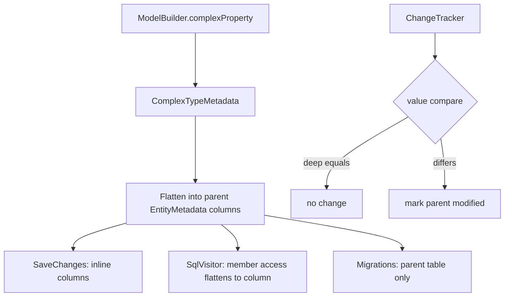

# Complex Types (EF8)

## 1. Why (problem statement)

EF Core 8 introduced `ComplexProperty` to model value-objects: structurally embedded fragments (e.g. `Address`, `Money`, `Coordinates`) with no identity, no `DbSet`, no change tracking as an entity, and reference-equality irrelevance. Owned types — which `ts-linq` is adding under P0-06 — still carry an implicit key and entity identity, which is wrong for value-objects: two distinct entities can hold equal-by-value `Address` instances without those being "the same row." `ts-linq` currently has no construct for true value semantics, so users emulate them with owned types and get spurious identity warnings and tracking churn. Complex types close this gap.

## 2. EF Core reference syntax (must be preserved verbatim)

```csharp
modelBuilder.Entity<Customer>()
    .ComplexProperty(c => c.ShippingAddress, b =>
    {
        b.Property(a => a.Street).HasMaxLength(200);
        b.Property(a => a.City).HasMaxLength(100);
        b.Property(a => a.PostalCode).IsRequired();
    });

modelBuilder.Entity<Customer>()
    .ComplexProperty(c => c.BillingAddress);
```

TypeScript shape that `ts-linq` must mirror:

```ts
modelBuilder.entity<Customer>(Customer)
  .complexProperty(c => c.shippingAddress, b => {
    b.property(a => a.street).hasMaxLength(200);
    b.property(a => a.city).hasMaxLength(100);
    b.property(a => a.postalCode).isRequired();
  });

modelBuilder.entity<Customer>(Customer)
  .complexProperty(c => c.billingAddress);
```

> Hard rule: the public TypeScript names, chaining order, and semantics MUST match EF Core. Internal implementation is free to deviate.

## 3. Architecture Decision Record (ADR)



- **Decision**: complex types are metadata-only flattening — no separate tracker entry, deep-equality value semantics, columns physically belong to parent table.
- **Context**: distinct from owned types (P0-06) which create a child entity with identity. Complex types are pure value-objects and must NOT appear in `ChangeTracker.entries()`.
- **Consequences**:
  - +: clean value-object support (Money, Address, Coordinates).
  - +: no spurious tracking for embedded fragments.
  - −: deep-equality required on snapshot (more CPU per DetectChanges call).
  - −: nesting depth must be bounded in metadata graph to prevent cycles.

## 4. Technical & architectural description

- **Affected packages**: `@ts-linq/metadata`, `@ts-linq/orm`, `@ts-linq/query`, `@ts-linq/sql-visitor`, `@ts-linq/migrations`.
- **New types / files**:
  - `packages/metadata/src/ComplexTypeMetadata.ts`
  - `packages/metadata/src/builders/ComplexTypeBuilder.ts`
  - `packages/orm/src/ChangeTracker/complexValueComparer.ts`
- **Touch-points**:
  - `packages/metadata/src/EntityMetadata.ts` — `complexProperties: Map<string, ComplexTypeMetadata>`.
  - `packages/orm/src/ChangeTracker.ts` — snapshot deep-clones complex values; diff uses structural equality.
  - `packages/sql-visitor/src/visitors/MemberAccessVisitor.ts` — `c.shippingAddress.street` lowers to flattened column `shipping_address_street`.
  - `packages/migrations/src/diff/SchemaDiff.ts` — emits flattened columns on parent.
- **Data flow**: builder records complex tree → column flattener generates `<owner>_<sub>` column names → SaveChanges reads/writes via nested object path → DetectChanges does structural diff.

## 5. Implementation options

### Option A — Pure metadata flatten (recommended)
- Pros: matches EF8 semantics exactly; zero new SQL pipeline branches; trivial JSON serialization story.
- Cons: deep-equality cost on every DetectChanges.
- Effort: L

### Option B — JSON column storage
- Pros: schema-less; no flattening logic.
- Cons: not EF Core's behavior; breaks LINQ predicates on nested fields without JSON path support; rejected.

### Recommendation
Option A — flatten to columns, treat as value-object, no identity.

## 6. Related problems / follow-up tasks

- [P0-06](./P0-06-owned-types.md) — must clearly distinguish owned vs complex in docs and metadata.
- [P1-25](./P1-25-table-entity-splitting.md) — entity splitting interacts with complex flattening.
- [P1-16](./P1-16-shadow-properties.md) — shadow props inside complex types are explicitly disallowed by EF; mirror that constraint.

## 7. Acceptance criteria

- [ ] Public API mirrors EF Core `complexProperty(selector, builder?)`.
- [ ] Unit tests cover: flat column generation, nested complex (`Address` containing `Coordinates`), value-equality change detection, null complex (when nullable), required complex throws on null.
- [ ] Integration test against at least one dialect verifying flattened column names match EF Core convention.
- [ ] Docs in `apps/docs/` clearly contrast complex vs owned types.
- [ ] No regressions in `pnpm typecheck`, `pnpm arch:deps`, `pnpm arch:cycles`, `pnpm arch:dead`.

## 8. Pre-PR sweep (mandatory)

Before opening the PR for this task:

1. Re-read every `dev-plans/*.md` whose `status != done`.
2. For each, decide whether assumptions changed because of this task. If yes — update the affected sections (especially **Implementation options**, **depends_on**, **ts_linq_packages_touched**).
3. Record sweep results in the PR description under `## Cross-task sweep` with the bullet list:
   - `P?-??` — no change / updated section X / status moved to `blocked` because Y
4. Only after the sweep is recorded, open the PR.
