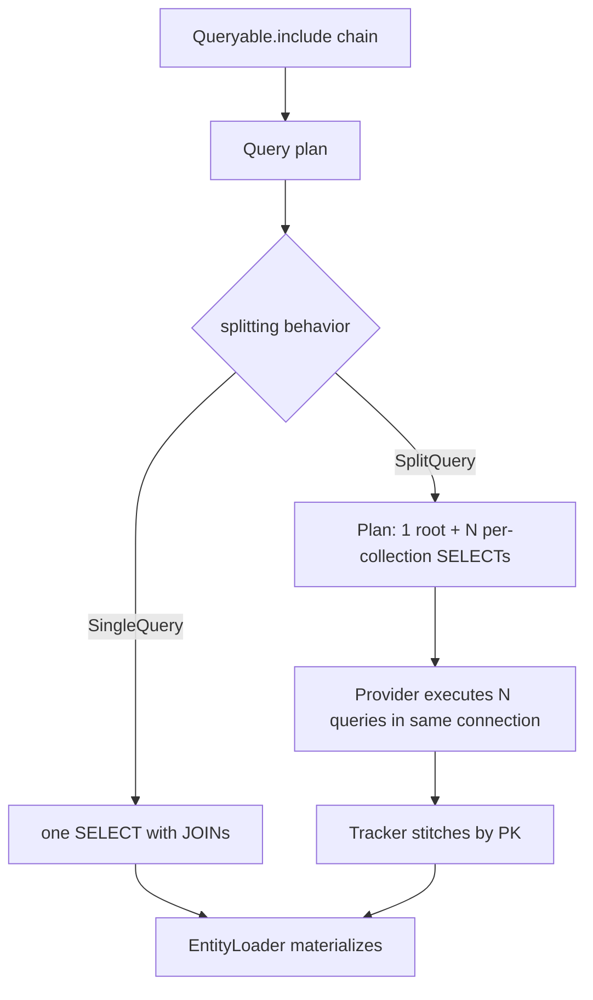

# AsSplitQuery / AsSingleQuery

## 1. Why (problem statement)

When a LINQ query with multiple collection `Include` calls is executed as a single SQL statement, the result set carries a cartesian-product of all included collections (a.k.a. "cartesian explosion"). For a blog with 100 posts and 50 tags per post, a single-query JOIN returns 5,000 rows; the EntityLoader then has to de-duplicate. EF Core mitigates this with `AsSplitQuery()`, which issues one SQL statement per collection navigation, transparently stitched together by tracker key. `ts-linq` currently always uses single-query mode (the EntityLoader does eager JOINs), so users hit unbounded result-set growth on wide includes with no escape valve.

## 2. EF Core reference syntax (must be preserved verbatim)

```csharp
var blogs = await context.Blogs
    .Include(b => b.Posts)
    .ThenInclude(p => p.Tags)
    .AsSplitQuery()
    .ToListAsync();

var single = await context.Blogs
    .Include(b => b.Posts)
    .AsSingleQuery()
    .ToListAsync();

// Global default
optionsBuilder.UseNpgsql(conn, o => o.UseQuerySplittingBehavior(QuerySplittingBehavior.SplitQuery));
```

TypeScript shape that `ts-linq` must mirror:

```ts
const blogs = await context.blogs
  .include(b => b.posts)
    .thenInclude(p => p.tags)
  .asSplitQuery()
  .toListAsync();

const single = await context.blogs
  .include(b => b.posts)
  .asSingleQuery()
  .toListAsync();

optionsBuilder.usePostgres(conn, o =>
  o.useQuerySplittingBehavior(QuerySplittingBehavior.SplitQuery));
```

> Hard rule: the public TypeScript names, chaining order, and semantics MUST match EF Core. Internal implementation is free to deviate.

## 3. Architecture Decision Record (ADR)



- **Decision**: split-query is a plan-level decision in `@ts-linq/query` that produces a list of `SqlBatchItem`s; the provider executes them sequentially on one connection and the materializer stitches by primary key.
- **Context**: current EntityLoader is JOIN-only. Splitting requires a planner phase that already exists (Include rewriter); we extend it to emit either one rooted plan or N rooted plans sharing parent IDs.
- **Consequences**:
  - +: huge perf win on wide includes (no cartesian explosion).
  - +: aligns with EF Core behavior 1:1.
  - −: split queries are not transactionally consistent unless wrapped in user-controlled transaction (must document, mirror EF warning).
  - −: introduces ordering constraints (root first, children IN(rootIds)).

## 4. Technical & architectural description

- **Affected packages**: `@ts-linq/query`, `@ts-linq/sql-visitor`, `@ts-linq/orm`, all `@ts-linq/provider-*`.
- **New types / files**:
  - `packages/query/src/options/QuerySplittingBehavior.ts`
  - `packages/query/src/planner/SplitQueryPlanner.ts`
  - `packages/query/src/Queryable.ts` — `asSplitQuery()`, `asSingleQuery()` methods.
- **Touch-points**:
  - `packages/orm/src/services/EntityLoader.ts` — accept a list of result sets keyed by parent PK.
  - `packages/orm/src/DbContextOptionsBuilder.ts` — `useQuerySplittingBehavior` global default.
  - All provider executors — accept `SqlBatchItem[]` and run sequentially.
- **Data flow**: queryable chain produces logical plan → Include rewriter detects mode → planner emits 1..N rooted plans → provider executes → loader stitches.

## 5. Implementation options

### Option A — Sequential N+1 root queries (recommended)
- Pros: matches EF Core; simple; same connection.
- Cons: not parallelizable safely on a single connection.
- Effort: L

### Option B — Parallel queries on pooled connections
- Pros: lower latency.
- Cons: diverges from EF; transactional semantics unclear; rejected initially.

### Recommendation
Option A — sequential, one connection. Parallelism can be revisited as a follow-up.

## 6. Related problems / follow-up tasks

- [P1-19](./P1-19-filtered-include.md) — filtered include must be supported in both modes.
- Telemetry: each split sub-query should emit a span tagged with parent operation id.

## 7. Acceptance criteria

- [ ] Public API mirrors EF Core: `asSplitQuery()`, `asSingleQuery()`, `useQuerySplittingBehavior(...)`.
- [ ] Unit tests cover: 2-level include in split mode, mixed reference+collection include, override of global default with per-query call.
- [ ] Integration test against at least one dialect verifying row counts (no cartesian explosion).
- [ ] Docs in `apps/docs/` updated with cartesian-explosion warning.
- [ ] No regressions in `pnpm typecheck`, `pnpm arch:deps`, `pnpm arch:cycles`, `pnpm arch:dead`.

## 8. Pre-PR sweep (mandatory)

Before opening the PR for this task:

1. Re-read every `dev-plans/*.md` whose `status != done`.
2. For each, decide whether assumptions changed because of this task. If yes — update the affected sections (especially **Implementation options**, **depends_on**, **ts_linq_packages_touched**).
3. Record sweep results in the PR description under `## Cross-task sweep` with the bullet list:
   - `P?-??` — no change / updated section X / status moved to `blocked` because Y
4. Only after the sweep is recorded, open the PR.
