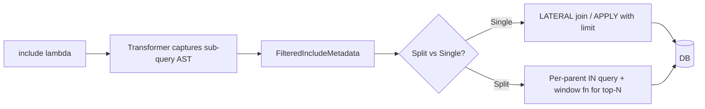

# Filtered Include

## 1. Why (problem statement)

EF Core supports filtering, ordering, skipping, and taking inside an `Include`, e.g. "give me each blog with its 10 most recent published posts". Without this, users must hand-write joins or post-filter in memory after loading every related row. `ts-linq` currently allows only plain navigation includes (`include(b => b.posts)`), which forces full collection materialization. Filtered include is a fundamental EF Core feature for any realistic UI page that shows "top N children per parent".

## 2. EF Core reference syntax (must be preserved verbatim)

```csharp
var blogs = await context.Blogs
    .Include(b => b.Posts
        .Where(p => p.IsPublished)
        .OrderByDescending(p => p.PublishedAt)
        .Take(10))
    .ToListAsync();

// Allowed inside Include lambda: Where, OrderBy, OrderByDescending,
// ThenBy, ThenByDescending, Skip, Take. Forbidden: Select, GroupBy, Join.
```

TypeScript shape that `ts-linq` must mirror:

```ts
const blogs = await context.blogs
  .include(b => b.posts
    .where(p => p.isPublished)
    .orderByDescending(p => p.publishedAt)
    .take(10))
  .toListAsync();
```

> Hard rule: the public TypeScript names, chaining order, and semantics MUST match EF Core. Internal implementation is free to deviate.

## 3. Architecture Decision Record (ADR)



- **Decision**: the transformer captures the include lambda body as an AST; the planner converts it into either a `LATERAL`/`CROSS APPLY` (single-query) or a windowed sub-query (split-query) per dialect.
- **Context**: `@ts-linq/transformer` already inspects lambda bodies for queryable chains. Reusing that pipeline avoids runtime reflection.
- **Consequences**:
  - +: top-N-per-parent works natively.
  - −: dialect divergence — PostgreSQL has `LATERAL`, MSSQL has `CROSS APPLY`, MySQL needs `ROW_NUMBER()` window emulation.
  - −: must enforce restriction (no `Select`/`GroupBy`/`Join` inside `Include`).

## 4. Technical & architectural description

- **Affected packages**: `@ts-linq/query`, `@ts-linq/sql-visitor`, `@ts-linq/orm`, `@ts-linq/transformer`, all dialects.
- **New types / files**:
  - `packages/query/src/include/FilteredIncludeMetadata.ts`
  - `packages/sql-visitor/src/visitors/LateralJoinEmitter.ts`
  - `packages/dialect-mysql/src/RowNumberLimitRewriter.ts`
- **Touch-points**:
  - `packages/query/src/Queryable.ts` — `include` overload accepting filtered sub-query.
  - `packages/transformer/src/visitors/IncludeVisitor.ts` — recognize and capture sub-chain.
  - `packages/orm/src/services/EntityLoader.ts` — group results by FK after window/lateral execution.
- **Data flow**: include lambda → AST captured → planner picks lateral or windowed strategy per dialect → SQL emitted → loader assembles.

## 5. Implementation options

### Option A — LATERAL / APPLY per dialect (recommended for PG/MSSQL)
- Pros: cleanest SQL; natively supports limit per parent.
- Cons: MySQL <8.0.14 lacks LATERAL → falls back to window function rewrite.
- Effort: L

### Option B — Window function (`ROW_NUMBER() OVER (PARTITION BY fk ORDER BY ...)`)
- Pros: portable across dialects.
- Cons: more complex SQL; sometimes slower; harder to combine with split-query.

### Recommendation
Hybrid: LATERAL/APPLY where supported, window-function rewrite for MySQL.

## 6. Related problems / follow-up tasks

- [P1-18](./P1-18-as-split-query.md) — filtered include in split-query mode uses the windowed sub-query path even on PG.
- Future: nested filtered `thenInclude` (EF supports; mirror it).

## 7. Acceptance criteria

- [ ] Public API mirrors EF Core `include(b => b.posts.where(...).orderBy(...).take(n))`.
- [ ] Compile-time error or runtime validation rejects forbidden operators (`select`, `groupBy`, `join`) inside include.
- [ ] Unit tests cover: where-only, ordered-take, skip+take, combined with `thenInclude`.
- [ ] Integration test against PostgreSQL (LATERAL) and MySQL (window-function fallback).
- [ ] Docs in `apps/docs/` updated.
- [ ] No regressions in `pnpm typecheck`, `pnpm arch:deps`, `pnpm arch:cycles`, `pnpm arch:dead`.

## 8. Pre-PR sweep (mandatory)

Before opening the PR for this task:

1. Re-read every `dev-plans/*.md` whose `status != done`.
2. For each, decide whether assumptions changed because of this task. If yes — update the affected sections (especially **Implementation options**, **depends_on**, **ts_linq_packages_touched**).
3. Record sweep results in the PR description under `## Cross-task sweep` with the bullet list:
   - `P?-??` — no change / updated section X / status moved to `blocked` because Y
4. Only after the sweep is recorded, open the PR.
