# Compiled Queries (EF.CompileQuery / EF.CompileAsyncQuery)

## 1. Why (problem statement)

EF Core lets users hoist a parameterized query outside the hot path so the LINQ → SQL translation cost is paid once. For high-frequency endpoints (e.g. "get user by id"), this is a 5–10x throughput improvement. `ts-linq` already has `@ts-linq/transformer`, which performs compile-time AST capture for LINQ chains, but exposes no run-time API to materialize a reusable, parameter-bound, pre-translated query. Closing this gap turns the existing transformer into a first-class compiled-query feature with a stable EF-shaped API.

## 2. EF Core reference syntax (must be preserved verbatim)

```csharp
private static readonly Func<MyContext, int, Customer?> _getById =
    EF.CompileQuery((MyContext ctx, int id) =>
        ctx.Customers.FirstOrDefault(c => c.Id == id));

private static readonly Func<MyContext, int, Task<Customer?>> _getByIdAsync =
    EF.CompileAsyncQuery((MyContext ctx, int id) =>
        ctx.Customers.FirstOrDefault(c => c.Id == id));

var customer = _getById(context, 42);
var customerAsync = await _getByIdAsync(context, 42);
```

TypeScript shape that `ts-linq` must mirror:

```ts
const getById = EF.compileQuery(
  (ctx: MyContext, id: number) =>
    ctx.customers.firstOrDefault(c => c.id === id)
);

const getByIdAsync = EF.compileAsyncQuery(
  (ctx: MyContext, id: number) =>
    ctx.customers.firstOrDefault(c => c.id === id)
);

const customer = getById(context, 42);
const customerAsync = await getByIdAsync(context, 42);
```

> Hard rule: the public TypeScript names, chaining order, and semantics MUST match EF Core. Internal implementation is free to deviate.

## 3. Architecture Decision Record (ADR)

```mermaid
flowchart TD
  A[Source: EF.compileQuery&#40;lambda&#41;] --> B[Transformer compile-time]
  B --> C[CapturedQueryPlan ctor]
  C --> D[Runtime: parameter map + cached SQL string]
  D --> E[Provider.execute with bound params]
  E --> F[(Database)]
  B -.fallback runtime.-> G[Runtime AST capture if transformer not configured]
```



- **Decision**: `EF.compileQuery` is a transformer-recognized intrinsic. At compile time the transformer replaces the call with a `CapturedQueryPlan` factory; at runtime, the factory binds free parameters into the SQL template and caches the translated SQL.
- **Context**: `@ts-linq/transformer` already rewrites LINQ chains into AST literals. Wrapping that output in a parameterized plan structure is incremental. Without the transformer (e.g. ts-node without plugin) we degrade to runtime AST capture using `Function.prototype.toString` parsing — same path used for non-compiled queries today.
- **Consequences**:
  - +: hot-path queries skip translation each call.
  - +: deterministic SQL — easier to log/analyze.
  - −: lambda must close over `ctx` only via the first parameter (no captured closures, mirror EF restriction).
  - −: two execution paths to maintain (compile-time vs runtime fallback).

## 4. Technical & architectural description

- **Affected packages**: `@ts-linq/query`, `@ts-linq/transformer`, `@ts-linq/sql-visitor`, `@ts-linq/orm`, `@ts-linq/telemetry`.
- **New types / files**:
  - `packages/query/src/EF.ts` — `compileQuery`, `compileAsyncQuery`.
  - `packages/query/src/compiled/CapturedQueryPlan.ts`
  - `packages/transformer/src/visitors/EFCompileQueryVisitor.ts`
- **Touch-points**:
  - `packages/transformer/src/index.ts` — register new visitor.
  - `packages/sql-visitor/src/SqlVisitor.ts` — accept pre-built parameter slots.
  - `packages/telemetry` — emit a `db.query.compiled=true` attribute.
- **Data flow**: build-time → transformer emits plan factory → first call binds parameters → SQL cached on plan → subsequent calls reuse cached SQL and merely rebind parameters.

## 5. Implementation options

### Option A — Transformer-first, runtime fallback (recommended)
- Pros: optimal in prod (where transformer runs); safe in dev/test.
- Cons: requires careful equivalence between two paths.
- Effort: M

### Option B — Runtime-only compilation
- Pros: simpler; no transformer changes.
- Cons: leaves existing transformer underutilized; first call still pays translation cost.

### Recommendation
Option A — fully utilize `@ts-linq/transformer`, fall back gracefully.

## 6. Related problems / follow-up tasks

- [P1-22](./P1-22-ef-functions.md) — `EF.Functions` calls inside compiled queries must round-trip through transformer.
- Telemetry follow-up: cache hit/miss metric per plan.

## 7. Acceptance criteria

- [ ] Public API mirrors EF Core: `EF.compileQuery`, `EF.compileAsyncQuery`.
- [ ] Unit tests cover: parameter binding, multiple parameters, async variant, fallback path produces identical SQL.
- [ ] Integration test against at least one dialect verifying plan cache hits on repeated invocations.
- [ ] Benchmark: documented 3x+ throughput vs uncompiled equivalent.
- [ ] Docs in `apps/docs/` updated with compiled-query guide.
- [ ] No regressions in `pnpm typecheck`, `pnpm arch:deps`, `pnpm arch:cycles`, `pnpm arch:dead`.

## 8. Pre-PR sweep (mandatory)

Before opening the PR for this task:

1. Re-read every `dev-plans/*.md` whose `status != done`.
2. For each, decide whether assumptions changed because of this task. If yes — update the affected sections (especially **Implementation options**, **depends_on**, **ts_linq_packages_touched**).
3. Record sweep results in the PR description under `## Cross-task sweep` with the bullet list:
   - `P?-??` — no change / updated section X / status moved to `blocked` because Y
4. Only after the sweep is recorded, open the PR.
