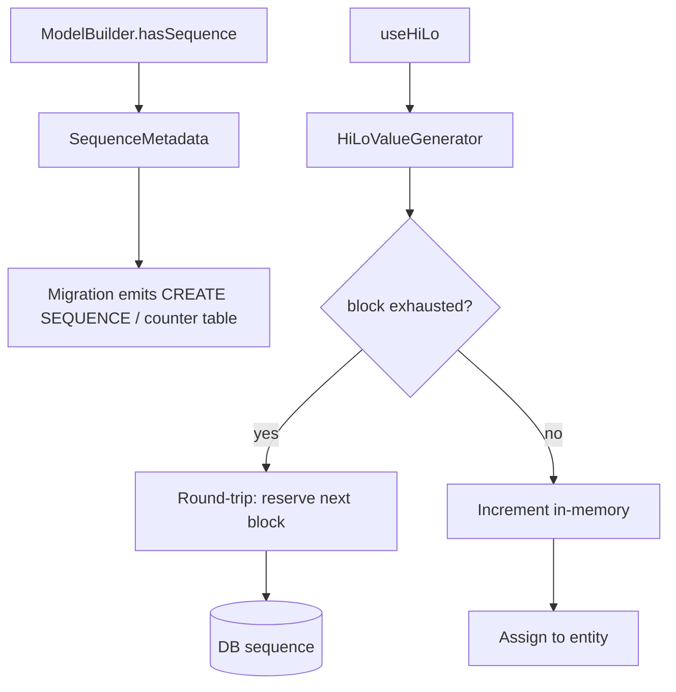

# Sequences and HiLo

## 1. Why (problem statement)

EF Core supports first-class database sequences and the HiLo pattern, which lets the client pre-allocate a block of IDs in a single round-trip and assign them locally — eliminating per-insert ID round-trips for bulk inserts. `ts-linq` currently relies on `IDENTITY`/`SERIAL`/`AUTO_INCREMENT` columns and round-trips `RETURNING id` per row. For bulk loads (millions of rows), HiLo is a 100x throughput improvement and is the canonical EF pattern. PostgreSQL has native sequences; MySQL does not and requires emulation via a counters table.

## 2. EF Core reference syntax (must be preserved verbatim)

```csharp
modelBuilder.HasSequence<int>("OrderNumbers", schema: "shared")
    .StartsAt(1000)
    .IncrementsBy(5);

modelBuilder.Entity<Order>()
    .Property(o => o.OrderNo)
    .HasDefaultValueSql("NEXT VALUE FOR shared.OrderNumbers");

modelBuilder.Entity<Customer>()
    .Property(c => c.Id)
    .UseHiLo("CustomerHiLo", schema: "shared");

modelBuilder.Entity<Product>()
    .Property(p => p.Id)
    .UseSequence("ProductSeq");
```

TypeScript shape that `ts-linq` must mirror:

```ts
modelBuilder.hasSequence<number>("OrderNumbers", { schema: "shared" })
  .startsAt(1000)
  .incrementsBy(5);

modelBuilder.entity<Order>(Order)
  .property(o => o.orderNo)
  .hasDefaultValueSql("NEXT VALUE FOR shared.OrderNumbers");

modelBuilder.entity<Customer>(Customer)
  .property(c => c.id)
  .useHiLo("CustomerHiLo", { schema: "shared" });

modelBuilder.entity<Product>(Product)
  .property(p => p.id)
  .useSequence("ProductSeq");
```

> Hard rule: the public TypeScript names, chaining order, and semantics MUST match EF Core. Internal implementation is free to deviate.

## 3. Architecture Decision Record (ADR)



- **Decision**: introduce `SequenceMetadata` on `ModelMetadata`; ship a `HiLoValueGenerator` that uses a per-context cache of reserved blocks; emit native `CREATE SEQUENCE` on PG/MSSQL and a counters-table emulation on MySQL.
- **Context**: P1-30 introduces `ValueGenerator`; HiLo is the canonical implementation. P1-31 documents alternate-key constraints that may also be sequence-backed.
- **Consequences**:
  - +: bulk inserts no longer need per-row RETURNING.
  - +: cross-context ID generation possible (UI client + server can both reserve from same sequence).
  - −: MySQL emulation is racy unless using `UPDATE ... RETURNING` (8.0.21+) or explicit row-level lock.
  - −: HiLo block size must be tunable and the unused tail is "lost" on context dispose.

## 4. Technical & architectural description

- **Affected packages**: `@ts-linq/metadata`, `@ts-linq/orm`, `@ts-linq/migrations`, all dialects.
- **New types / files**:
  - `packages/metadata/src/SequenceMetadata.ts`
  - `packages/orm/src/services/HiLoValueGenerator.ts`
  - `packages/dialect-mysql/src/sequenceEmulation.ts`
- **Touch-points**:
  - `packages/orm/src/services/SaveChangesPipeline.ts` — invoke generator before INSERT.
  - `packages/migrations/src/diff/SchemaDiff.ts` — emit sequence DDL.
- **Data flow**: model declares sequence → migration creates DB object → SaveChanges asks generator for next id → generator either uses cached block or fetches next block.

## 5. Implementation options

### Option A — Per-context HiLo block cache (recommended)
- Pros: matches EF behavior; minimizes round-trips.
- Cons: blocks lost on context dispose; tunable size mitigates.
- Effort: L

### Option B — Per-app singleton cache
- Pros: even fewer round-trips.
- Cons: cross-context coordination required; EF chose per-context, mirror it.

### Recommendation
Option A.

## 6. Related problems / follow-up tasks

- [P1-30](./P1-30-value-generators-sentinel.md) — HiLo is a concrete ValueGenerator.
- [P1-31](./P1-31-alternate-keys-indexes.md) — alternate keys may use sequences.

## 7. Acceptance criteria

- [ ] Public API mirrors EF Core (`hasSequence`, `useHiLo`, `useSequence`, `startsAt`, `incrementsBy`).
- [ ] Unit tests cover: block reservation, exhaustion, multi-entity sharing.
- [ ] Integration test against PostgreSQL (native), MSSQL (native), MySQL (emulated).
- [ ] Migration diff produces idempotent sequence DDL.
- [ ] Docs in `apps/docs/` updated.
- [ ] No regressions in `pnpm typecheck`, `pnpm arch:deps`, `pnpm arch:cycles`, `pnpm arch:dead`.

## 8. Pre-PR sweep (mandatory)

Before opening the PR for this task:

1. Re-read every `dev-plans/*.md` whose `status != done`.
2. For each, decide whether assumptions changed because of this task. If yes — update the affected sections (especially **Implementation options**, **depends_on**, **ts_linq_packages_touched**).
3. Record sweep results in the PR description under `## Cross-task sweep` with the bullet list:
   - `P?-??` — no change / updated section X / status moved to `blocked` because Y
4. Only after the sweep is recorded, open the PR.
