# EF.Functions and HasDbFunction

## 1. Why (problem statement)

`EF.Functions` exposes DB-side functions to LINQ — `Like`, `ILike` (PG), `Random`, `DateDiffDay`, `DateDiffMonth`, `Greatest`, `Least`, `StDev`, `Variance` — without leaking dialect-specific SQL into user code. EF also supports `HasDbFunction` to register user-defined functions. `ts-linq` users today fall back to raw SQL fragments for these, which defeats the LINQ benefit and breaks across dialects. This task closes the gap with a curated set of canonical functions plus a registration API.

## 2. EF Core reference syntax (must be preserved verbatim)

```csharp
var rows = context.Posts
    .Where(p => EF.Functions.Like(p.Title, "%urgent%"))
    .OrderBy(p => EF.Functions.Random())
    .ToList();

var recent = context.Logs
    .Where(l => EF.Functions.DateDiffDay(l.CreatedAt, DateTime.UtcNow) <= 7);

// User-defined
modelBuilder.HasDbFunction(typeof(MyContext).GetMethod(nameof(MyContext.JsonExtract)))
    .HasName("jsonb_extract_path_text");
```

TypeScript shape that `ts-linq` must mirror:

```ts
const rows = context.posts
  .where(p => EF.functions.like(p.title, "%urgent%"))
  .orderBy(_ => EF.functions.random())
  .toList();

const recent = context.logs
  .where(l => EF.functions.dateDiffDay(l.createdAt, new Date()) <= 7);

modelBuilder
  .hasDbFunction(MyContext.prototype.jsonExtract)
  .hasName("jsonb_extract_path_text");
```

> Hard rule: the public TypeScript names, chaining order, and semantics MUST match EF Core. Internal implementation is free to deviate.

## 3. Architecture Decision Record (ADR)

```mermaid
flowchart LR
  A[EF.functions.foo&#40;...&#41;] --> B[Marker call captured by visitor]
  B --> C[FunctionTranslator registry]
  C --> D{dialect}
  D -->|postgres| E[postgresTranslators]
  D -->|mysql| F[mysqlTranslators]
  D -->|mssql| G[mssqlTranslators]
  E --> H[SQL fragment]
  F --> H
  G --> H
```



- **Decision**: `EF.functions` is a frozen object of marker methods that throw at runtime if not intercepted; the SQL visitor recognizes them via a registry; per-dialect translators emit the SQL fragment.
- **Context**: each dialect already owns its operator/function table; extending it with a `FunctionTranslator` interface is additive.
- **Consequences**:
  - +: portable LINQ stays portable.
  - +: `HasDbFunction` extends mechanism to user-defined functions cleanly.
  - −: must document which functions are supported per dialect (e.g. `ILike` only PG).
  - −: misuse outside of LINQ (calling `EF.functions.like` directly) must throw a clear "this is a query-only marker" error.

## 4. Technical & architectural description

- **Affected packages**: `@ts-linq/query`, `@ts-linq/sql-visitor`, all dialect packages, `@ts-linq/transformer`.
- **New types / files**:
  - `packages/query/src/EF.functions.ts`
  - `packages/sql-visitor/src/functions/FunctionTranslator.ts`
  - `packages/dialect-postgres/src/functions/index.ts`
  - `packages/dialect-mysql/src/functions/index.ts`
  - `packages/dialect-mssql/src/functions/index.ts`
- **Touch-points**:
  - `packages/sql-visitor/src/visitors/CallVisitor.ts` — match by symbol key.
  - `packages/metadata/src/builders/ModelBuilder.ts` — `hasDbFunction` registration.
- **Data flow**: user code → marker call → visitor recognizes → translator emits dialect SQL → parameterized fragment.

## 5. Implementation options

### Option A — Symbol-tagged marker functions (recommended)
- Pros: zero ambiguity at visitor time; safe vs name collisions.
- Cons: every function declared explicitly.
- Effort: L

### Option B — String-name dispatch
- Pros: easier to register dynamically.
- Cons: collides with user methods of same name.

### Recommendation
Option A — symbol tags. Use Option B style only for `HasDbFunction` (user-supplied name).

## 6. Related problems / follow-up tasks

- [P1-20](./P1-20-compiled-queries.md) — compiled queries must preserve `EF.functions` markers through transformer.
- Future: pgvector / full-text search functions as a separate extension package.

## 7. Acceptance criteria

- [ ] Public API mirrors EF Core (`EF.functions.like/iLike/random/dateDiffDay/dateDiffMonth/greatest/least/stDev/variance`, `hasDbFunction`).
- [ ] Per-dialect tests for each function; unsupported function on dialect throws a precise error.
- [ ] Integration test against at least one dialect.
- [ ] `hasDbFunction` round-trips a user function name through a Where clause.
- [ ] Docs in `apps/docs/` updated with support matrix.
- [ ] No regressions in `pnpm typecheck`, `pnpm arch:deps`, `pnpm arch:cycles`, `pnpm arch:dead`.

## 8. Pre-PR sweep (mandatory)

Before opening the PR for this task:

1. Re-read every `dev-plans/*.md` whose `status != done`.
2. For each, decide whether assumptions changed because of this task. If yes — update the affected sections (especially **Implementation options**, **depends_on**, **ts_linq_packages_touched**).
3. Record sweep results in the PR description under `## Cross-task sweep` with the bullet list:
   - `P?-??` — no change / updated section X / status moved to `blocked` because Y
4. Only after the sweep is recorded, open the PR.
