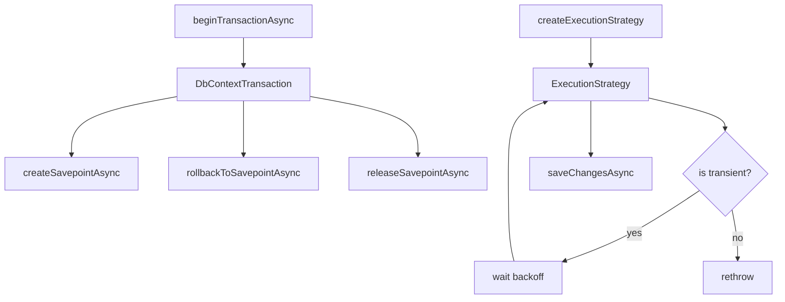

# Transaction Savepoints and Retry-on-Failure (ExecutionStrategy)

## 1. Why (problem statement)

`ts-linq` has a depth-counter-based nested-transaction emulation, but it lacks two things EF Core gives users: (1) named savepoints (`SAVEPOINT/ROLLBACK TO/RELEASE`) for fine-grained partial rollback, and (2) `ExecutionStrategy` / `EnableRetryOnFailure` to automatically retry transient failures (deadlocks, connection drops) with exponential backoff. `@ts-linq/concurrency` already has `RetryPolicies` but they're not wired into the SaveChanges pipeline as a first-class strategy. Without these, users can't safely do partial-rollback workflows or build resilient services.

## 2. EF Core reference syntax (must be preserved verbatim)

```csharp
await using var tx = await context.Database.BeginTransactionAsync();
try
{
    await context.SaveChangesAsync();
    await tx.CreateSavepointAsync("before_risky");

    try { await DoRisky(); }
    catch
    {
        await tx.RollbackToSavepointAsync("before_risky");
    }

    await tx.ReleaseSavepointAsync("before_risky");
    await tx.CommitAsync();
}
catch { await tx.RollbackAsync(); }

optionsBuilder.UseNpgsql(conn, o =>
    o.EnableRetryOnFailure(maxRetryCount: 5,
        maxRetryDelay: TimeSpan.FromSeconds(30),
        errorCodesToAdd: null));

var strategy = context.Database.CreateExecutionStrategy();
await strategy.ExecuteAsync(async () => { /* atomic block */ });
```

TypeScript shape that `ts-linq` must mirror:

```ts
await using const tx = await context.database.beginTransactionAsync();
try {
  await context.saveChangesAsync();
  await tx.createSavepointAsync("before_risky");

  try { await doRisky(); }
  catch { await tx.rollbackToSavepointAsync("before_risky"); }

  await tx.releaseSavepointAsync("before_risky");
  await tx.commitAsync();
} catch { await tx.rollbackAsync(); }

optionsBuilder.usePostgres(conn, o =>
  o.enableRetryOnFailure({
    maxRetryCount: 5,
    maxRetryDelay: 30_000,
    errorCodesToAdd: null,
  }));

const strategy = context.database.createExecutionStrategy();
await strategy.executeAsync(async () => { /* atomic block */ });
```

> Hard rule: the public TypeScript names, chaining order, and semantics MUST match EF Core. Internal implementation is free to deviate.

## 3. Architecture Decision Record (ADR)



- **Decision**: extend the existing transaction object with explicit savepoint API; introduce `ExecutionStrategy` abstraction wrapping the existing `RetryPolicies`; gate retried operations on idempotency (only retry whole-block executions, not partial commits).
- **Context**: depth counter today emulates nesting via savepoints implicitly. Promoting savepoints to first-class API is mostly surface work. Retry, however, must own the *entire* execution of the user block, so users wrap their work in `strategy.executeAsync(...)`.
- **Consequences**:
  - +: partial-rollback workflows possible without abandoning the outer transaction.
  - +: production-grade resilience for transient failures.
  - −: must clearly document that user code inside `executeAsync` must be idempotent.
  - −: per-dialect transient-error code lists need maintenance.

## 4. Technical & architectural description

- **Affected packages**: `@ts-linq/orm`, `@ts-linq/concurrency`, all provider packages.
- **New types / files**:
  - `packages/orm/src/transactions/Savepoint.ts`
  - `packages/concurrency/src/ExecutionStrategy.ts`
  - `packages/provider-postgres/src/transientErrorCodes.ts`
  - similar for mysql/mssql.
- **Touch-points**:
  - `packages/orm/src/DbContextTransaction.ts` — add savepoint methods.
  - `packages/orm/src/DbContextOptionsBuilder.ts` — `enableRetryOnFailure`.
  - `packages/orm/src/services/SaveChangesPipeline.ts` — when strategy active, wrap entire pipeline.
- **Data flow**: user calls `executeAsync(fn)` → strategy invokes `fn` → on transient error checks count + delay → retries until success or budget exhausted.

## 5. Implementation options

### Option A — Composition: strategy wraps SaveChanges (recommended)
- Pros: minimal intrusion; user opts in.
- Cons: requires user-block discipline.
- Effort: L

### Option B — Implicit auto-retry on every SaveChanges
- Pros: zero user effort.
- Cons: hides non-idempotent bugs; EF chose explicit, mirror it.

### Recommendation
Option A.

## 6. Related problems / follow-up tasks

- Telemetry: emit attempts count + final outcome per executeAsync span.
- Future: per-operation idempotency tokens.

## 7. Acceptance criteria

- [ ] Public API mirrors EF Core (`createSavepointAsync`, `rollbackToSavepointAsync`, `releaseSavepointAsync`, `enableRetryOnFailure`, `createExecutionStrategy`, `executeAsync`).
- [ ] Unit tests cover: savepoint create/rollback/release, nested savepoints, retry on injected transient error, retry-budget exhaustion.
- [ ] Integration test against at least one dialect verifying savepoint SQL.
- [ ] Docs in `apps/docs/` updated with idempotency warning.
- [ ] No regressions in `pnpm typecheck`, `pnpm arch:deps`, `pnpm arch:cycles`, `pnpm arch:dead`.

## 8. Pre-PR sweep (mandatory)

Before opening the PR for this task:

1. Re-read every `dev-plans/*.md` whose `status != done`.
2. For each, decide whether assumptions changed because of this task. If yes — update the affected sections (especially **Implementation options**, **depends_on**, **ts_linq_packages_touched**).
3. Record sweep results in the PR description under `## Cross-task sweep` with the bullet list:
   - `P?-??` — no change / updated section X / status moved to `blocked` because Y
4. Only after the sweep is recorded, open the PR.
