# Primitive Collections (EF8)

## 1. Why (problem statement)

EF8 lets primitive-typed collections (`string[]`, `int[]`, `Guid[]`, etc.) be stored as a single column (JSON on most providers, native arrays on PostgreSQL) and queried with `Contains`/`Count`. This eliminates the awkward "side-table for tags" model for short, owned lists. `ts-linq` today has no path for `Tags: string[]` properties — they must be modeled as joined entities. Bridging this gap unlocks idiomatic modeling for tag-like data and enables `WHERE 'foo' = ANY(tags)` translation.

## 2. EF Core reference syntax (must be preserved verbatim)

```csharp
public class Post
{
    public int Id { get; set; }
    public List<string> Tags { get; set; } = new();
}

// Modeled by convention; explicit:
modelBuilder.Entity<Post>().Property(p => p.Tags);

var hot = context.Posts
    .Where(p => p.Tags.Contains("urgent"))
    .ToList();

var many = context.Posts
    .Where(p => p.Tags.Count > 3)
    .ToList();
```

TypeScript shape that `ts-linq` must mirror:

```ts
class Post {
  id!: number;
  tags: string[] = [];
}

modelBuilder.entity<Post>(Post).property(p => p.tags);

const hot = context.posts
  .where(p => p.tags.includes("urgent"))
  .toList();

const many = context.posts
  .where(p => p.tags.length > 3)
  .toList();
```

> Hard rule: the public TypeScript names, chaining order, and semantics MUST match EF Core. Internal implementation is free to deviate.

## 3. Architecture Decision Record (ADR)

```mermaid
flowchart TD
  A[Property of type T&#91;&#93;] --> B[PrimitiveCollectionMetadata]
  B --> C{dialect}
  C -->|postgres| D[native array column]
  C -->|mysql| E[JSON column]
  C -->|mssql| F[JSON / OPENJSON]
  G[tags.includes&#40;x&#41;] --> H[Translator]
  H -->|pg| I[x = ANY&#40;tags&#41;]
  H -->|mysql| J[JSON_CONTAINS&#40;tags, JSON_QUOTE&#40;x&#41;&#41;]
  H -->|mssql| K[EXISTS&#40;SELECT 1 FROM OPENJSON&#40;tags&#41; WHERE value = x&#41;]
```



- **Decision**: model primitive collections as a single column; dispatch storage and query translation per dialect; runtime materializer is `JSON.parse` / driver-native array reader.
- **Context**: PG has native `text[]`/`int[]`; MySQL/MSSQL use JSON. Existing dialect packages already know their column types — adding `arrayOf(primitive)` slot is incremental.
- **Consequences**:
  - +: idiomatic tag/label modeling.
  - +: `includes`/`length` push down to SQL.
  - −: indexability differs — PG `GIN`, MSSQL needs computed columns; document it.
  - −: deep change tracking on arrays requires structural diff (or "always rewrite the column" simpler default).

## 4. Technical & architectural description

- **Affected packages**: `@ts-linq/metadata`, `@ts-linq/query`, `@ts-linq/sql-visitor`, all dialects.
- **New types / files**:
  - `packages/metadata/src/PrimitiveCollectionMetadata.ts`
  - `packages/sql-visitor/src/visitors/CollectionMethodVisitor.ts`
  - per-dialect translator updates.
- **Touch-points**:
  - `packages/orm/src/ChangeTracker.ts` — array-aware snapshot/clone.
  - `packages/migrations/src/diff/SchemaDiff.ts` — emit `text[]` / `JSON` per dialect.
- **Data flow**: model declares array property → migration emits dialect-appropriate column → SaveChanges serializes array as needed → LINQ predicates translate `includes`/`length`.

## 5. Implementation options

### Option A — Always whole-column overwrite on change (recommended)
- Pros: simple; correct; matches EF8 default.
- Cons: row size matters; large arrays = larger updates.
- Effort: M

### Option B — Granular append/remove (PG only)
- Pros: less write amplification on large arrays.
- Cons: dialect-divergent; out of scope for v1.

### Recommendation
Option A.

## 6. Related problems / follow-up tasks

- [P1-22](./P1-22-ef-functions.md) — JSON-path functions may be added for richer querying.
- Index recommendations doc — GIN index for PG arrays.

## 7. Acceptance criteria

- [ ] Public API: declaring a primitive-array property requires no extra config.
- [ ] Unit tests cover: `includes`, `length`, equality, null/empty handling.
- [ ] Integration test against PostgreSQL (native array) and MySQL (JSON).
- [ ] Migration emits correct column type per dialect.
- [ ] Docs in `apps/docs/` updated with indexability notes.
- [ ] No regressions in `pnpm typecheck`, `pnpm arch:deps`, `pnpm arch:cycles`, `pnpm arch:dead`.

## 8. Pre-PR sweep (mandatory)

Before opening the PR for this task:

1. Re-read every `dev-plans/*.md` whose `status != done`.
2. For each, decide whether assumptions changed because of this task. If yes — update the affected sections (especially **Implementation options**, **depends_on**, **ts_linq_packages_touched**).
3. Record sweep results in the PR description under `## Cross-task sweep` with the bullet list:
   - `P?-??` — no change / updated section X / status moved to `blocked` because Y
4. Only after the sweep is recorded, open the PR.
