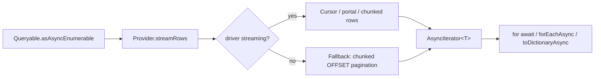

# AsAsyncEnumerable / ForEachAsync / ToDictionaryAsync

## 1. Why (problem statement)

EF Core exposes streaming and dictionary-shaped terminators that let users process large result sets without materializing the whole list (`AsAsyncEnumerable`, `ForEachAsync`) and pivot into a map keyed by a selector (`ToDictionaryAsync`). `ts-linq` today exposes only `toListAsync` / `toArrayAsync` terminators that fully buffer the result. For result sets of millions of rows (ETL, exports), this is a memory cliff. Adding `asAsyncEnumerable()` wrapped in a TypeScript `AsyncIterable<T>` (so users can `for await`) closes the gap, plus the convenience `forEachAsync` and `toDictionaryAsync` round it out.

## 2. EF Core reference syntax (must be preserved verbatim)

```csharp
await foreach (var post in context.Posts.AsAsyncEnumerable())
{
    Process(post);
}

await context.Posts
    .Where(p => p.IsPublished)
    .ForEachAsync(p => Process(p));

var byId = await context.Posts.ToDictionaryAsync(p => p.Id);
var byIdSelect = await context.Posts.ToDictionaryAsync(p => p.Id, p => p.Title);
```

TypeScript shape that `ts-linq` must mirror:

```ts
for await (const post of context.posts.asAsyncEnumerable()) {
  process(post);
}

await context.posts
  .where(p => p.isPublished)
  .forEachAsync(p => process(p));

const byId = await context.posts.toDictionaryAsync(p => p.id);
const byIdTitle = await context.posts.toDictionaryAsync(p => p.id, p => p.title);
```

> Hard rule: the public TypeScript names, chaining order, and semantics MUST match EF Core. Internal implementation is free to deviate.

## 3. Architecture Decision Record (ADR)



- **Decision**: provider exposes a `streamRows(plan): AsyncIterable<Row>` primitive; non-streaming drivers fall back to chunked pagination using an existing ORDER BY + keyset; materializer wraps rows into entities one at a time.
- **Context**: PG (`pg-cursor` or simple unnamed-portal fetch), MSSQL (`mssql` streamed events), MySQL (`mysql2` streaming `query`) all support row-by-row. Surface alignment lets us keep the queryable chain unchanged until the terminator.
- **Consequences**:
  - +: memory bounded by per-row size, not result-set size.
  - +: idiomatic JS via `AsyncIterable`.
  - −: must define behavior on cancellation (close cursor); leverage `AbortSignal`.
  - −: tracking mode interaction — streaming should default to no-tracking to avoid identity-map blow-up; mirror EF's behavior (it tracks unless `AsNoTracking`).

## 4. Technical & architectural description

- **Affected packages**: `@ts-linq/query`, `@ts-linq/orm`, all provider packages.
- **New types / files**:
  - `packages/query/src/async/AsyncQueryable.ts`
  - `packages/orm/src/async/forEachAsync.ts`, `toDictionaryAsync.ts`
- **Touch-points**:
  - `packages/query/src/Queryable.ts` — `asAsyncEnumerable`, `forEachAsync`, `toDictionaryAsync`.
  - Each provider: implement `streamRows`.
- **Data flow**: terminator opens driver cursor → yields rows → materializer turns each into entity → caller consumes.

## 5. Implementation options

### Option A — Driver cursor primary, paginated fallback (recommended)
- Pros: best perf where supported; safe everywhere.
- Cons: per-driver implementation.
- Effort: M

### Option B — Always-paginated (cursorless) implementation
- Pros: uniform code.
- Cons: requires a stable order key; worse on big tables.

### Recommendation
Option A.

## 6. Related problems / follow-up tasks

- Telemetry: emit row count + duration on stream close.
- [P1-29](./P1-29-local-view-find.md) — Local view ignores streamed entities by default.

## 7. Acceptance criteria

- [ ] Public API mirrors EF Core (`asAsyncEnumerable`, `forEachAsync`, `toDictionaryAsync` with key+optional element selector).
- [ ] Unit tests cover: streaming a large fake row source, cancellation via `AbortSignal`, dictionary collision throws like EF.
- [ ] Integration test against at least one dialect verifies memory stays bounded across 100k rows.
- [ ] Docs in `apps/docs/` updated.
- [ ] No regressions in `pnpm typecheck`, `pnpm arch:deps`, `pnpm arch:cycles`, `pnpm arch:dead`.

## 8. Pre-PR sweep (mandatory)

Before opening the PR for this task:

1. Re-read every `dev-plans/*.md` whose `status != done`.
2. For each, decide whether assumptions changed because of this task. If yes — update the affected sections (especially **Implementation options**, **depends_on**, **ts_linq_packages_touched**).
3. Record sweep results in the PR description under `## Cross-task sweep` with the bullet list:
   - `P?-??` — no change / updated section X / status moved to `blocked` because Y
4. Only after the sweep is recorded, open the PR.
