# TrackGraph and DetectChanges Control

## 1. Why (problem statement)

EF Core's `ChangeTracker.TrackGraph(root, callback)` walks a detached object graph and lets the user decide per node whether to attach as `Added`/`Modified`/`Unchanged`, which is the canonical disconnected-scenario API. `DetectChanges()` is the explicit on-demand diff trigger; `AutoDetectChangesEnabled` lets users opt out of the implicit pre-SaveChanges diff for performance. `ts-linq`'s tracker today uses snapshot diff and always implicitly diffs before SaveChanges, with no graph-walker API and no opt-out — making bulk import and SPA-PATCH scenarios painful.

## 2. EF Core reference syntax (must be preserved verbatim)

```csharp
context.ChangeTracker.TrackGraph(blog, node =>
{
    var e = node.Entry;
    e.State = e.IsKeySet ? EntityState.Modified : EntityState.Added;
});

context.ChangeTracker.AutoDetectChangesEnabled = false;
try
{
    foreach (var p in posts) context.Posts.Update(p);
    context.ChangeTracker.DetectChanges();
    await context.SaveChangesAsync();
}
finally { context.ChangeTracker.AutoDetectChangesEnabled = true; }
```

TypeScript shape that `ts-linq` must mirror:

```ts
context.changeTracker.trackGraph(blog, node => {
  const e = node.entry;
  e.state = e.isKeySet ? EntityState.Modified : EntityState.Added;
});

context.changeTracker.autoDetectChangesEnabled = false;
try {
  for (const p of posts) context.posts.update(p);
  context.changeTracker.detectChanges();
  await context.saveChangesAsync();
} finally {
  context.changeTracker.autoDetectChangesEnabled = true;
}
```

> Hard rule: the public TypeScript names, chaining order, and semantics MUST match EF Core. Internal implementation is free to deviate.

## 3. Architecture Decision Record (ADR)

```mermaid
flowchart TD
  A[trackGraph&#40;root, cb&#41;] --> B[Traverse navigations BFS]
  B --> C[Per-node entry exposed to cb]
  C --> D[User sets state]
  D --> E[Tracker attaches without diff]
  F[saveChangesAsync] --> G{autoDetect on?}
  G -->|yes| H[detectChanges&#40;&#41;]
  G -->|no| I[skip diff]
  H --> J[Pipeline]
  I --> J
```



- **Decision**: implement `trackGraph` as a BFS over navigation metadata, exposing a node object with `entry` (lazy `EntityEntry`) and `inboundNavigation`. Make `detectChanges` an explicit public method that runs the existing snapshot-diff. Add `autoDetectChangesEnabled` flag; default true.
- **Context**: existing tracker already snapshots on attach and compares on SaveChanges. Splitting "diff" into an explicit method plus a gate flag is a small refactor. P0-02 (AsNoTracking) and P1-29 (LocalView/Find) lean on the same tracker internals.
- **Consequences**:
  - +: disconnected scenarios (DTO POST → graph attach) work with EF-idiomatic code.
  - +: bulk-update perf when users opt out of auto-detect.
  - −: users who turn auto-detect off and forget `detectChanges()` may miss updates — must document loudly.
  - −: graph traversal must guard against cycles.

## 4. Technical & architectural description

- **Affected packages**: `@ts-linq/orm`.
- **New types / files**:
  - `packages/orm/src/ChangeTracker/GraphIterator.ts`
  - `packages/orm/src/ChangeTracker/EntityEntryGraphNode.ts`
- **Touch-points**:
  - `packages/orm/src/ChangeTracker.ts` — expose `trackGraph`, `detectChanges`, `autoDetectChangesEnabled`.
  - `packages/orm/src/services/SaveChangesPipeline.ts` — gate implicit diff on flag.
- **Data flow**: user calls `trackGraph` → BFS visits each reachable entity once → callback decides state → tracker registers without immediate diff. `detectChanges` walks all tracked entities and updates state.

## 5. Implementation options

### Option A — BFS over navigation metadata (recommended)
- Pros: matches EF; cycle-safe via visited set; metadata-driven.
- Cons: pure-data graphs (no class type tag) need careful handling.
- Effort: L

### Option B — Reflection-based deep walk
- Pros: handles anonymous shapes.
- Cons: too permissive; tracks accidental fields.

### Recommendation
Option A.

## 6. Related problems / follow-up tasks

- [P0-02](./P0-02-as-no-tracking.md) — no-tracking queries skip both detect and tracking entirely.
- [P1-29](./P1-29-local-view-find.md) — Local view depends on tracker state propagation.
- [P1-16](./P1-16-shadow-properties.md) — detectChanges must diff shadow values too.

## 7. Acceptance criteria

- [ ] Public API mirrors EF Core (`trackGraph`, `detectChanges`, `autoDetectChangesEnabled`).
- [ ] Unit tests cover: graph attach with mixed Added/Modified, cycle resilience, auto-detect off batch update.
- [ ] Integration test verifying disconnected-scenario PATCH workflow.
- [ ] Docs in `apps/docs/` warn about forgetting `detectChanges()`.
- [ ] No regressions in `pnpm typecheck`, `pnpm arch:deps`, `pnpm arch:cycles`, `pnpm arch:dead`.

## 8. Pre-PR sweep (mandatory)

Before opening the PR for this task:

1. Re-read every `dev-plans/*.md` whose `status != done`.
2. For each, decide whether assumptions changed because of this task. If yes — update the affected sections (especially **Implementation options**, **depends_on**, **ts_linq_packages_touched**).
3. Record sweep results in the PR description under `## Cross-task sweep` with the bullet list:
   - `P?-??` — no change / updated section X / status moved to `blocked` because Y
4. Only after the sweep is recorded, open the PR.
