# DbSet.Local, FindEntry, Find / FindAsync

## 1. Why (problem statement)

EF Core exposes the tracker's view of a `DbSet` via `DbSet.Local` (an observable `LocalView<T>`), a `Find`/`FindAsync` PK lookup that hits the tracker before the DB, and (EF8) `FindEntry`/`GetEntries` for retrieving `EntityEntry` instances by key without materializing the entity again. These are critical for data-binding UIs and round-trip-free hot lookups. `ts-linq` today exposes the tracker only as an internal collection — users can't cheaply ask "is this row already loaded?" or "give me everything currently tracked of type T".

## 2. EF Core reference syntax (must be preserved verbatim)

```csharp
var local = context.Posts.Local;            // LocalView<Post>
local.CollectionChanged += OnChanged;

var post = await context.Posts.FindAsync(42);  // tracker first, DB on miss
var post2 = context.Posts.Find(42);

// EF8
var entry = context.ChangeTracker.FindEntry<Post>(42);
var entries = context.ChangeTracker.Entries<Post>();
```

TypeScript shape that `ts-linq` must mirror:

```ts
const local = context.posts.local;             // LocalView<Post>
local.subscribe(change => onChanged(change));

const post = await context.posts.findAsync(42);
const post2 = context.posts.find(42);

const entry = context.changeTracker.findEntry<Post>(Post, 42);
const entries = context.changeTracker.entries<Post>(Post);
```

> Hard rule: the public TypeScript names, chaining order, and semantics MUST match EF Core. Internal implementation is free to deviate.

## 3. Architecture Decision Record (ADR)

```mermaid
flowchart LR
  A[ChangeTracker] --> B[PK-keyed map per entity type]
  B --> C[DbSet.local: LocalView&lt;T&gt;]
  B --> D[findEntry&lt;T&gt;&#40;pk&#41;]
  E[findAsync&#40;pk&#41;] --> F{in tracker?}
  F -->|yes| G[Return tracked]
  F -->|no| H[Query by PK + attach]
```



- **Decision**: add a PK-keyed secondary index to the tracker (`Map<EntityType, Map<PkTuple, EntityEntry>>`); `LocalView<T>` is a thin observable wrapper around that map filtered by entity type; `Find`/`FindAsync` check the index first then fall back to a `WHERE pk = ?` query.
- **Context**: the tracker currently scans entries linearly. A PK index is a small additive structure but must be maintained on Add/Attach/Remove and key value changes (rare).
- **Consequences**:
  - +: O(1) tracker lookups by PK.
  - +: data-binding-friendly `LocalView<T>`.
  - −: composite-PK tuple keys require canonicalization (stable hash).
  - −: LocalView observation needs a small pub-sub layer (no external dependency).

## 4. Technical & architectural description

- **Affected packages**: `@ts-linq/orm`.
- **New types / files**:
  - `packages/orm/src/ChangeTracker/PrimaryKeyIndex.ts`
  - `packages/orm/src/LocalView.ts`
- **Touch-points**:
  - `packages/orm/src/ChangeTracker.ts` — maintain PK index on attach/detach/state changes.
  - `packages/orm/src/DbSet.ts` — expose `local`, `find`, `findAsync`.
- **Data flow**: tracker mutations update PK index → DbSet operations consult index first → on miss, `findAsync` issues PK query and attaches result.

## 5. Implementation options

### Option A — Side index keyed by stringified PK tuple (recommended)
- Pros: simple; works for composite PKs; mirrors EF.
- Cons: stringification cost; minor.
- Effort: M

### Option B — Per-entity per-PK WeakRef cache
- Pros: GC-friendly.
- Cons: harder to enumerate; LocalView wants strong references anyway.

### Recommendation
Option A.

## 6. Related problems / follow-up tasks

- [P1-28](./P1-28-track-graph-detect-changes.md) — graph attach populates PK index.
- [P0-02](./P0-02-as-no-tracking.md) — no-tracking queries do not populate index.
- [P1-16](./P1-16-shadow-properties.md) — when PK is a shadow property, find still works via tracker.

## 7. Acceptance criteria

- [ ] Public API mirrors EF Core (`local`, `find`, `findAsync`, `findEntry`, `entries<T>()`).
- [ ] Unit tests cover: PK hit, PK miss roundtrip, composite-PK find, LocalView change notifications.
- [ ] Integration test against at least one dialect for the miss-then-DB path.
- [ ] Docs in `apps/docs/` updated with LocalView guide.
- [ ] No regressions in `pnpm typecheck`, `pnpm arch:deps`, `pnpm arch:cycles`, `pnpm arch:dead`.

## 8. Pre-PR sweep (mandatory)

Before opening the PR for this task:

1. Re-read every `dev-plans/*.md` whose `status != done`.
2. For each, decide whether assumptions changed because of this task. If yes — update the affected sections (especially **Implementation options**, **depends_on**, **ts_linq_packages_touched**).
3. Record sweep results in the PR description under `## Cross-task sweep` with the bullet list:
   - `P?-??` — no change / updated section X / status moved to `blocked` because Y
4. Only after the sweep is recorded, open the PR.
