# Backing Fields and Property Access Mode

## 1. Why (problem statement)

EF Core lets a property be backed by a private field (`_name`) instead of the public getter/setter, with `UsePropertyAccessMode` deciding whether the runtime reads/writes the field, the property, or "field during materialization, property after". This is critical for domain-driven design: invariants enforced in setters shouldn't run during DB hydration (e.g. a domain entity might validate "non-empty" in the setter but the DB legitimately holds historical empty values). `ts-linq` currently always uses property accessors, blocking DDD patterns and forcing developers to expose mutable getters/setters.

## 2. EF Core reference syntax (must be preserved verbatim)

```csharp
modelBuilder.Entity<Order>()
    .Property(o => o.Total)
    .HasField("_total");

modelBuilder.Entity<Order>()
    .UsePropertyAccessMode(PropertyAccessMode.Field);

modelBuilder.Entity<Order>()
    .Property(o => o.Status)
    .UsePropertyAccessMode(PropertyAccessMode.FieldDuringConstruction);
```

TypeScript shape that `ts-linq` must mirror:

```ts
modelBuilder.entity<Order>(Order)
  .property(o => o.total)
  .hasField("_total");

modelBuilder.entity<Order>(Order)
  .usePropertyAccessMode(PropertyAccessMode.Field);

modelBuilder.entity<Order>(Order)
  .property(o => o.status)
  .usePropertyAccessMode(PropertyAccessMode.FieldDuringConstruction);
```

> Hard rule: the public TypeScript names, chaining order, and semantics MUST match EF Core. Internal implementation is free to deviate.

## 3. Architecture Decision Record (ADR)

```mermaid
flowchart TD
  A[PropertyMetadata.accessor] --> B{mode}
  B -->|Property| C[obj.prop / obj.prop=]
  B -->|Field| D[obj&#91;_field&#93; / obj&#91;_field&#93;=]
  B -->|FieldDuringConstruction| E[Field on hydrate, Property on user mutation]
  F[Materializer] --> A
  G[ChangeTracker.snapshot] --> A
  H[SaveChanges read] --> A
```



- **Decision**: introduce a `PropertyAccessor` abstraction (`get(entity): T`, `set(entity, v: T)`); generate accessors at model-build time per `(property, mode)`; materializer and tracker route all reads/writes through the accessor.
- **Context**: TS has no built-in distinction between fields and properties (everything is a property on the object), but private/underscored fields are a strong convention. We treat `_xyz` as a field name and bypass any defined setter via direct property assignment with `Reflect.set` (or `Object.defineProperty` interception only when needed).
- **Consequences**:
  - +: DDD-friendly entities (private mutators).
  - +: hydration doesn't run setter-side invariants.
  - −: TS has no real "private field" until `#` syntax, which isn't reflectable; document that `_foo` convention is what we read; use `#foo` only via user-provided accessor function fallback.
  - −: tree-shakability of generated accessors must be verified.

## 4. Technical & architectural description

- **Affected packages**: `@ts-linq/metadata`, `@ts-linq/orm`.
- **New types / files**:
  - `packages/metadata/src/PropertyAccessMode.ts`
  - `packages/metadata/src/PropertyAccessor.ts`
- **Touch-points**:
  - `packages/metadata/src/PropertyMetadata.ts` — store accessor.
  - `packages/orm/src/services/EntityLoader.ts` — use accessor on hydrate.
  - `packages/orm/src/ChangeTracker.ts` — use accessor on snapshot/diff.
- **Data flow**: model build resolves accessor for each property based on mode → materializer and tracker call accessor instead of plain property access.

## 5. Implementation options

### Option A — Generated accessor functions per property (recommended)
- Pros: zero per-call branching; fast.
- Cons: one closure per property; benign.
- Effort: M

### Option B — Runtime branching inside each read/write
- Pros: less codegen.
- Cons: hot-path branch on every property touch.

### Recommendation
Option A.

## 6. Related problems / follow-up tasks

- [P1-16](./P1-16-shadow-properties.md) — shadow props bypass entity entirely; accessor concept doesn't apply.
- Documentation note: ECMAScript hard-private `#field` requires user-supplied accessor lambda — provide an escape hatch.

## 7. Acceptance criteria

- [ ] Public API mirrors EF Core (`hasField`, `usePropertyAccessMode` at entity and property level).
- [ ] Unit tests cover: hydration bypasses setter validation, user mutation runs setter when mode allows.
- [ ] Integration test against at least one dialect verifying round-trip on DDD-style entity.
- [ ] Docs in `apps/docs/` document `_field` convention and the `#field` escape hatch.
- [ ] No regressions in `pnpm typecheck`, `pnpm arch:deps`, `pnpm arch:cycles`, `pnpm arch:dead`.

## 8. Pre-PR sweep (mandatory)

Before opening the PR for this task:

1. Re-read every `dev-plans/*.md` whose `status != done`.
2. For each, decide whether assumptions changed because of this task. If yes — update the affected sections (especially **Implementation options**, **depends_on**, **ts_linq_packages_touched**).
3. Record sweep results in the PR description under `## Cross-task sweep` with the bullet list:
   - `P?-??` — no change / updated section X / status moved to `blocked` because Y
4. Only after the sweep is recorded, open the PR.
