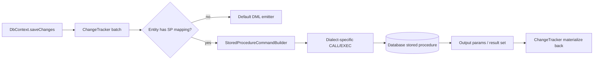

# Stored Procedure Mapping for Insert/Update/Delete

## 1. Why (problem statement)

EF Core 7+ lets users map entity CUD operations onto existing stored procedures, which is common in enterprise databases where DBAs own write paths, auditing logic lives in procs, or row-level security is enforced inside the database. `ts-linq` today emits inline `INSERT`/`UPDATE`/`DELETE` statements from `SaveChanges` and offers no way to redirect those operations through user-defined procedures. Closing this gap unlocks adoption in regulated environments and large legacy estates where direct DML is forbidden.

## 2. EF Core reference syntax (must be preserved verbatim)

```csharp
modelBuilder.Entity<Person>()
    .InsertUsingStoredProcedure(
        "Person_Insert",
        spb => spb
            .HasParameter(p => p.Name)
            .HasParameter(p => p.Id, p => p.IsOutput()))
    .UpdateUsingStoredProcedure(
        "Person_Update",
        spb => spb
            .HasOriginalValueParameter(p => p.Id)
            .HasParameter(p => p.Name)
            .HasRowsAffectedResultColumn())
    .DeleteUsingStoredProcedure(
        "Person_Delete",
        spb => spb.HasOriginalValueParameter(p => p.Id));
```

TypeScript shape that `ts-linq` must mirror (signatures only, no implementation):

```ts
modelBuilder.entity<Person>()
  .insertUsingStoredProcedure(
    'Person_Insert',
    spb => spb
      .hasParameter(p => p.name)
      .hasParameter(p => p.id, p => p.isOutput()))
  .updateUsingStoredProcedure(
    'Person_Update',
    spb => spb
      .hasOriginalValueParameter(p => p.id)
      .hasParameter(p => p.name)
      .hasRowsAffectedResultColumn())
  .deleteUsingStoredProcedure(
    'Person_Delete',
    spb => spb.hasOriginalValueParameter(p => p.id));

interface StoredProcedureBuilder<T> {
  hasParameter<K extends keyof T>(selector: (t: T) => T[K], cfg?: (p: SpParamBuilder) => SpParamBuilder): this;
  hasOriginalValueParameter<K extends keyof T>(selector: (t: T) => T[K]): this;
  hasRowsAffectedParameter(): this;
  hasRowsAffectedResultColumn(): this;
  hasRowsAffectedReturnValue(): this;
}
```

> Hard rule: the public TypeScript names, chaining order, and semantics MUST match EF Core. Internal implementation is free to deviate.

## 3. Architecture Decision Record (ADR)



- **Decision**: Add a parallel `StoredProcedureMapping` registry on entity metadata; `SaveChanges` consults it before invoking the default DML path.
- **Context**: Current `SaveChanges` pipeline already groups changes per entity-type; injecting a strategy lookup is a localized change versus rewriting the dispatcher.
- **Consequences**: (+) Clean separation, minimal blast radius. (-) Two code paths to maintain. (~) Concurrency token logic must be duplicated for the SP path.

## 4. Technical & architectural description

- **Affected packages**: `@ts-linq/metadata` (new `StoredProcedureMapping` model), `@ts-linq/orm` (SaveChanges dispatcher), `@ts-linq/sql-visitor` (call-statement builder), `@ts-linq/dialect-*` (per-dialect call syntax).
- **New types / files**:
  - `packages/metadata/src/stored-procedure-mapping.ts` — model + builder
  - `packages/orm/src/save-changes/sp-executor.ts` — execution path
  - `packages/sql-visitor/src/sp-call-emitter.ts` — dialect-neutral AST → call SQL
  - `packages/dialect-*/src/sp-syntax.ts` — `EXEC` (MSSQL), `CALL` (PG/MySQL)
- **Touch-points**: `packages/orm/src/db-context.ts` (SaveChanges loop), `packages/metadata/src/entity-type-builder.ts` (fluent surface).
- **Data flow**: Entity entry → mapping lookup → parameter binding (current + original) → dialect call SQL → execute → read output params/result columns → propagate generated PKs/rows-affected back into ChangeTracker.

## 5. Implementation options

### Option A — Strategy pattern in SaveChanges dispatcher
- Pros: Localized, easy to test in isolation, no churn to default path.
- Cons: Concurrency token handling repeated.
- Effort: L

### Option B — Translate SP mapping to virtual `INSERT/UPDATE/DELETE` AST nodes
- Pros: One execution path.
- Cons: AST contorts to represent `EXEC` semantics; output parameter binding leaks abstractions.

### Recommendation
Option A — explicit strategy is more honest about the divergence between DML and call statements and keeps the AST clean.

## 6. Related problems / follow-up tasks

- `[P0-04](./P0-04-execute-update-delete.md)` — bulk operations are a different write path; SP mapping is row-by-row.
- `[P2-46](./P2-46-batching-max-batch-size.md)` — SP path bypasses MaxBatchSize batching; must document the regression.

## 7. Acceptance criteria

- [ ] Public API mirrors EF Core signature including builder chain order
- [ ] Unit tests cover parameter direction (input/output/inout), original-value params, rows-affected channels
- [ ] Integration test against MSSQL (EXEC) and PostgreSQL (CALL)
- [ ] Docs in `apps/docs/` updated with a worked example per dialect
- [ ] No regressions in `pnpm typecheck`, `pnpm arch:deps`, `pnpm arch:cycles`, `pnpm arch:dead`

## 8. Pre-PR sweep (mandatory)

Before opening the PR for this task:

1. Re-read every `dev-plans/*.md` whose `status != done`.
2. For each, decide whether assumptions changed because of this task. If yes — update the affected sections (especially **Implementation options**, **depends_on**, **ts_linq_packages_touched**).
3. Record sweep results in the PR description under `## Cross-task sweep` with the bullet list:
   - `P?-??` — no change / updated section X / status moved to `blocked` because Y
4. Only after the sweep is recorded, open the PR.
