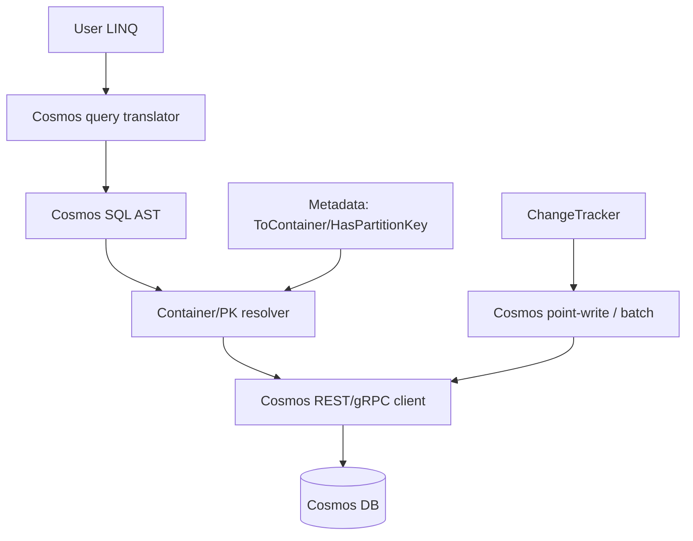

# Cosmos DB Provider (Hierarchical Partition Keys, Full-Text, Vector Search)

## 1. Why (problem statement)

EF Core has shipped a Cosmos DB provider since v3 and added hierarchical partition keys, full-text search, and vector search through EF8/9. `ts-linq` is currently relational-only (PG/MySQL/MSSQL). A Cosmos provider opens NoSQL workloads, multi-region globally distributed apps, and AI/vector scenarios. Cosmos differs fundamentally from SQL dialects (document store, partition keys, RU budget), so it deserves its own package.

## 2. EF Core reference syntax (must be preserved verbatim)

```csharp
services.AddDbContext<OrderContext>(o =>
    o.UseCosmos(
        accountEndpoint: endpoint,
        accountKey: key,
        databaseName: "OrdersDb"));

modelBuilder.Entity<Order>()
    .ToContainer("Orders")
    .HasPartitionKey(o => new { o.TenantId, o.UserId, o.Region })   // hierarchical
    .HasNoDiscriminator();

var hits = ctx.Documents
    .Where(d => EF.Functions.FullTextContains(d.Body, "claude"))
    .ToList();
```

TypeScript shape that `ts-linq` must mirror (signatures only, no implementation):

```ts
dbContextOptions.useCosmos({
  accountEndpoint: endpoint,
  accountKey: key,
  databaseName: 'OrdersDb',
});

modelBuilder.entity<Order>()
  .toContainer('Orders')
  .hasPartitionKey(o => [o.tenantId, o.userId, o.region]) // hierarchical
  .hasNoDiscriminator();

const hits = ctx.documents
  .where(d => ef.functions.fullTextContains(d.body, 'claude'))
  .toArray();
```

> Hard rule: the public TypeScript names, chaining order, and semantics MUST match EF Core. Internal implementation is free to deviate.

## 3. Architecture Decision Record (ADR)



- **Decision**: Introduce `@ts-linq/provider-cosmos` + `@ts-linq/dialect-cosmos`. Reuse `@ts-linq/query` AST but add a NoSQL-specific visitor; reuse `@ts-linq/metadata` with Cosmos-specific fluent extensions (`toContainer`, `hasPartitionKey`).
- **Context**: Cosmos SQL is a different language; emitting it via the existing relational visitor would entangle relational concerns. A parallel visitor is cleaner.
- **Consequences**: (+) Clean separation. (-) Some duplication of AST→SQL plumbing. (~) Many relational features (JOIN across containers, FK navigation) don't apply — must error clearly.

## 4. Technical & architectural description

- **Affected packages**: New `@ts-linq/provider-cosmos`, new `@ts-linq/dialect-cosmos`; touch `@ts-linq/core` (option-builder hook), `@ts-linq/metadata` (Cosmos fluent surface), `@ts-linq/query` (no change expected, AST stays neutral).
- **New types / files**:
  - `packages/provider-cosmos/` (new package)
    - `src/cosmos-client.ts`, `src/cosmos-connection.ts`, `src/cosmos-command.ts`
    - `src/save-changes-cosmos.ts` (point writes, batch with TransactionalBatch)
  - `packages/dialect-cosmos/` (new package)
    - `src/cosmos-sql-visitor.ts`
    - `src/full-text-functions.ts`
    - `src/vector-functions.ts`
  - Metadata: `ToContainer`, `HasPartitionKey` (composite), `HasNoDiscriminator`, `HasShadowId`, `UseETagConcurrency`
- **Touch-points**: option-builder in `@ts-linq/core` must register Cosmos provider factory.
- **Data flow**: LINQ → AST → Cosmos visitor → Cosmos SQL string + partition key extracted from predicate → Cosmos client query → documents deserialized → ChangeTracker.

## 5. Implementation options

### Option A — Two new packages (provider + dialect), separate visitor
- Pros: Clean boundaries; relational core stays untouched.
- Cons: Largest surface area.
- Effort: XL

### Option B — Single package with embedded dialect
- Pros: Less package overhead.
- Cons: Violates the existing dialect/provider split.

### Recommendation
Option A — consistency with the relational provider layout matters more than minimizing package count.

## 6. Related problems / follow-up tasks

- `[P0-03](./P0-03-from-sql-raw.md)` — `FromSqlRaw` semantics differ on Cosmos (no parameterized container DDL); base abstraction must allow this.
- `[P0-04](./P0-04-execute-update-delete.md)` — Cosmos bulk-update path is point-write iteration; ExecuteUpdate abstraction must accept this.
- `[P2-48](./P2-48-vector-search.md)` — vector search hard-depends on this provider.
- `[P2-38](./P2-38-sqlite-provider.md)`, `[P2-39](./P2-39-in-memory-provider.md)` — sibling provider work.

## 7. Acceptance criteria

- [ ] Public API mirrors `UseCosmos`, `ToContainer`, `HasPartitionKey` (hierarchical)
- [ ] Unit tests cover Cosmos SQL emission for `Where`/`Select`/`OrderBy`/`Take`
- [ ] Integration test against Cosmos emulator
- [ ] Partition-key extraction from predicate documented and tested
- [ ] Docs in `apps/docs/` updated with NoSQL caveats
- [ ] No regressions in `pnpm typecheck`, `pnpm arch:deps`, `pnpm arch:cycles`, `pnpm arch:dead`

## 8. Pre-PR sweep (mandatory)

Before opening the PR for this task:

1. Re-read every `dev-plans/*.md` whose `status != done`.
2. For each, decide whether assumptions changed because of this task. If yes — update the affected sections (especially **Implementation options**, **depends_on**, **ts_linq_packages_touched**).
3. Record sweep results in the PR description under `## Cross-task sweep` with the bullet list:
   - `P?-??` — no change / updated section X / status moved to `blocked` because Y
4. Only after the sweep is recorded, open the PR.
