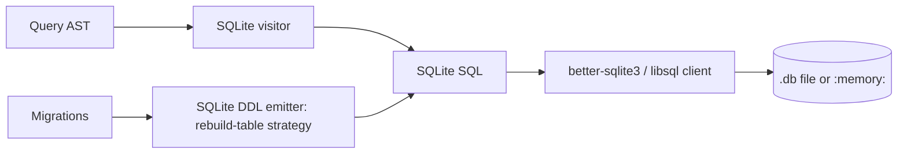

# First-Class SQLite Provider with :memory: Mode

## 1. Why (problem statement)

SQLite is the default lightweight provider for EF Core demos, tests, and embedded scenarios; its `:memory:` mode is the standard way to run integration tests without a containerized DB. `ts-linq` currently lacks SQLite entirely. Adding it gives users an offline development story, dramatically faster CI, and a familiar EF entry-point. SQLite's relaxed type system and limited ALTER TABLE require dedicated dialect handling.

## 2. EF Core reference syntax (must be preserved verbatim)

```csharp
services.AddDbContext<AppContext>(o =>
    o.UseSqlite("Data Source=app.db"));

// In-memory
services.AddDbContext<AppContext>(o =>
    o.UseSqlite("Data Source=:memory:;Cache=Shared"));
```

TypeScript shape that `ts-linq` must mirror (signatures only, no implementation):

```ts
dbContextOptions.useSqlite({ dataSource: 'app.db' });
dbContextOptions.useSqlite({ dataSource: ':memory:', cache: 'shared' });

// Functions exposed on EF.functions for SQLite:
ef.functions.glob(pattern, value);
ef.functions.like(pattern, value);
ef.functions.dateTimeAdd(...);
```

> Hard rule: the public TypeScript names, chaining order, and semantics MUST match EF Core. Internal implementation is free to deviate.

## 3. Architecture Decision Record (ADR)



- **Decision**: Adopt `better-sqlite3` for Node and `libsql` for cross-runtime; abstract behind a connection adapter so users can swap drivers.
- **Context**: SQLite is single-process / file-based; we need synchronous and async client variants because `better-sqlite3` is synchronous and `libsql` is async.
- **Consequences**: (+) Choice for users. (-) Two client adapters to maintain. (~) ALTER TABLE limitations force the rebuild-table migration strategy.

## 4. Technical & architectural description

- **Affected packages**: New `@ts-linq/provider-sqlite`, new `@ts-linq/dialect-sqlite`; touch `@ts-linq/migrations` (rebuild-table strategy), `@ts-linq/core` (option hook).
- **New types / files**:
  - `packages/provider-sqlite/src/sqlite-client.ts` (adapter interface)
  - `packages/provider-sqlite/src/better-sqlite3-driver.ts`
  - `packages/provider-sqlite/src/libsql-driver.ts`
  - `packages/dialect-sqlite/src/sqlite-sql-visitor.ts`
  - `packages/dialect-sqlite/src/sqlite-type-mapping.ts` (TEXT/INTEGER/REAL/BLOB only)
  - `packages/migrations/src/sqlite-rebuild-table-strategy.ts`
- **Touch-points**: type mapping table — SQLite has 4 storage classes; `decimal`/`datetime` need affinity-based encoding.
- **Data flow**: As relational providers; difference is migrations must rebuild tables to drop/alter columns.

## 5. Implementation options

### Option A — Single driver (`better-sqlite3`)
- Pros: Simple, fast, battle-tested.
- Cons: Node-only, native binding.
- Effort: M

### Option B — Adapter interface with two drivers
- Pros: Cross-runtime (Deno/Bun via libsql).
- Cons: More code.
- Effort: L

### Recommendation
Option B — adapter pattern matches the existing `@ts-linq/provider-*` design where the connection is pluggable.

## 6. Related problems / follow-up tasks

- `[P0-03](./P0-03-from-sql-raw.md)`, `[P0-04](./P0-04-execute-update-delete.md)` — required write abstractions.
- `[P2-39](./P2-39-in-memory-provider.md)` — `:memory:` overlaps with in-memory provider; document which to pick.
- `[P2-42](./P2-42-migration-bundles-idempotent.md)` — SQLite needs rebuild-table strategy aware of bundles.

## 7. Acceptance criteria

- [ ] Public API exposes `useSqlite` with file and `:memory:` modes
- [ ] Unit tests cover SQLite-specific SQL (GLOB, datetime modifiers, type affinity)
- [ ] Integration test on `better-sqlite3` driver
- [ ] Migrations rebuild-table strategy tested for drop/alter column
- [ ] Docs in `apps/docs/` cover affinity caveats
- [ ] No regressions in `pnpm typecheck`, `pnpm arch:deps`, `pnpm arch:cycles`, `pnpm arch:dead`

## 8. Pre-PR sweep (mandatory)

Before opening the PR for this task:

1. Re-read every `dev-plans/*.md` whose `status != done`.
2. For each, decide whether assumptions changed because of this task. If yes — update the affected sections (especially **Implementation options**, **depends_on**, **ts_linq_packages_touched**).
3. Record sweep results in the PR description under `## Cross-task sweep` with the bullet list:
   - `P?-??` — no change / updated section X / status moved to `blocked` because Y
4. Only after the sweep is recorded, open the PR.
