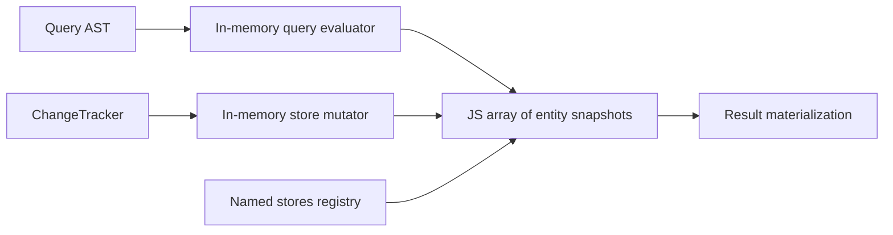

# In-Memory Provider for Unit Tests

## 1. Why (problem statement)

EF Core ships an in-memory provider for fast unit tests that don't need true relational semantics. It's deliberately non-relational — no FK constraints, no transactions, no SQL — and EF officially recommends SQLite `:memory:` for higher fidelity. `ts-linq` should offer the same trade-off: a zero-dependency provider for pure-logic tests with documented caveats.

## 2. EF Core reference syntax (must be preserved verbatim)

```csharp
services.AddDbContext<AppContext>(o =>
    o.UseInMemoryDatabase(databaseName: "TestDb_1"));

// Each unique name gets an isolated store.
```

TypeScript shape that `ts-linq` must mirror (signatures only, no implementation):

```ts
dbContextOptions.useInMemoryDatabase({ databaseName: 'TestDb_1' });

// Caveats interface — surface intentionally limited
interface InMemoryOptions {
  databaseName: string;
  ignoreTransactions?: boolean;     // default true
  enforceUniqueConstraints?: boolean; // default true (in-mem subset)
}
```

> Hard rule: the public TypeScript names, chaining order, and semantics MUST match EF Core. Internal implementation is free to deviate.

## 3. Architecture Decision Record (ADR)



- **Decision**: Evaluate the query AST against a JS object store keyed by entity type; never produce SQL.
- **Context**: We already have an AST; an interpreter is the smallest viable path. Stores are global by `databaseName` to mirror EF.
- **Consequences**: (+) Zero dependency; very fast. (-) Behavior diverges from real DB on FK / unique / null-comparison semantics — must be documented. (~) Some translation features (window functions) are unsupported.

## 4. Technical & architectural description

- **Affected packages**: New `@ts-linq/provider-in-memory`; touch `@ts-linq/core` (option hook), `@ts-linq/query` (visitor pattern reuse).
- **New types / files**:
  - `packages/provider-in-memory/src/in-memory-store.ts` — `Map<EntityType, Map<PK, RowSnapshot>>`
  - `packages/provider-in-memory/src/in-memory-query-evaluator.ts` — AST interpreter
  - `packages/provider-in-memory/src/in-memory-save-changes.ts`
  - `packages/provider-in-memory/src/store-registry.ts` — global named stores
- **Touch-points**: option-builder factory registration in `@ts-linq/core`.
- **Data flow**: LINQ → AST → interpreter walks the AST node-by-node against JS arrays → results. SaveChanges mutates the same arrays.

## 5. Implementation options

### Option A — Pure AST interpreter
- Pros: Reuses existing AST; correct LINQ semantics by construction.
- Cons: Slower than direct JS expressions.
- Effort: M

### Option B — Generate JS expression functions from AST
- Pros: Faster.
- Cons: More complexity; debugging is harder.

### Recommendation
Option A — speed isn't the goal of an in-memory provider; correctness and AST reuse are.

## 6. Related problems / follow-up tasks

- `[P2-38](./P2-38-sqlite-provider.md)` — recommended higher-fidelity alternative; docs should cross-link.
- `[P0-04](./P0-04-execute-update-delete.md)` — bulk operations on in-memory store iterate JS arrays.

## 7. Acceptance criteria

- [ ] Public API exposes `useInMemoryDatabase`
- [ ] Unit tests cover Where/Select/GroupBy/Join interpretation
- [ ] Named-store isolation tested
- [ ] Documented caveats list (FK, transactions, null semantics)
- [ ] Docs recommend SQLite `:memory:` as higher-fidelity alternative
- [ ] No regressions in `pnpm typecheck`, `pnpm arch:deps`, `pnpm arch:cycles`, `pnpm arch:dead`

## 8. Pre-PR sweep (mandatory)

Before opening the PR for this task:

1. Re-read every `dev-plans/*.md` whose `status != done`.
2. For each, decide whether assumptions changed because of this task. If yes — update the affected sections (especially **Implementation options**, **depends_on**, **ts_linq_packages_touched**).
3. Record sweep results in the PR description under `## Cross-task sweep` with the bullet list:
   - `P?-??` — no change / updated section X / status moved to `blocked` because Y
4. Only after the sweep is recorded, open the PR.
