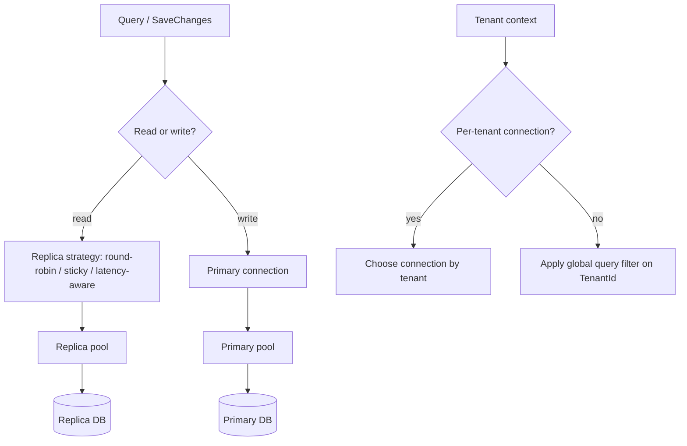

# Read Replica Routing and Multi-Tenancy

## 1. Why (problem statement)

Production EF Core users routinely combine two patterns the framework doesn't ship out of the box: (1) **read-replica routing** — direct read-only queries to a follower while writes hit the primary; (2) **multi-tenancy** with per-tenant connection strings or shared-DB tenant-scoped filtering. `ts-linq` already has a multi-tenant plugin (filter-based) but no replica routing or per-tenant connection strategy. Closing this gap is what makes `ts-linq` viable for SaaS deployments.

## 2. EF Core reference syntax (must be preserved verbatim)

```csharp
// Per-context connection switch
ctx.Database.SetConnectionString(replicaConnString);

// Global query filter for tenant scoping
modelBuilder.Entity<Order>()
    .HasQueryFilter(o => o.TenantId == _tenantContext.CurrentTenantId);

// Factory-based per-tenant DbContext
services.AddDbContextFactory<AppContext>((sp, o) => {
    var tenant = sp.GetRequiredService<ITenantContext>();
    o.UseSqlServer(tenant.ConnectionString);
});
```

TypeScript shape that `ts-linq` must mirror (signatures only, no implementation):

```ts
// Per-context connection switch (read replica path)
ctx.database.setConnectionString(replicaConnString);

// Or declarative read/write split
dbContextOptions
  .useReadReplicas([replicaA, replicaB], { strategy: 'round-robin' })
  .useWriter(primary);

// Global query filter
modelBuilder.entity<Order>()
  .hasQueryFilter(o => o.tenantId === tenantContext.currentTenantId);

// Factory-based per-tenant
container.addDbContextFactory<AppContext>((sp, o) => {
  const tenant = sp.get<ITenantContext>('ITenantContext');
  o.usePostgres(tenant.connectionString);
});
```

> Hard rule: the public TypeScript names, chaining order, and semantics MUST match EF Core. Internal implementation is free to deviate.

## 3. Architecture Decision Record (ADR)



- **Decision**: Add a `ConnectionRouter` abstraction (consulted by every `DbCommand` execution) and extend the existing multi-tenant plugin with a per-tenant-connection strategy.
- **Context**: All command execution already goes through `DbContext.Database`; injecting a router is a contained change.
- **Consequences**: (+) Clean read/write split. (-) Read-after-write consistency hazards must be documented. (~) Combining pooling (`P2-40`) with per-tenant connections requires pool sharding.

## 4. Technical & architectural description

- **Affected packages**: `@ts-linq/orm` (router + tenant binding), `@ts-linq/core` (option-builder), `@ts-linq/metadata` (global filter already exists — extend with tenant context hook); the existing multi-tenant plugin gets a per-tenant-connection mode.
- **New types / files**:
  - `packages/orm/src/connections/connection-router.ts`
  - `packages/orm/src/connections/replica-strategy.ts` (round-robin, sticky, weighted)
  - `packages/orm/src/connections/read-write-classifier.ts` (queries vs SaveChanges)
  - `packages/orm/src/multi-tenancy/per-tenant-connection.ts`
- **Touch-points**: `packages/orm/src/db-context.ts` — execute path must consult router; existing multi-tenant plugin must expose connection-string hook.
- **Data flow**: Command about to execute → classify read/write → router picks connection → executes → entity materialization unchanged.

## 5. Implementation options

### Option A — Router abstraction + extension of existing plugin
- Pros: Reuses today's infrastructure; clean DI story.
- Cons: Two patterns intertwine (replicas × tenants) → matrix of pools.
- Effort: L

### Option B — Separate plugin per concern
- Pros: Smaller per-PR.
- Cons: Combining them later is harder.

### Recommendation
Option A — replicas and per-tenant routing are often deployed together; a unified abstraction prevents an awkward retrofit.

## 6. Related problems / follow-up tasks

- `[P2-40](./P2-40-db-context-pooling-factory.md)` — pools must shard by (connection-string, role). Document combined behavior.

## 7. Acceptance criteria

- [ ] Public API exposes `useReadReplicas`, `useWriter`, per-tenant factory
- [ ] Unit tests for replica strategies (round-robin, sticky, weighted)
- [ ] Read/write classifier covers explicit transactions correctly
- [ ] Integration test on at least one dialect with a primary + replica pair
- [ ] Multi-tenant plugin extension test for per-tenant connection
- [ ] Docs in `apps/docs/` cover read-after-write consistency caveats
- [ ] No regressions in `pnpm typecheck`, `pnpm arch:deps`, `pnpm arch:cycles`, `pnpm arch:dead`

## 8. Pre-PR sweep (mandatory)

Before opening the PR for this task:

1. Re-read every `dev-plans/*.md` whose `status != done`.
2. For each, decide whether assumptions changed because of this task. If yes — update the affected sections (especially **Implementation options**, **depends_on**, **ts_linq_packages_touched**).
3. Record sweep results in the PR description under `## Cross-task sweep` with the bullet list:
   - `P?-??` — no change / updated section X / status moved to `blocked` because Y
4. Only after the sweep is recorded, open the PR.
