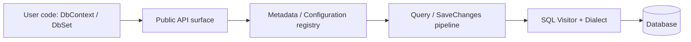

# <Title>

## 1. Why (problem statement)

One paragraph: what EF Core users expect, what `ts-linq` is missing today, and the user-visible value of closing this gap.

## 2. EF Core reference syntax (must be preserved verbatim)

```csharp
// canonical EF Core sample — copy from learn.microsoft.com or efcore source
```

TypeScript shape that `ts-linq` must mirror (signatures only, no implementation):

```ts
// mirrored API surface
```

> Hard rule: the public TypeScript names, chaining order, and semantics MUST match EF Core. Internal implementation is free to deviate.

## 3. Architecture Decision Record (ADR)



- **Decision**: <one-line decision>
- **Context**: why this approach fits `ts-linq` architecture today
- **Consequences**: positive / negative / neutral side-effects

## 4. Technical & architectural description

- **Affected packages**: e.g. `@ts-linq/orm`, `@ts-linq/metadata`, `@ts-linq/query`, `@ts-linq/sql-visitor`, `@ts-linq/dialect-*`, `@ts-linq/migrations`, `@ts-linq/transformer`
- **New types / files**: list types to introduce with target paths
- **Touch-points** in existing code (with `packages/.../*.ts` paths)
- **Data flow** description

## 5. Implementation options

### Option A — <name>
- Pros
- Cons
- Effort: S/M/L/XL

### Option B — <name>
- Pros
- Cons

### Recommendation
Option X because ...

## 6. Related problems / follow-up tasks

- `[P?-??](./P?-??-...md)` — relationship description
- (Use this section for cross-links to sibling tasks)

## 7. Acceptance criteria

- [ ] Public API mirrors EF Core signature
- [ ] Unit tests cover ...
- [ ] Integration test against at least one dialect
- [ ] Docs in `apps/docs/` updated
- [ ] No regressions in `pnpm typecheck`, `pnpm arch:deps`, `pnpm arch:cycles`, `pnpm arch:dead`

## 8. Pre-PR sweep (mandatory)

Before opening the PR for this task:

1. Re-read every `dev-plans/*.md` whose `status != done`.
2. For each, decide whether assumptions changed because of this task. If yes — update the affected sections (especially **Implementation options**, **depends_on**, **ts_linq_packages_touched**).
3. Record sweep results in the PR description under `## Cross-task sweep` with the bullet list:
   - `P?-??` — no change / updated section X / status moved to `blocked` because Y
4. Only after the sweep is recorded, open the PR.
