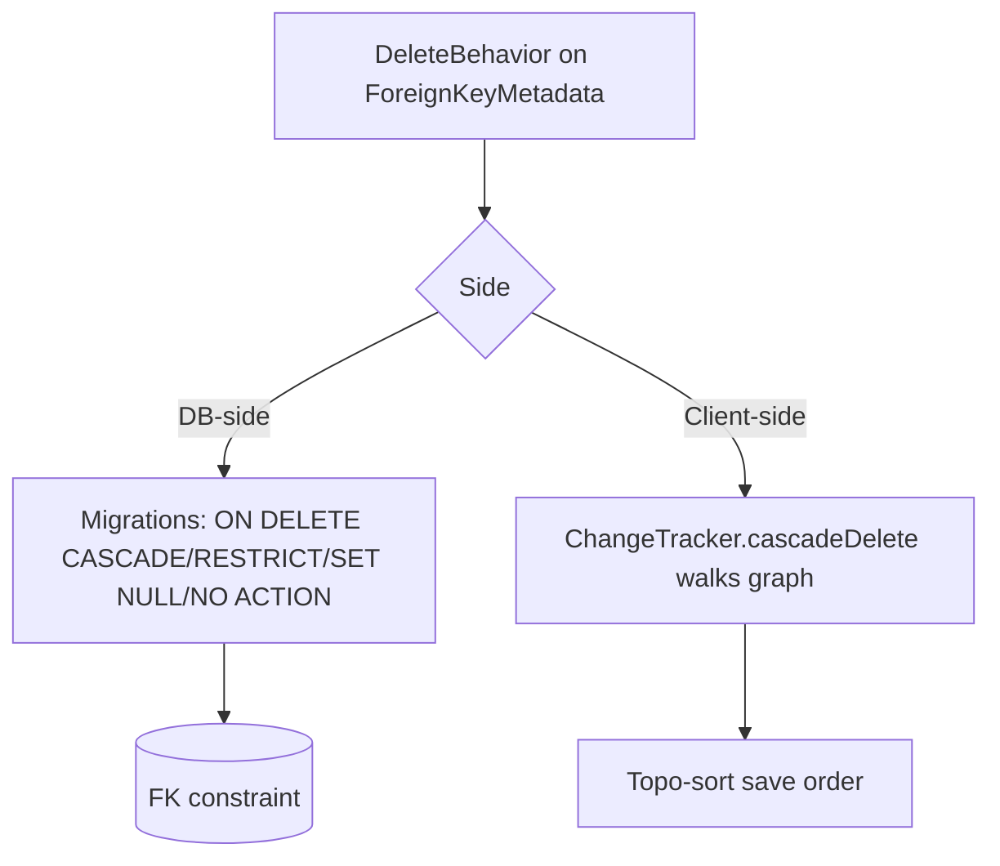

# Cascade Delete Behaviors

## 1. Why (problem statement)

EF Core distinguishes seven delete behaviors that determine what happens to dependents when a principal is deleted, split between the database (FK action) and the change tracker (client-side fixup). `ts-linq` today has a single hard-coded behavior: emit `ON DELETE NO ACTION` in DDL and let the database decide, with no client-side cascade. Real applications need at least `Cascade`, `Restrict`, `SetNull`, and the `Client*` variants for soft-delete scenarios that must not hit the DB. This task wires per-relationship delete behavior into both the migration DDL emitter and the change-tracker save algorithm.

## 2. EF Core reference syntax (must be preserved verbatim)

```csharp
modelBuilder.Entity<Post>()
  .HasOne(p => p.Blog)
  .WithMany(b => b.Posts)
  .OnDelete(DeleteBehavior.Cascade);

modelBuilder.Entity<Comment>()
  .HasOne(c => c.Post)
  .WithMany()
  .OnDelete(DeleteBehavior.Restrict);

modelBuilder.Entity<Author>()
  .HasMany(a => a.Books)
  .WithOne(b => b.Author)
  .OnDelete(DeleteBehavior.SetNull);
```

TypeScript shape that `ts-linq` must mirror:

```ts
export enum DeleteBehavior {
  Cascade = 'Cascade',
  Restrict = 'Restrict',
  SetNull = 'SetNull',
  ClientSetNull = 'ClientSetNull',     // default for optional
  NoAction = 'NoAction',
  ClientCascade = 'ClientCascade',     // default for required
  ClientNoAction = 'ClientNoAction',
}

export class ReferenceCollectionBuilder<TPrin, TDep> {
  onDelete(behavior: DeleteBehavior): this;
}

export class ReferenceReferenceBuilder<T, TRel> {
  onDelete(behavior: DeleteBehavior): this;
}
```

> Hard rule: public TypeScript names and chaining order MUST match EF Core.

## 3. Architecture Decision Record (ADR)



- **Decision**: Each behavior maps to (a) a DDL clause when the DB enforces, (b) a client-side traversal step when "Client*" or the cascade must precede the DB write.
- **Context**: `ChangeTracker` already has a save-order step; we add a pre-pass that visits dependents.
- **Consequences**:
  - (+) Predictable, documented behavior under all combinations.
  - (+) `ClientSetNull` enables idiomatic soft-delete patterns.
  - (−) Requires graph walk on delete — bounded by entities currently tracked.

## 4. Technical & architectural description

- **Affected packages**: `@ts-linq/metadata`, `@ts-linq/orm`, `@ts-linq/migrations`, `@ts-linq/sql-visitor`
- **New types / files**:
  - `packages/metadata/src/DeleteBehavior.ts`
  - `packages/orm/src/changetracker/CascadeWalker.ts`
- **Touch-points**:
  - `packages/metadata/src/ForeignKeyMetadata.ts` — add `deleteBehavior`.
  - `packages/orm/src/builders/ReferenceReferenceBuilder.ts` & sibling — `onDelete`.
  - `packages/orm/src/ChangeTracker.ts` — invoke `CascadeWalker` on each entity marked deleted.
  - `packages/migrations/src/SchemaComparator.ts` — map behavior to FK action clause; emit `RESTRICT` / `CASCADE` / `SET NULL` / `NO ACTION`.
- **Data flow**: when an entity is marked `Deleted`, walker enumerates dependents per FK. `Cascade` ⇒ mark dependents deleted; `SetNull` ⇒ null the FK column on dependents; `Restrict`/`NoAction` ⇒ leave alone (DB will error if violated); `Client*` variants apply only on tracker side, DB still gets `NO ACTION`.

## 5. Implementation options

### Option A — Full seven-mode mapping with shared walker (recommended)
- Pros: EF parity, exact semantics, no surprises.
- Cons: must document the matrix clearly.
- Effort: M

### Option B — Implement only DB-side behaviors; ignore Client* variants
- Pros: less code.
- Cons: soft-delete and detached-entity cases break.
- Effort: S

### Option C — Defer to provider drivers, drop FK action from migration
- Pros: minimal code.
- Cons: ts-linq stops owning the schema; no longer authoritative.
- Effort: S

### Recommendation
Option A. The matrix is small but load-bearing for correctness.

## 6. Related problems / follow-up tasks

- [P0-01](./P0-01-fluent-api-modelbuilder.md) — `onDelete` lives on navigation builders.
- [P0-08](./P0-08-many-to-many-skip-navigations.md) — join-table FKs need their own delete behavior.
- [P0-10](./P0-10-concurrency-tokens-rowversion.md) — concurrency tokens may guard cascading updates.

## 7. Acceptance criteria

- [ ] Public API mirrors EF Core signature with all seven values.
- [ ] DDL emits correct FK clause per behavior in postgres / mysql / mssql.
- [ ] Client-side walker handles `Cascade`, `ClientCascade`, `SetNull`, `ClientSetNull`.
- [ ] Cycle detection prevents infinite walks on self-referencing FKs.
- [ ] Unit tests for every behavior; integration test asserts DB-side action.
- [ ] No regressions in `pnpm typecheck`, `pnpm arch:deps`, `pnpm arch:cycles`, `pnpm arch:dead`.

## 8. Pre-PR sweep (mandatory)

Before opening the PR for this task:

1. Re-read every `dev-plans/*.md` whose `status != done`.
2. For each, decide whether assumptions changed because of this task. If yes — update the affected sections (especially **Implementation options**, **depends_on**, **ts_linq_packages_touched**).
3. Record sweep results in the PR description under `## Cross-task sweep` with the bullet list:
   - `P?-??` — no change / updated section X / status moved to `blocked` because Y
4. Only after the sweep is recorded, open the PR.
