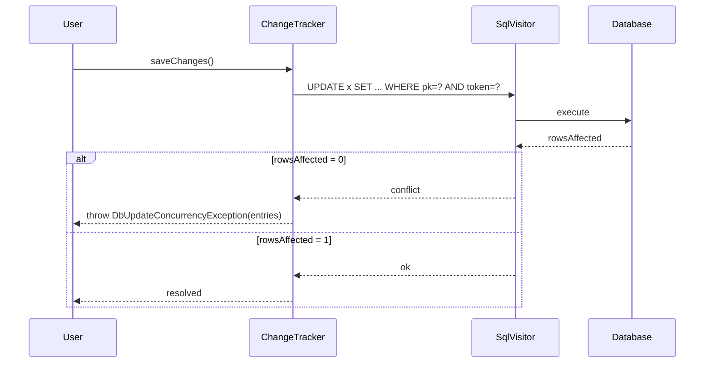

# Concurrency Tokens & RowVersion

## 1. Why (problem statement)

Optimistic concurrency is table stakes for any multi-writer system. EF Core lets users mark columns as concurrency tokens (any column whose previous value is included in the WHERE of UPDATE/DELETE) or `RowVersion` (an auto-incrementing timestamp/`bytea`/`rowversion` updated by the DB). On conflict, EF throws `DbUpdateConcurrencyException` carrying the offending entries. `ts-linq` has none of this — last-writer-wins is the only behavior, which is unacceptable for collaborative editing, financial workflows, or distributed services. We need the metadata, the WHERE-clause injection in saves, the exception, and the recovery helpers (`reload`, `getDatabaseValues`).

## 2. EF Core reference syntax (must be preserved verbatim)

```csharp
modelBuilder.Entity<Article>()
  .Property(a => a.Title)
  .IsConcurrencyToken();

modelBuilder.Entity<Article>()
  .Property(a => a.RowVersion)
  .IsRowVersion();

try {
  await ctx.SaveChangesAsync();
} catch (DbUpdateConcurrencyException ex) {
  foreach (var entry in ex.Entries) {
    var dbValues = await entry.GetDatabaseValuesAsync();
    await entry.ReloadAsync();
  }
}
```

TypeScript shape that `ts-linq` must mirror:

```ts
export class PropertyBuilder<TProp> {
  isConcurrencyToken(yes?: boolean): this;
  isRowVersion(): this;
}

export class DbUpdateConcurrencyException extends Error {
  readonly entries: EntityEntry[];
}

export class EntityEntry<T = unknown> {
  reload(): Promise<void>;
  getDatabaseValues(): Promise<Partial<T> | null>;
}
```

> Hard rule: public TypeScript names MUST match EF Core.

## 3. Architecture Decision Record (ADR)



- **Decision**: Mark properties as concurrency tokens in metadata. The save-emitter appends `AND token = @originalValue` to UPDATE/DELETE WHERE clauses. If `rowsAffected = 0`, throw `DbUpdateConcurrencyException` listing the failed entries.
- **Context**: `ChangeTracker` already snapshots originals per property — we have everything we need to bind the original value.
- **Consequences**:
  - (+) Optimistic concurrency without DB-specific code in user-land.
  - (+) `RowVersion` per-dialect: postgres `xmin` / mysql trigger / mssql `rowversion`.
  - (−) Failed batches need entry-level resolution — we expose `reload`/`getDatabaseValues`.

## 4. Technical & architectural description

- **Affected packages**: `@ts-linq/metadata`, `@ts-linq/orm`, `@ts-linq/sql-visitor`, `@ts-linq/dialect-*`
- **New types / files**:
  - `packages/orm/src/exceptions/DbUpdateConcurrencyException.ts`
  - `packages/orm/src/changetracker/EntityEntry.ts` — extend with `reload`, `getDatabaseValues`.
- **Touch-points**:
  - `packages/metadata/src/PropertyMetadata.ts` — add `isConcurrencyToken`, `isRowVersion`.
  - `packages/sql-visitor/src/visitors/SaveVisitor.ts` (or equivalent emitter) — append concurrency predicates.
  - `packages/dialect-postgres/src/PostgresDialect.ts` — `xmin::text` as row-version column.
  - `packages/dialect-mssql/src/MsSqlDialect.ts` — native `rowversion`.
  - `packages/dialect-mysql/src/MySqlDialect.ts` — emit trigger or use updated-at + version column convention.
- **Data flow**: UPDATE/DELETE built from change tracker; for every concurrency token, append `AND col = @orig`. Provider returns rowsAffected; mismatch ⇒ throw. After throw, `reload()` issues a SELECT by PK and rebases the snapshot.

## 5. Implementation options

### Option A — WHERE-injection + dialect rowversion per provider (recommended)
- Pros: portable, matches EF, gives users `xmin`/`rowversion`/trigger.
- Cons: triggers on mysql require migration emission.
- Effort: M

### Option B — Application-level version column managed by ts-linq
- Pros: dialect-agnostic.
- Cons: ignores the better native primitives (`xmin`, `rowversion`).
- Effort: S

### Option C — Pessimistic locking only (SELECT ... FOR UPDATE)
- Pros: simpler conceptually.
- Cons: not EF API; serialises writers.
- Effort: M

### Recommendation
Option A. Native row-version primitives are why they exist.

## 6. Related problems / follow-up tasks

- [P0-01](./P0-01-fluent-api-modelbuilder.md) — builder hosts `isConcurrencyToken/isRowVersion`.
- [P0-09](./P0-09-cascade-delete-behaviors.md) — cascade deletes must also enforce concurrency on parents.
- [P0-12](./P0-12-interceptors.md) — `ISaveChangesInterceptor` is the canonical hook for conflict resolution callbacks.

## 7. Acceptance criteria

- [ ] Public API mirrors EF Core signature.
- [ ] UPDATE/DELETE include concurrency tokens in WHERE clause.
- [ ] `DbUpdateConcurrencyException` thrown with populated `entries`.
- [ ] `entry.reload()` / `entry.getDatabaseValues()` round-trip correctly.
- [ ] Integration test simulates parallel writers in postgres and asserts conflict.
- [ ] Row-version backing types per dialect: postgres `xmin`, mssql `rowversion`, mysql convention documented.
- [ ] No regressions in `pnpm typecheck`, `pnpm arch:deps`, `pnpm arch:cycles`, `pnpm arch:dead`.

## 8. Pre-PR sweep (mandatory)

Before opening the PR for this task:

1. Re-read every `dev-plans/*.md` whose `status != done`.
2. For each, decide whether assumptions changed because of this task. If yes — update the affected sections (especially **Implementation options**, **depends_on**, **ts_linq_packages_touched**).
3. Record sweep results in the PR description under `## Cross-task sweep` with the bullet list:
   - `P?-??` — no change / updated section X / status moved to `blocked` because Y
4. Only after the sweep is recorded, open the PR.
