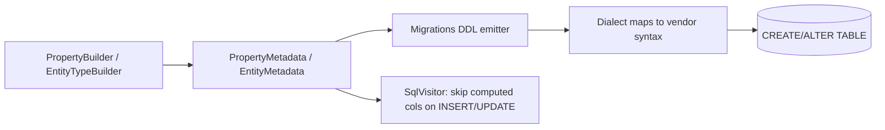

# Default Values, Computed Columns, Check Constraints, Comments

## 1. Why (problem statement)

The basic column-level metadata everyone needs and nobody can build without: server defaults (`createdAt DEFAULT now()`), computed columns (`fullName GENERATED ALWAYS AS (...)`), check constraints (`CHECK (age >= 0)`), column/table comments. EF Core ships fluent setters for each. `ts-linq` lacks all of them: every default has to be set client-side, computed values are impossible, check constraints are written by hand outside the migrations runner, and there's no way to surface a schema comment. This task lands the metadata + DDL emission across three dialects.

## 2. EF Core reference syntax (must be preserved verbatim)

```csharp
modelBuilder.Entity<User>()
  .Property(u => u.CreatedAt)
  .HasDefaultValueSql("now()");

modelBuilder.Entity<User>()
  .Property(u => u.Status)
  .HasDefaultValue(UserStatus.Pending);

modelBuilder.Entity<Invoice>()
  .Property(i => i.Total)
  .HasComputedColumnSql("subtotal + tax", stored: true);

modelBuilder.Entity<User>()
  .HasCheckConstraint("ck_user_age", "age >= 0");

modelBuilder.Entity<User>().HasComment("Application users");
modelBuilder.Entity<User>().Property(u => u.Email).HasComment("Login email");
```

TypeScript shape that `ts-linq` must mirror:

```ts
export class PropertyBuilder<TProp> {
  hasDefaultValue(value: TProp): this;
  hasDefaultValueSql(sql: string): this;
  hasComputedColumnSql(sql: string, options?: { stored?: boolean }): this;
  hasComment(comment: string): this;
}

export class EntityTypeBuilder<T> {
  hasCheckConstraint(name: string, sql: string): this;
  hasComment(comment: string): this;
}
```

> Hard rule: public TypeScript names MUST match EF Core.

## 3. Architecture Decision Record (ADR)



- **Decision**: Each capability is a metadata flag on `PropertyMetadata` or `EntityMetadata`. DDL emitter expands them at migration time using dialect-specific syntax; query emitter excludes computed columns from INSERT/UPDATE column lists.
- **Context**: Migrations already produce per-column DDL; we extend the column descriptor.
- **Consequences**:
  - (+) Server-side timestamps, generated columns, and integrity constraints become declarative.
  - (+) Comments power doc-generation downstream.
  - (−) Computed columns interact with seeds (P0-13) and converters (P0-05) — both must skip server-computed columns.

## 4. Technical & architectural description

- **Affected packages**: `@ts-linq/metadata`, `@ts-linq/orm`, `@ts-linq/migrations`, `@ts-linq/sql-visitor`, `@ts-linq/dialect-*`
- **New types / files**:
  - `packages/metadata/src/CheckConstraintMetadata.ts`
- **Touch-points**:
  - `packages/metadata/src/PropertyMetadata.ts` — add `defaultValue`, `defaultValueSql`, `computedColumnSql`, `isStored`, `comment`.
  - `packages/metadata/src/EntityMetadata.ts` — add `checkConstraints[]`, `comment`.
  - `packages/orm/src/builders/PropertyBuilder.ts` + `EntityTypeBuilder.ts` — fluent setters.
  - `packages/migrations/src/SchemaComparator.ts` — emit `DEFAULT`, `GENERATED`, `CHECK`, `COMMENT ON`.
  - `packages/sql-visitor/src/visitors/InsertVisitor.ts` / `UpdateVisitor.ts` — skip computed columns.
  - `packages/dialect-postgres/src/PostgresDialect.ts` — `GENERATED ALWAYS AS (...) STORED`, `COMMENT ON TABLE/COLUMN`.
  - `packages/dialect-mysql/src/MySqlDialect.ts` — `GENERATED ALWAYS AS (...) [VIRTUAL|STORED]`, inline `COMMENT '...'`.
  - `packages/dialect-mssql/src/MsSqlDialect.ts` — `AS (...)` for computed, `sp_addextendedproperty` for comments.
- **Data flow**: at DDL generation, metadata is asked for each column's defaults/computed/check/comment and rendered through the dialect. Query emitters consult metadata to exclude computed columns from INSERT/UPDATE.

## 5. Implementation options

### Option A — Per-feature metadata + per-dialect DDL emission (recommended)
- Pros: native syntax per dialect, best-quality DDL.
- Cons: triplicated dialect code.
- Effort: M

### Option B — Generic "raw DDL fragment" attached to property, no per-dialect knowledge
- Pros: minimal code.
- Cons: not portable; defeats the abstraction.
- Effort: S

### Option C — Implement defaults only, defer computed/check/comment
- Pros: scope.
- Cons: computed columns and checks are the high-value items.
- Effort: S

### Recommendation
Option A. The features only matter if they're portable across dialects.

## 6. Related problems / follow-up tasks

- [P0-01](./P0-01-fluent-api-modelbuilder.md) — builder host.
- [P0-05](./P0-05-value-converters.md) — `HasDefaultValue(value)` must apply the converter so the DDL literal is provider-shaped.
- [P0-13](./P0-13-has-data-seeding.md) — seed INSERTs must omit computed columns.

## 7. Acceptance criteria

- [ ] Public API mirrors EF Core signatures.
- [ ] `HasDefaultValue(value)` applies value converter before rendering DDL literal.
- [ ] Computed columns excluded from INSERT/UPDATE.
- [ ] Check constraints round-trip through migrations (add/remove diff).
- [ ] Comments emitted in all three dialects.
- [ ] No regressions in `pnpm typecheck`, `pnpm arch:deps`, `pnpm arch:cycles`, `pnpm arch:dead`.

## 8. Pre-PR sweep (mandatory)

Before opening the PR for this task:

1. Re-read every `dev-plans/*.md` whose `status != done`.
2. For each, decide whether assumptions changed because of this task. If yes — update the affected sections (especially **Implementation options**, **depends_on**, **ts_linq_packages_touched**).
3. Record sweep results in the PR description under `## Cross-task sweep` with the bullet list:
   - `P?-??` — no change / updated section X / status moved to `blocked` because Y
4. Only after the sweep is recorded, open the PR.
