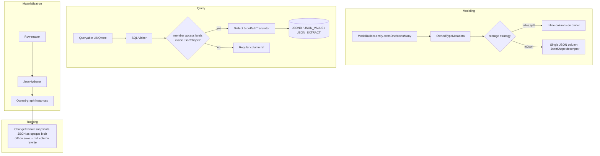

# JSON columns

## 1. Why (problem statement)

EF Core 7 introduced first-class JSON columns: an owned-type aggregate stored as a single JSON value in one column on the owner table. EF Core 8/9 expanded this with primitive collections and complex types in JSON. Users expect to model semi-structured data (preferences, settings, address books, audit payloads) without lifting every nested object into its own table — and still query inside it with normal LINQ (`Where(u => u.Preferences.Theme == "dark")`). `ts-linq` today has no JSON-storage strategy; user code has to round-trip `JSON.stringify` manually in a value converter and loses LINQ-into-JSON entirely. This task layers JSON storage on top of the owned-type machinery (P0-06) and the SQL Visitor.

## 2. EF Core reference syntax (must be preserved verbatim)

```csharp
modelBuilder.Entity<User>().OwnsOne(
    u => u.Preferences,
    b =>
    {
        b.ToJson();                          // single JSON column "Preferences"
        b.OwnsOne(p => p.Display);           // nested aggregate, still JSON
        b.OwnsMany(p => p.RecentSearches);   // arrays in JSON
    });

modelBuilder.Entity<Blog>().OwnsMany(
    b => b.Posts,
    pb =>
    {
        pb.ToJson();
        pb.OwnsMany(p => p.Tags);
    });

// Querying:
var dark = await ctx.Users
    .Where(u => u.Preferences.Display.Theme == "dark")
    .Where(u => u.Preferences.RecentSearches.Any(s => s.Query.Contains("efcore")))
    .ToListAsync();
```

TypeScript shape that `ts-linq` must mirror:

```ts
protected override onModelCreating(b: ModelBuilder): void {
  b.entity<User>().ownsOne(u => u.preferences, pb => {
    pb.toJson();
    pb.ownsOne(p => p.display);
    pb.ownsMany(p => p.recentSearches);
  });

  b.entity<Blog>().ownsMany(b => b.posts, pb => {
    pb.toJson();
    pb.ownsMany(p => p.tags);
  });
}

// Querying:
const dark = await ctx.users
  .where(u => u.preferences.display.theme === 'dark')
  .where(u => u.preferences.recentSearches.any(s => s.query.includes('efcore')))
  .toArray();
```

> Hard rule: `ToJson()` must be reachable from the same owned-type builder as P0-06 (no separate API surface).

## 3. Architecture Decision Record (ADR)



- **Decision**: extend the owned-type metadata from P0-06 with a `jsonStorage: JsonShape | null` flag. When set, the column is emitted as a single dialect-native JSON column and queries against owned members are routed through a new `JsonPathTranslator` per dialect. Change tracking serialises the entire owned subtree as a snapshot on first read and compares the re-serialised blob on save.
- **Context**: Postgres has `jsonb` with first-class indexing and path operators (`->`, `->>`, `@>`, `jsonb_path_query`); MSSQL exposes `JSON_VALUE`/`JSON_QUERY`/`OPENJSON`; MySQL has `JSON_EXTRACT`/`->`/`JSON_TABLE`. We need a thin dialect interface, not a polyfill.
- **Consequences**:
  - (+) Re-uses the entire owned-type pipeline from P0-06 — no parallel hierarchy of "JSON entity".
  - (+) Works with existing migrations (single column add/alter).
  - (−) Partial updates are not free — first cut diffs and rewrites the whole column. EF9-style `JsonSet` is deferred to a follow-up.
  - (−) Aggregate `Any`/`All`/`Count` inside JSON requires per-dialect translation; provider parity will lag.

## 4. Technical & architectural description

- **Affected packages**:
  - `@ts-linq/metadata` — add `JsonShape` descriptor (tree of member names + leaf converters), `toJson()` on owned-type builder, validation that nested owned types under a `toJson()` boundary inherit JSON storage.
  - `@ts-linq/orm` — `ChangeTracker` snapshot of owned graph as JSON string; entity loader hydrates the graph from JSON on materialisation.
  - `@ts-linq/sql-visitor` — new `JsonAccessRewriter` visitor stage that detects member access chains rooted in a JSON-stored owned property and replaces them with a `JsonPathExpression` AST node.
  - `@ts-linq/dialect-postgres` — translate `JsonPathExpression` to `col->'a'->'b'->>'c'` (text) or `(col->'a')::int` (cast); `IN`/`ANY` on JSON arrays via `jsonb_array_elements`.
  - `@ts-linq/dialect-mssql` — `JSON_VALUE(col, '$.a.b.c')` for scalars, `OPENJSON` for arrays, `JSON_QUERY` for nested objects.
  - `@ts-linq/dialect-mysql` — `JSON_EXTRACT(col, '$.a.b.c')` / `col->>'$.a.b.c'`.
  - `@ts-linq/migrations` — emit dialect-native JSON column type (`jsonb`, `nvarchar(max)` w/ CHECK ISJSON, `json`).

- **New types / files**:
  - `packages/metadata/src/JsonShape.ts` — descriptor with `properties: Map<string, JsonNode>`, `arrayOf?: JsonShape`, leaf `converter?: ValueConverter`.
  - `packages/sql-visitor/src/JsonAccessRewriter.ts` — pre-pass before dialect emit.
  - `packages/sql-visitor/src/ast/JsonPathExpression.ts` — `{ root: ColumnRef, path: string[], cast?: SqlType }`.
  - `packages/dialect-*/src/json/JsonPathTranslator.ts` (one per dialect).
  - `packages/orm/src/changetracker/JsonSnapshotter.ts` — serialise/diff for JSON-stored owned subtrees.

- **Touch-points** in existing code:
  - `packages/metadata/src/OwnedTypeBuilder.ts` (introduced in P0-06) — add `toJson(): this` method; flag propagates to children.
  - `packages/orm/src/DbContext.ts` — `saveChanges` consults `JsonSnapshotter` to decide if a JSON column needs a full rewrite.
  - `packages/orm/src/EntityLoader.ts` — when materialising, JSON columns are parsed and inflated into owned-type instances using the `JsonShape` descriptor.
  - `packages/sql-visitor/src/Visitor.ts` — register `JsonAccessRewriter` in the pipeline before column resolution.
  - `packages/migrations/src/SchemaComparator.ts` — recognise `JsonShape` and emit the right dialect column type.

- **Data flow**:
  1. `onModelCreating` registers an owned-type with `toJson()` → metadata stores a `JsonShape`.
  2. Query phase: LINQ expression `u.preferences.display.theme === 'dark'` is parsed; the rewriter replaces `MemberAccess(MemberAccess(Param('u'),'preferences'),'display','theme')` with a `JsonPathExpression(col='preferences', path=['display','theme'], cast=Text)`. Dialect emits the native SQL.
  3. Read phase: column comes back as a JSON string; `JsonHydrator` walks `JsonShape` and builds instances.
  4. Write phase: `ChangeTracker` compares original JSON blob with re-serialised current state; if differ → emits a full-column update.

## 5. Implementation options

### Option A — Owned-type-builder flag (`toJson()`) reusing P0-06 pipeline (recommended)
- **Pros**: minimal new surface; mirrors EF Core 1:1; reuses owned-type lifecycle; one place to evolve toward EF9 `JsonSet` partial updates.
- **Cons**: forces P0-06 to land first (already a hard dependency); JSON path translation is a non-trivial per-dialect chunk of work.
- **Effort**: L

### Option B — Separate `JsonEntity` decorator independent of owned types
- **Pros**: can ship before owned-type support is finished.
- **Cons**: diverges from EF Core public surface (no `OwnsOne(..).ToJson()` parity); duplicates change-tracking and migration logic; users have to learn two value-object models.
- **Effort**: M (illusory — long-term cost is higher).

### Option C — User-side `ValueConverter<TModel,string>` only (no LINQ-into-JSON)
- **Pros**: trivial — just expose JSON value converter helpers in P0-05.
- **Cons**: gives up the headline feature (querying inside JSON); leaves users with opaque blobs. Disqualifies the task from being "EF Core JSON columns".
- **Effort**: S

### Recommendation
**Option A**. P0-06 is already on the critical path. The bulk of the work in Option A is the per-dialect translator, which is unavoidable for any honest JSON-column story. Options B and C either fork the surface or amputate the feature.

## 6. Related problems / follow-up tasks

- [`P0-01`](./P0-01-fluent-api-modelbuilder.md) — `ModelBuilder` + `EntityTypeBuilder` must exist before `OwnsOne` can chain to `ToJson`.
- [`P0-06`](./P0-06-owned-entity-types.md) — **hard dependency**; this task layers on top.
- [`P0-05`](./P0-05-value-converters.md) — leaf properties inside JSON still go through value converters (enums, custom types).
- [`P1-17`](./P1-17-complex-types.md) — complex types in JSON columns is an EF9 extension; track separately.
- [`P1-24`](./P1-24-primitive-collections.md) — primitive collections share the same JSON storage substrate; coordinate dialect translators.
- Follow-up (out of scope here): EF9 `SetProperty` over JSON paths inside `ExecuteUpdate` (see [`P0-04`](./P0-04-execute-update-delete.md)).

## 7. Acceptance criteria

- [ ] `ownsOne(..., b => b.toJson())` and `ownsMany(..., b => b.toJson())` compile and round-trip through metadata.
- [ ] Schema generation produces dialect-native column types: `jsonb` (PG), `nvarchar(max)` + ISJSON check (MSSQL), `json` (MySQL).
- [ ] LINQ `Where` and `Select` reaching into JSON paths translate to native JSON operators per dialect.
- [ ] LINQ `Any`/`Contains` over JSON arrays translate (at least on Postgres) to `jsonb_array_elements` or equivalent.
- [ ] Materialisation hydrates the owned graph; change-tracker detects mutations and emits a single UPDATE.
- [ ] Unit tests cover: scalar path, nested object path, array `.any(...)`, full-rewrite update, no-op detection.
- [ ] Integration test against Postgres + MSSQL + MySQL with a realistic `Preferences` aggregate.
- [ ] Docs in `apps/docs/` updated with the JSON storage section.
- [ ] No regressions in `pnpm typecheck`, `pnpm arch:deps`, `pnpm arch:cycles`, `pnpm arch:dead`.

## 8. Pre-PR sweep (mandatory)

Before opening the PR for this task:

1. Re-read every `dev-plans/*.md` whose `status != done`.
2. For each, decide whether assumptions changed because of this task. If yes — update the affected sections (especially **Implementation options**, **depends_on**, **ts_linq_packages_touched**).
3. Record sweep results in the PR description under `## Cross-task sweep` with the bullet list:
   - `P?-??` — no change / updated section X / status moved to `blocked` because Y
4. Only after the sweep is recorded, open the PR.
