# Table Splitting and Entity Splitting

## 1. Why (problem statement)

EF Core supports two opposite patterns: (a) **table splitting** — multiple entities share the same physical table (typical when modeling a 1:1 lazy-loadable detail block), and (b) **entity splitting** — one entity is spread across multiple physical tables (typical when migrating legacy schemas or splitting hot/cold columns). `ts-linq` enforces a strict 1:1 entity-to-table mapping today, blocking both patterns. Adding them unlocks legacy schema integration and clean hot/cold separation.

## 2. EF Core reference syntax (must be preserved verbatim)

```csharp
// Table splitting: Customer + CustomerDetail share table "Customers"
modelBuilder.Entity<Customer>().HasOne(c => c.Detail).WithOne()
    .HasForeignKey<CustomerDetail>(d => d.Id);
modelBuilder.Entity<Customer>().ToTable("Customers");
modelBuilder.Entity<CustomerDetail>().ToTable("Customers");

// Entity splitting: Order across "Orders" and "OrdersDetails"
modelBuilder.Entity<Order>(b =>
{
    b.ToTable("Orders");
    b.SplitToTable("OrdersDetails", s =>
    {
        s.Property(o => o.Notes);
        s.Property(o => o.InternalRef);
    });
});
```

TypeScript shape that `ts-linq` must mirror:

```ts
modelBuilder.entity<Customer>(Customer)
  .hasOne(c => c.detail).withOne()
  .hasForeignKey<CustomerDetail>(CustomerDetail, d => d.id);
modelBuilder.entity<Customer>(Customer).toTable("Customers");
modelBuilder.entity<CustomerDetail>(CustomerDetail).toTable("Customers");

modelBuilder.entity<Order>(Order, b => {
  b.toTable("Orders");
  b.splitToTable("OrdersDetails", s => {
    s.property(o => o.notes);
    s.property(o => o.internalRef);
  });
});
```

> Hard rule: the public TypeScript names, chaining order, and semantics MUST match EF Core. Internal implementation is free to deviate.

## 3. Architecture Decision Record (ADR)

```mermaid
flowchart TD
  A[EntityMetadata.tableFragments&#91;&#93;] --> B{insert/update}
  B --> C[Per-fragment SQL]
  C --> D[Join by shared PK]
  E[Query plan] --> F[Auto-JOIN fragments on SELECT]
  G[Migrations] --> H[Multiple CREATE TABLE per entity]
```



- **Decision**: introduce `TableFragmentMetadata` allowing one entity to map to N tables, and allow multiple entities to share a single table fragment; SaveChanges issues per-fragment writes inside the same transaction; queries auto-join.
- **Context**: current code assumes `entity.tableName: string`. Lifting it to `entity.fragments: TableFragmentMetadata[]` (length 1 = today's behavior) is backward-compatible.
- **Consequences**:
  - +: legacy schemas with side-tables modeled cleanly.
  - +: hot/cold split for wide rows.
  - −: SaveChanges per-entity becomes per-fragment — must ensure correct ordering (parent table inserted before fragments).
  - −: query planner must auto-join all fragments unless property selection allows pruning.

## 4. Technical & architectural description

- **Affected packages**: `@ts-linq/metadata`, `@ts-linq/orm`, `@ts-linq/sql-visitor`, `@ts-linq/migrations`.
- **New types / files**:
  - `packages/metadata/src/TableFragmentMetadata.ts`
  - `packages/sql-visitor/src/visitors/FragmentJoinPlanner.ts`
- **Touch-points**:
  - `packages/orm/src/services/SaveChangesPipeline.ts` — emit per-fragment INSERT/UPDATE.
  - `packages/migrations/src/diff/SchemaDiff.ts` — multiple table outputs per entity.
- **Data flow**: model declares fragments → migration emits N CREATE TABLE → SaveChanges loops fragments per entity → query auto-joins fragments unless projection narrows scope.

## 5. Implementation options

### Option A — Fragments as first-class metadata (recommended)
- Pros: clean uniform mental model; both patterns fall out of same primitive.
- Cons: large internal refactor of metadata access points.
- Effort: L

### Option B — Separate APIs for the two patterns
- Pros: less invasive.
- Cons: more code paths; diverges from EF's unified mental model.

### Recommendation
Option A.

## 6. Related problems / follow-up tasks

- [P1-17](./P1-17-complex-types.md) — complex flattening into split tables needs special-casing.
- [P1-26](./P1-26-views-keyless-entities.md) — views with shared PK can mimic table splitting.

## 7. Acceptance criteria

- [ ] Public API mirrors EF Core (`toTable`, `splitToTable`).
- [ ] Unit tests cover: table splitting read/write, entity splitting read/write, projection pruning fragments.
- [ ] Integration test against at least one dialect.
- [ ] Migrations produce correct multi-table DDL.
- [ ] Docs in `apps/docs/` clearly differentiate the two patterns.
- [ ] No regressions in `pnpm typecheck`, `pnpm arch:deps`, `pnpm arch:cycles`, `pnpm arch:dead`.

## 8. Pre-PR sweep (mandatory)

Before opening the PR for this task:

1. Re-read every `dev-plans/*.md` whose `status != done`.
2. For each, decide whether assumptions changed because of this task. If yes — update the affected sections (especially **Implementation options**, **depends_on**, **ts_linq_packages_touched**).
3. Record sweep results in the PR description under `## Cross-task sweep` with the bullet list:
   - `P?-??` — no change / updated section X / status moved to `blocked` because Y
4. Only after the sweep is recorded, open the PR.
