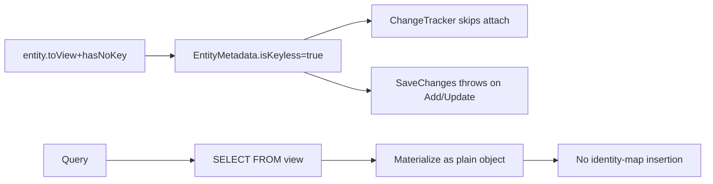

# Views and Keyless Entities

## 1. Why (problem statement)

EF Core lets you map an entity to a database view via `ToView` and declare it keyless via `HasNoKey`, producing a read-only, never-tracked query type — perfect for materialized analytics, report rows, and ad-hoc joins exposed as DB views. `ts-linq` today requires every entity to have a primary key and be writeable, so users either fake a PK or drop to raw SQL, losing LINQ. This feature lets `DbSet<ReportRow>` consume a view cleanly.

## 2. EF Core reference syntax (must be preserved verbatim)

```csharp
modelBuilder.Entity<SalesSummary>(b =>
{
    b.HasNoKey();
    b.ToView("v_sales_summary");
});

public DbSet<SalesSummary> SalesSummary => Set<SalesSummary>();

var rows = await context.SalesSummary
    .Where(s => s.Region == "EU")
    .ToListAsync();
```

TypeScript shape that `ts-linq` must mirror:

```ts
modelBuilder.entity<SalesSummary>(SalesSummary, b => {
  b.hasNoKey();
  b.toView("v_sales_summary");
});

salesSummary = this.set<SalesSummary>(SalesSummary);

const rows = await context.salesSummary
  .where(s => s.region === "EU")
  .toListAsync();
```

> Hard rule: the public TypeScript names, chaining order, and semantics MUST match EF Core. Internal implementation is free to deviate.

## 3. Architecture Decision Record (ADR)



- **Decision**: `isKeyless` + `viewName` flags on `EntityMetadata`; ChangeTracker bypass for keyless entities; SaveChanges rejects mutations with a precise error.
- **Context**: very small surface area — mostly metadata flags and a query-pipeline branch. Migration emits an *optional* `CREATE VIEW` only if user supplies one via fluent `hasViewSql` (mirroring EF Core's recent additions); otherwise the view is assumed pre-existing.
- **Consequences**:
  - +: read-only analytics shapes integrate cleanly with LINQ.
  - +: zero tracking overhead for report scenarios.
  - −: must firmly reject any mutation attempt with a useful error.
  - −: migration story is intentionally limited — users own view DDL.

## 4. Technical & architectural description

- **Affected packages**: `@ts-linq/metadata`, `@ts-linq/orm`, `@ts-linq/query`, `@ts-linq/migrations`.
- **New types / files**:
  - `packages/metadata/src/ViewMetadata.ts`
  - `packages/orm/src/errors/KeylessMutationError.ts`
- **Touch-points**:
  - `packages/metadata/src/EntityMetadata.ts` — `viewName?`, `isKeyless`.
  - `packages/orm/src/DbSet.ts` — `add/update/remove` throw if keyless.
  - `packages/orm/src/services/EntityLoader.ts` — skip identity-map for keyless rows.
- **Data flow**: model declares view → query emits `FROM viewName` → materialize as POJO → never attached to tracker.

## 5. Implementation options

### Option A — Pure flags + tracker bypass (recommended)
- Pros: minimal; matches EF.
- Cons: nothing notable.
- Effort: M

### Option B — Separate `DbView<T>` type
- Pros: stronger type signal.
- Cons: diverges from EF's unified `DbSet<T>` shape; reject.

### Recommendation
Option A.

## 6. Related problems / follow-up tasks

- [P1-25](./P1-25-table-entity-splitting.md) — views and splitting both touch read-path planner.
- Future: materialized view refresh helper.

## 7. Acceptance criteria

- [ ] Public API mirrors EF Core (`toView`, `hasNoKey`).
- [ ] Mutation attempts on keyless types throw `KeylessMutationError`.
- [ ] Unit tests cover: keyless select, filter, projection; identity-map not populated.
- [ ] Integration test against at least one dialect against a real view.
- [ ] Docs in `apps/docs/` updated.
- [ ] No regressions in `pnpm typecheck`, `pnpm arch:deps`, `pnpm arch:cycles`, `pnpm arch:dead`.

## 8. Pre-PR sweep (mandatory)

Before opening the PR for this task:

1. Re-read every `dev-plans/*.md` whose `status != done`.
2. For each, decide whether assumptions changed because of this task. If yes — update the affected sections (especially **Implementation options**, **depends_on**, **ts_linq_packages_touched**).
3. Record sweep results in the PR description under `## Cross-task sweep` with the bullet list:
   - `P?-??` — no change / updated section X / status moved to `blocked` because Y
4. Only after the sweep is recorded, open the PR.
