# Value Generators and Sentinel (EF8)

## 1. Why (problem statement)

EF Core normalizes ID/timestamp/version generation through a `ValueGenerator` abstraction (with `ValueGeneratedOnAdd`/`OnUpdate`/`Never` policy markers) and, in EF8, lets you declare a `Sentinel` value that distinguishes "user has not set this" from "user set it to the default". `ts-linq` currently hardcodes DB-side IDENTITY and treats `undefined` as "unset" — which breaks `number` PKs where `0` is a legitimate user value, and offers no extensibility for client-side IDs (UUIDv7, ULID, NanoID). This task introduces the generator abstraction and the sentinel concept.

## 2. EF Core reference syntax (must be preserved verbatim)

```csharp
modelBuilder.Entity<Post>().Property(p => p.Id)
    .ValueGeneratedOnAdd();

modelBuilder.Entity<Post>().Property(p => p.UpdatedAt)
    .ValueGeneratedOnAddOrUpdate();

modelBuilder.Entity<Post>().Property(p => p.ExternalId)
    .HasValueGenerator<UlidValueGenerator>();

modelBuilder.Entity<Post>().Property(p => p.SortOrder)
    .HasSentinel(-1);          // -1 means "not set"
```

TypeScript shape that `ts-linq` must mirror:

```ts
modelBuilder.entity<Post>(Post).property(p => p.id)
  .valueGeneratedOnAdd();

modelBuilder.entity<Post>(Post).property(p => p.updatedAt)
  .valueGeneratedOnAddOrUpdate();

modelBuilder.entity<Post>(Post).property(p => p.externalId)
  .hasValueGenerator(UlidValueGenerator);

modelBuilder.entity<Post>(Post).property(p => p.sortOrder)
  .hasSentinel(-1);
```

> Hard rule: the public TypeScript names, chaining order, and semantics MUST match EF Core. Internal implementation is free to deviate.

## 3. Architecture Decision Record (ADR)

```mermaid
flowchart TD
  A[Property metadata] --> B[ValueGeneratedPolicy enum]
  A --> C[ValueGenerator class / factory]
  A --> D[Sentinel value]
  E[SaveChanges INSERT] --> F{generator type}
  F -->|DB-side| G[Send default; read back]
  F -->|Client-side| H[Generator.next&#40;&#41; before INSERT]
  E --> I{value == sentinel?}
  I -->|yes| H
  I -->|no| J[Use user value]
```



- **Decision**: introduce `ValueGenerator<T>` interface (`next(context, entry): T`), a `ValueGeneratedPolicy` enum (`Never`, `OnAdd`, `OnUpdate`, `OnAddOrUpdate`), and an optional `sentinel` per property; SaveChanges consults generator + sentinel to decide whether to override the user value.
- **Context**: P1-21 (HiLo) is the canonical client-side generator. P1-16 (shadow) often combines with `OnAddOrUpdate` for timestamps.
- **Consequences**:
  - +: pluggable client-side ID strategies (Ulid/Uuidv7/NanoID).
  - +: correct handling of `0`/`""` as valid user values via sentinel.
  - −: SaveChanges decision tree grows (generator vs sentinel vs DB default).
  - −: must clearly document precedence (sentinel match → generator runs; otherwise user value wins).

## 4. Technical & architectural description

- **Affected packages**: `@ts-linq/metadata`, `@ts-linq/orm`.
- **New types / files**:
  - `packages/metadata/src/ValueGeneratorMetadata.ts`
  - `packages/orm/src/valueGenerators/UlidValueGenerator.ts`
  - `packages/orm/src/valueGenerators/UuidV7ValueGenerator.ts`
  - `packages/orm/src/valueGenerators/UtcNowValueGenerator.ts`
- **Touch-points**:
  - `packages/orm/src/services/SaveChangesPipeline.ts` — generator invocation + sentinel check.
  - `packages/orm/src/ChangeTracker.ts` — record generator-produced values on entry.
- **Data flow**: before INSERT, pipeline checks generator policy + sentinel; if generator owns the value, invoke it and assign back to the entity before issuing SQL.

## 5. Implementation options

### Option A — Per-property generator object (recommended)
- Pros: matches EF; pluggable.
- Cons: more metadata.
- Effort: M

### Option B — DB-default-only (status quo)
- Pros: zero work.
- Cons: rejects client-side ID strategies; rejected.

### Recommendation
Option A.

## 6. Related problems / follow-up tasks

- [P1-21](./P1-21-sequences-hi-lo.md) — HiLo is a `ValueGenerator`.
- [P1-16](./P1-16-shadow-properties.md) — timestamps as `OnAddOrUpdate` shadow props.
- Built-in generators package: `@ts-linq/value-generators` (consider extracting).

## 7. Acceptance criteria

- [ ] Public API mirrors EF Core (`valueGeneratedOnAdd`/`OnUpdate`/`Never`/`OnAddOrUpdate`, `hasValueGenerator`, `hasSentinel`).
- [ ] Unit tests cover: sentinel match triggers generator, sentinel non-match preserves user value, OnUpdate fires on UPDATE only.
- [ ] Built-in `UlidValueGenerator` ships and is covered by tests.
- [ ] Integration test against at least one dialect for the DB-side path (IDENTITY) and client-side path.
- [ ] Docs in `apps/docs/` updated with precedence rules.
- [ ] No regressions in `pnpm typecheck`, `pnpm arch:deps`, `pnpm arch:cycles`, `pnpm arch:dead`.

## 8. Pre-PR sweep (mandatory)

Before opening the PR for this task:

1. Re-read every `dev-plans/*.md` whose `status != done`.
2. For each, decide whether assumptions changed because of this task. If yes — update the affected sections (especially **Implementation options**, **depends_on**, **ts_linq_packages_touched**).
3. Record sweep results in the PR description under `## Cross-task sweep` with the bullet list:
   - `P?-??` — no change / updated section X / status moved to `blocked` because Y
4. Only after the sweep is recorded, open the PR.
