# Alternate Keys and Rich Indexes

## 1. Why (problem statement)

`ts-linq` currently supports only primary keys plus naïve indexes via `@Index`. EF Core gives you (1) **alternate keys** — non-PK uniqueness used as the target of foreign keys — and (2) rich indexes: unique, filtered (`WHERE deleted_at IS NULL`), covering (`INCLUDE`), descending column order. Without these, users can't enforce business-key uniqueness, can't model soft-delete-friendly unique constraints, and miss substantial query-performance wins (covering indexes eliminate heap lookups).

## 2. EF Core reference syntax (must be preserved verbatim)

```csharp
modelBuilder.Entity<User>().HasAlternateKey(u => u.Email);
modelBuilder.Entity<Order>().HasAlternateKey(o => new { o.TenantId, o.PublicNumber });

modelBuilder.Entity<Post>()
    .HasIndex(p => new { p.AuthorId, p.PublishedAt })
    .IsUnique()
    .HasFilter("deleted_at IS NULL")
    .IncludeProperties(p => new { p.Title, p.Slug })
    .IsDescending(false, true);
```

TypeScript shape that `ts-linq` must mirror:

```ts
modelBuilder.entity<User>(User).hasAlternateKey(u => u.email);
modelBuilder.entity<Order>(Order)
  .hasAlternateKey(o => [o.tenantId, o.publicNumber]);

modelBuilder.entity<Post>(Post)
  .hasIndex(p => [p.authorId, p.publishedAt])
  .isUnique()
  .hasFilter("deleted_at IS NULL")
  .includeProperties(p => [p.title, p.slug])
  .isDescending([false, true]);
```

> Hard rule: the public TypeScript names, chaining order, and semantics MUST match EF Core. Internal implementation is free to deviate.

## 3. Architecture Decision Record (ADR)

```mermaid
flowchart TD
  A[hasAlternateKey] --> B[KeyMetadata kind=Alternate]
  A2[hasIndex&#40;...&#41;] --> C[IndexMetadata]
  C --> D[isUnique]
  C --> E[hasFilter]
  C --> F[includeProperties]
  C --> G[isDescending&#91;&#93;]
  B --> H[FK targets]
  C --> I[Migrations emit dialect DDL]
  I --> J[(DB)]
```



- **Decision**: model both as first-class metadata: `KeyMetadata` with a `kind: Primary | Alternate` field, and `IndexMetadata` carrying unique/filter/include/descending vectors. Migration emits dialect-specific SQL — `HasFilter` becomes `WHERE` on PG/MSSQL, no-ops on MySQL (which lacks filtered indexes) with a warning.
- **Context**: existing index metadata is a flat list of columns. Lifting it into a typed shape is additive; FK metadata already accepts a key reference so alternate-key targets fit naturally.
- **Consequences**:
  - +: business-key FKs (e.g. `FK -> Email`) without surfacing PK.
  - +: massive query speedups via covering indexes.
  - +: soft-delete-compatible uniqueness via filtered indexes.
  - −: MySQL can't honor `HasFilter` natively (must emit warning / fallback to plain unique).

## 4. Technical & architectural description

- **Affected packages**: `@ts-linq/metadata`, `@ts-linq/migrations`, all dialects.
- **New types / files**:
  - `packages/metadata/src/IndexMetadata.ts` (extend)
  - `packages/metadata/src/KeyMetadata.ts`
  - `packages/dialect-*/src/ddl/IndexDdlEmitter.ts`
- **Touch-points**:
  - `packages/metadata/src/builders/EntityBuilder.ts` — `hasAlternateKey`, `hasIndex(...).isUnique().hasFilter(...).includeProperties(...).isDescending(...)`.
  - `packages/migrations/src/diff/SchemaDiff.ts` — diff index/alt-key metadata.
- **Data flow**: model declares → migration diff against introspected DB metadata → dialect emits DDL.

## 5. Implementation options

### Option A — Unified `IndexMetadata` carrying all options (recommended)
- Pros: matches EF; one model evolves.
- Cons: option matrix per dialect.
- Effort: M

### Option B — Separate index classes per option
- Pros: type-driven discoverability.
- Cons: combinatorial explosion (unique+filtered+covering).

### Recommendation
Option A.

## 6. Related problems / follow-up tasks

- [P1-21](./P1-21-sequences-hi-lo.md) — sequences may back alternate keys.
- Future: pgvector / GIN index types (separate task).

## 7. Acceptance criteria

- [ ] Public API mirrors EF Core (`hasAlternateKey`, `hasIndex`, `isUnique`, `hasFilter`, `includeProperties`, `isDescending`).
- [ ] FK can target an alternate key.
- [ ] Unit tests cover: alternate-key FK navigation, filtered unique violation, descending index DDL.
- [ ] Integration test against PostgreSQL (full support) and MySQL (filter-not-supported warning).
- [ ] Migrations produce idempotent DDL.
- [ ] Docs in `apps/docs/` updated with dialect support matrix.
- [ ] No regressions in `pnpm typecheck`, `pnpm arch:deps`, `pnpm arch:cycles`, `pnpm arch:dead`.

## 8. Pre-PR sweep (mandatory)

Before opening the PR for this task:

1. Re-read every `dev-plans/*.md` whose `status != done`.
2. For each, decide whether assumptions changed because of this task. If yes — update the affected sections (especially **Implementation options**, **depends_on**, **ts_linq_packages_touched**).
3. Record sweep results in the PR description under `## Cross-task sweep` with the bullet list:
   - `P?-??` — no change / updated section X / status moved to `blocked` because Y
4. Only after the sweep is recorded, open the PR.
