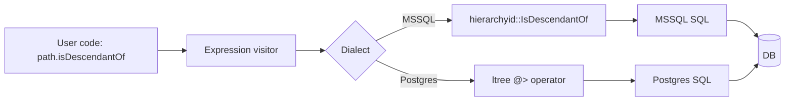

# HierarchyId Support (SQL Server) with ltree Fallback (Postgres)

## 1. Why (problem statement)

EF Core 8 added first-class `HierarchyId` mapping for SQL Server, letting users represent tree structures (org charts, folder trees, threaded comments) with built-in `GetAncestor`, `IsDescendantOf`, `GetLevel`. `ts-linq` has no hierarchy primitive, so users must hand-roll closure tables. Adding `HierarchyId` for MSSQL and a parallel `ltree` mapping for Postgres gives EF parity and a portable mental model.

## 2. EF Core reference syntax (must be preserved verbatim)

```csharp
modelBuilder.Entity<Node>()
    .Property(n => n.Path)
    .HasColumnType("hierarchyid");

var descendants = ctx.Nodes
    .Where(n => n.Path.IsDescendantOf(parent.Path))
    .OrderBy(n => n.Path)
    .ToList();

var level = node.Path.GetLevel();
var ancestor = node.Path.GetAncestor(2);
```

TypeScript shape that `ts-linq` must mirror (signatures only, no implementation):

```ts
modelBuilder.entity<Node>()
  .property(n => n.path)
  .hasColumnType('hierarchyid'); // 'ltree' for Postgres

const descendants = ctx.nodes
  .where(n => n.path.isDescendantOf(parent.path))
  .orderBy(n => n.path)
  .toArray();

export interface HierarchyId {
  getLevel(): number;
  getAncestor(n: number): HierarchyId;
  isDescendantOf(other: HierarchyId): boolean;
  getDescendant(child1?: HierarchyId, child2?: HierarchyId): HierarchyId;
  toString(): string;
}
```

> Hard rule: the public TypeScript names, chaining order, and semantics MUST match EF Core. Internal implementation is free to deviate.

## 3. Architecture Decision Record (ADR)



- **Decision**: Treat `HierarchyId` as a portable opaque type with dialect-specific binary encoding (MSSQL native, ltree text for PG).
- **Context**: SQL Server's wire format is opaque-binary; Postgres ltree is plain text. A common TS class with two codecs is the smallest viable abstraction.
- **Consequences**: (+) Cross-dialect portability. (-) Some MSSQL-specific operations (e.g. `GetReparentedValue`) have no clean ltree mapping; we document the gap.

## 4. Technical & architectural description

- **Affected packages**: `@ts-linq/core` (HierarchyId class), `@ts-linq/metadata` (column-type recognition), `@ts-linq/sql-visitor` (method translator), `@ts-linq/dialect-mssql` + `@ts-linq/dialect-postgres`, `@ts-linq/provider-mssql` + `@ts-linq/provider-postgres` (codec).
- **New types / files**:
  - `packages/core/src/hierarchy/hierarchy-id.ts`
  - `packages/sql-visitor/src/hierarchy-method-translator.ts`
  - `packages/dialect-mssql/src/hierarchy-functions.ts`
  - `packages/dialect-postgres/src/ltree-functions.ts`
  - `packages/provider-mssql/src/hierarchy-codec.ts` (binary)
  - `packages/provider-postgres/src/ltree-codec.ts` (text)
- **Touch-points**: same method-call-translator registry as spatial (`P2-34`).
- **Data flow**: Property typed `HierarchyId` → on read, provider decodes binary/text → on write, encodes → on query, expression visitor maps methods to dialect SQL.

## 5. Implementation options

### Option A — Shared TS class with dialect codecs
- Pros: Portable user code, single import.
- Cons: Need to document the small set of MSSQL-only operations.
- Effort: L

### Option B — Two distinct types (`SqlHierarchyId`, `LTree`)
- Pros: Honest about differences.
- Cons: Breaks portability; EF Core uses a single type.

### Recommendation
Option A — match EF's single-type model, document gaps explicitly.

## 6. Related problems / follow-up tasks

- `[P2-34](./P2-34-spatial-types.md)` — shares the method-translator registration pattern.

## 7. Acceptance criteria

- [x] Public API mirrors EF Core `HierarchyId` surface
- [x] Unit tests cover `getLevel`, `getAncestor`, `isDescendantOf`, `getDescendant` round-trip
- [x] Integration test on MSSQL native + Postgres ltree
- [x] Docs in `apps/docs/` cover gap list (MSSQL-only ops)
- [x] No regressions in `pnpm typecheck`, `pnpm arch:deps`, `pnpm arch:cycles`, `pnpm arch:dead`

## 8. Pre-PR sweep (mandatory)

Before opening the PR for this task:

1. Re-read every `dev-plans/*.md` whose `status != done`.
2. For each, decide whether assumptions changed because of this task. If yes — update the affected sections (especially **Implementation options**, **depends_on**, **ts_linq_packages_touched**).
3. Record sweep results in the PR description under `## Cross-task sweep` with the bullet list:
   - `P?-??` — no change / updated section X / status moved to `blocked` because Y
4. Only after the sweep is recorded, open the PR.
