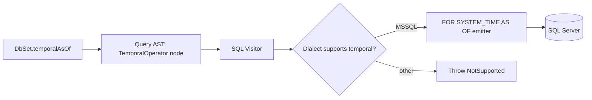

# Temporal Queries on System-Versioned Tables

## 1. Why (problem statement)

SQL Server system-versioned (a.k.a. temporal) tables automatically track row history; EF Core exposes this via the `TemporalAsOf`/`TemporalAll`/`TemporalBetween`/`TemporalFromTo`/`TemporalContainedIn` operators on `DbSet`. Without them, `ts-linq` users on MSSQL must drop to raw SQL to query history — a major regression for audit-heavy workloads. This task adds the operators behind a dialect-aware feature flag.

## 2. EF Core reference syntax (must be preserved verbatim)

```csharp
var asOf = ctx.Employees
    .TemporalAsOf(new DateTime(2023, 1, 1))
    .Where(e => e.Department == "Sales")
    .ToList();

var history = ctx.Employees
    .TemporalAll()
    .OrderBy(e => EF.Property<DateTime>(e, "PeriodStart"))
    .ToList();

var between = ctx.Employees.TemporalBetween(from, to).ToList();
var fromTo = ctx.Employees.TemporalFromTo(from, to).ToList();
var contained = ctx.Employees.TemporalContainedIn(from, to).ToList();
```

TypeScript shape that `ts-linq` must mirror (signatures only, no implementation):

```ts
const asOf = ctx.employees
  .temporalAsOf(new Date('2023-01-01'))
  .where(e => e.department === 'Sales')
  .toArray();

const history = ctx.employees
  .temporalAll()
  .orderBy(e => ef.property<Date>(e, 'PeriodStart'))
  .toArray();

ctx.employees.temporalBetween(from, to).toArray();
ctx.employees.temporalFromTo(from, to).toArray();
ctx.employees.temporalContainedIn(from, to).toArray();
```

> Hard rule: the public TypeScript names, chaining order, and semantics MUST match EF Core. Internal implementation is free to deviate.

## 3. Architecture Decision Record (ADR)



- **Decision**: Add a `TemporalOperator` AST node attached to `DbSet`; only the MSSQL visitor emits `FOR SYSTEM_TIME`. Other dialects throw at translation time with a clear message.
- **Context**: EF Core itself restricts these operators to SQL Server. Failing late at translation matches EF's behavior.
- **Consequences**: (+) Honest dialect support. (-) Users on PG/MySQL must use plugin-based audit (e.g. existing audit plugin) for history.

## 4. Technical & architectural description

- **Affected packages**: `@ts-linq/orm` (DbSet extensions), `@ts-linq/query` (AST node), `@ts-linq/metadata` (mark entity as temporal in fluent config), `@ts-linq/sql-visitor` (emit clause), `@ts-linq/dialect-mssql`.
- **New types / files**:
  - `packages/query/src/ast/temporal-operator.ts`
  - `packages/orm/src/db-set-temporal-extensions.ts`
  - `packages/dialect-mssql/src/emit-temporal.ts`
  - Metadata: `IsTemporal()`, `WithHistoryTable(name)` (extends `EntityTypeBuilder`)
- **Touch-points**: `packages/sql-visitor/src/visit-from-clause.ts` (must consult Temporal node).
- **Data flow**: User chains `temporalAsOf` → DbSet wraps query root with TemporalOperator → visitor emits `FOR SYSTEM_TIME AS OF @p` directly after table name → period columns (`PeriodStart`, `PeriodEnd`) become accessible via `ef.property`.

## 5. Implementation options

### Option A — AST node + dialect-gated emitter
- Pros: Type-checks at compile time; mirrors EF.
- Cons: Throws on non-MSSQL dialects at translation, not compile-time.
- Effort: L

### Option B — Augment FROM clause directly with a string suffix
- Pros: Minimal AST change.
- Cons: Composition with `JOIN` and subqueries gets ugly.

### Recommendation
Option A — proper AST integration is needed for `JOIN`s and `OrderBy(e => ef.property(e, 'PeriodStart'))`.

## 6. Related problems / follow-up tasks

- `[P2-33](./P2-33-stored-procedure-mapping.md)` — orthogonal write path; temporal is read-only.
- The existing audit plugin is the PG/MySQL workaround.

## 7. Acceptance criteria

- [ ] Public API mirrors all five EF temporal operators
- [ ] Unit tests cover SQL emission per operator
- [ ] Integration test against MSSQL system-versioned table
- [ ] Clear error on non-MSSQL dialects
- [ ] Docs in `apps/docs/` updated
- [ ] No regressions in `pnpm typecheck`, `pnpm arch:deps`, `pnpm arch:cycles`, `pnpm arch:dead`

## 8. Pre-PR sweep (mandatory)

Before opening the PR for this task:

1. Re-read every `dev-plans/*.md` whose `status != done`.
2. For each, decide whether assumptions changed because of this task. If yes — update the affected sections (especially **Implementation options**, **depends_on**, **ts_linq_packages_touched**).
3. Record sweep results in the PR description under `## Cross-task sweep` with the bullet list:
   - `P?-??` — no change / updated section X / status moved to `blocked` because Y
4. Only after the sweep is recorded, open the PR.
