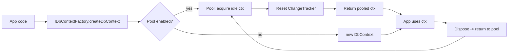

# DbContext Pooling and IDbContextFactory

## 1. Why (problem statement)

EF Core's `AddDbContextPool` reuses `DbContext` instances across requests to amortize the cost of model snapshot binding, change tracker initialization, and DI resolution. `IDbContextFactory<T>` solves the lifetime mismatch problem in long-lived hosts (background workers, Blazor Server, single-page apps with stateful clients) by creating short-lived contexts on demand. `ts-linq` instantiates a fresh `DbContext` on every use, with no pool and no factory — fine for HTTP scoping but problematic for high-throughput and worker scenarios.

## 2. EF Core reference syntax (must be preserved verbatim)

```csharp
services.AddDbContextPool<AppContext>(o => o.UseSqlServer(conn), poolSize: 128);

services.AddDbContextFactory<AppContext>(o => o.UseSqlServer(conn));

public class Worker(IDbContextFactory<AppContext> factory) {
    public async Task DoWork() {
        await using var ctx = await factory.CreateDbContextAsync();
        // ...
    }
}
```

TypeScript shape that `ts-linq` must mirror (signatures only, no implementation):

```ts
container.addDbContextPool<AppContext>(o => o.usePostgres(conn), { poolSize: 128 });
container.addDbContextFactory<AppContext>(o => o.usePostgres(conn));

class Worker {
  constructor(private factory: IDbContextFactory<AppContext>) {}
  async doWork() {
    await using const ctx = await this.factory.createDbContextAsync();
    // ...
  }
}

interface IDbContextFactory<T> {
  createDbContext(): T;
  createDbContextAsync(): Promise<T>;
}
```

> Hard rule: the public TypeScript names, chaining order, and semantics MUST match EF Core. Internal implementation is free to deviate.

## 3. Architecture Decision Record (ADR)



- **Decision**: Add a `DbContextPool` LIFO queue and a thin `IDbContextFactory<T>` interface. Pooled contexts are reset (clear tracked entries, dispose query cache scratch) on return.
- **Context**: Reusing contexts requires a deterministic reset; we already have a ChangeTracker that can be wiped.
- **Consequences**: (+) Major throughput win for high-RPS scenarios. (-) Bugs from forgotten ChangeTracker state are now possible. (~) Pool size needs sensible default and monitoring.

## 4. Technical & architectural description

- **Affected packages**: `@ts-linq/orm` (lifecycle + pool), `@ts-linq/core` (DI integration helpers if we provide one).
- **New types / files**:
  - `packages/orm/src/pooling/db-context-pool.ts`
  - `packages/orm/src/pooling/pooled-db-context-factory.ts`
  - `packages/orm/src/factory/db-context-factory.ts`
  - `packages/orm/src/lifecycle/reset-context.ts` (resets ChangeTracker, query cache, transaction state)
- **Touch-points**: `packages/orm/src/db-context.ts` — add `[Symbol.dispose]`/`reset()` hooks; ChangeTracker must expose `clear()`.
- **Data flow**: Factory call → check pool → if idle exists, pop and reset → else construct new → on dispose, push back if pool < max.

## 5. Implementation options

### Option A — Internal LIFO pool with explicit reset hook
- Pros: Predictable; mirrors EF.
- Cons: Reset bug surface area.
- Effort: L

### Option B — Generic-object-pool dependency
- Pros: Off-the-shelf.
- Cons: Dependency for a small data structure; semantic mismatch around async dispose.

### Recommendation
Option A — a ~50 LOC LIFO pool is simpler than vetting a dependency.

## 6. Related problems / follow-up tasks

- `[P2-47](./P2-47-read-replica-multi-tenancy.md)` — pooled contexts with per-tenant connection strings need pool sharding by tenant.

## 7. Acceptance criteria

- [ ] Public API exposes `addDbContextPool` and `addDbContextFactory`
- [ ] Unit tests cover acquire/release, reset semantics, max pool size
- [ ] Stress test confirms no entity leakage across pooled checkouts
- [ ] Docs in `apps/docs/` clarify reset rules and forbidden patterns (e.g. storing entities in fields)
- [ ] No regressions in `pnpm typecheck`, `pnpm arch:deps`, `pnpm arch:cycles`, `pnpm arch:dead`

## 8. Pre-PR sweep (mandatory)

Before opening the PR for this task:

1. Re-read every `dev-plans/*.md` whose `status != done`.
2. For each, decide whether assumptions changed because of this task. If yes — update the affected sections (especially **Implementation options**, **depends_on**, **ts_linq_packages_touched**).
3. Record sweep results in the PR description under `## Cross-task sweep` with the bullet list:
   - `P?-??` — no change / updated section X / status moved to `blocked` because Y
4. Only after the sweep is recorded, open the PR.
