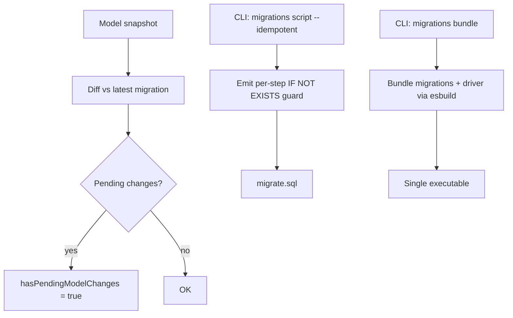

# Migration Bundles, Idempotent Scripts, HasPendingModelChanges

## 1. Why (problem statement)

EF Core has shipped three migration-deployment improvements that `ts-linq` lacks: (1) **migration bundles** — single self-contained executables you can ship to ops without a .NET SDK on the target; (2) **idempotent scripts** — SQL files that check `__EFMigrationsHistory` before each step so reruns are safe; (3) **`HasPendingModelChanges`** — a runtime check that warns developers their model drifted from the latest migration. Today, `ts-linq` only generates a DDL diff. These features are the difference between hobby-grade and production-grade migrations tooling.

## 2. EF Core reference syntax (must be preserved verbatim)

```bash
dotnet ef migrations bundle --self-contained -r linux-x64
dotnet ef migrations script --idempotent --output migrate.sql
```

```csharp
if (ctx.Database.HasPendingModelChanges()) {
    throw new InvalidOperationException("Model is out of sync with migrations");
}
```

TypeScript shape that `ts-linq` must mirror (signatures only, no implementation):

```bash
pnpm ts-linq migrations bundle --target node-linux-x64
pnpm ts-linq migrations script --idempotent --output migrate.sql
```

```ts
if (ctx.database.hasPendingModelChanges()) {
  throw new Error('Model is out of sync with migrations');
}

// Programmatic:
await ctx.database.migrate({ idempotent: true });
const pending = await ctx.database.getPendingMigrations();
```

> Hard rule: the public TypeScript names, chaining order, and semantics MUST match EF Core. Internal implementation is free to deviate.

## 3. Architecture Decision Record (ADR)



- **Decision**: Use `esbuild` to produce a self-contained Node SEA (single-executable application) or Deno-compile output for bundles; emit per-step idempotency guards by querying `__ts_linq_migrations_history` inline.
- **Context**: Node 20+ ships SEA support, and migrations are I/O-bound, so JIT performance is irrelevant. Reusing esbuild keeps the toolchain minimal.
- **Consequences**: (+) Ship a single binary to ops. (-) Per-platform builds needed. (~) Idempotency guards bloat SQL slightly.

## 4. Technical & architectural description

- **Affected packages**: `@ts-linq/migrations` (script generator, bundle command, model snapshot diff), `@ts-linq/orm` (`Database.hasPendingModelChanges`, `getPendingMigrations`, `migrate`), `@ts-linq/metadata` (model snapshot serialization).
- **New types / files**:
  - `packages/migrations/src/script/idempotent-emitter.ts`
  - `packages/migrations/src/bundle/build-bundle.ts` (esbuild driver)
  - `packages/migrations/src/snapshot/model-snapshot.ts` (deterministic JSON)
  - `packages/migrations/src/snapshot/diff.ts`
  - `packages/orm/src/database/has-pending-model-changes.ts`
- **Touch-points**: existing DDL diff code in `@ts-linq/migrations`; CLI entry point.
- **Data flow**: model snapshot serialized at design time → committed to repo → at runtime, current model serialized → compared → diff drives migrate / pending check.

## 5. Implementation options

### Option A — esbuild SEA bundle, inline idempotency guards
- Pros: Single-file deploy; works with existing Node infrastructure.
- Cons: Per-OS builds.
- Effort: L

### Option B — Docker image as the bundle
- Pros: Cross-platform.
- Cons: Heavier; ops dependency.

### Recommendation
Option A — matches the EF Core bundle UX and produces lightweight artifacts.

## 6. Related problems / follow-up tasks

- `[P2-38](./P2-38-sqlite-provider.md)` — rebuild-table strategy must produce idempotent SQL too.
- `[P2-43](./P2-43-db-first-scaffolding.md)` — scaffolding is the inverse direction; reuse the model snapshot type.

## 7. Acceptance criteria

- [x] CLI `migrations bundle` produces a runnable executable per supported OS
- [x] CLI `migrations script --idempotent` emits guarded SQL verified by re-run test
- [x] `hasPendingModelChanges` returns true when model drifts
- [x] Unit tests for snapshot diff
- [x] Integration test: drift detection in CI
- [x] Docs in `apps/docs/` updated
- [x] No regressions in `pnpm typecheck`, `pnpm arch:deps`, `pnpm arch:cycles`, `pnpm arch:dead`

## 8. Pre-PR sweep (mandatory)

Before opening the PR for this task:

1. Re-read every `dev-plans/*.md` whose `status != done`.
2. For each, decide whether assumptions changed because of this task. If yes — update the affected sections (especially **Implementation options**, **depends_on**, **ts_linq_packages_touched**).
3. Record sweep results in the PR description under `## Cross-task sweep` with the bullet list:
   - `P?-??` — no change / updated section X / status moved to `blocked` because Y
4. Only after the sweep is recorded, open the PR.
