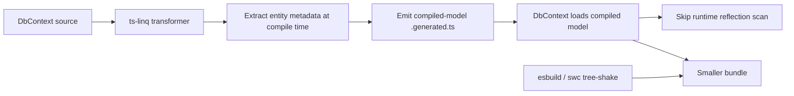

# Compiled Models / AOT Optimization

## 1. Why (problem statement)

EF Core's `dotnet ef dbcontext optimize` pre-builds the model snapshot at design time so the first DbContext construction skips reflection scanning, slashing cold-start latency on serverless and CLI workloads. The same command is the foundation of NativeAOT support in EF8+. TypeScript has no AOT to NativeAOT, but bundlers (esbuild, swc, tsc) deliver an analogous benefit: a pre-compiled model snapshot can be tree-shaken and inlined, eliminating reflection on `Reflect.metadata`. `ts-linq` does model assembly on first use; this task closes the gap.

## 2. EF Core reference syntax (must be preserved verbatim)

```bash
dotnet ef dbcontext optimize --output-dir CompiledModels --namespace App.CompiledModels
```

```csharp
[DbContext(typeof(AppContextModel))]
public partial class AppContext : DbContext { }
```

TypeScript shape that `ts-linq` must mirror (signatures only, no implementation):

```bash
pnpm ts-linq dbcontext optimize --output src/compiled-models
```

```ts
import { AppContextModel } from './compiled-models/app-context-model.generated';

@dbContext({ compiledModel: AppContextModel })
class AppContext extends DbContext {
  // ...
}
```

> Hard rule: the public TypeScript names, chaining order, and semantics MUST match EF Core. Internal implementation is free to deviate.

## 3. Architecture Decision Record (ADR)



- **Decision**: Reuse `@ts-linq/transformer` (the existing TS plugin that already participates in builds) to emit a sibling `.generated.ts` model file; `DbContext` consults the compiled model when present, falling back to runtime reflection otherwise.
- **Context**: We already invest in a transformer for other features; this is an incremental responsibility for it.
- **Consequences**: (+) Cold-start wins, smaller bundle (tree-shake unused entities). (-) Generated file must stay in sync with code; CI drift check needed. (~) Some dynamic registration patterns become unsupported when a compiled model is bound.

## 4. Technical & architectural description

- **Affected packages**: `@ts-linq/transformer` (emit step), `@ts-linq/metadata` (consume compiled snapshot), `@ts-linq/orm` (DbContext bootstrap branch).
- **New types / files**:
  - `packages/transformer/src/emit-compiled-model.ts`
  - `packages/metadata/src/compiled-model.ts` — typed snapshot interface
  - `packages/orm/src/bootstrap/use-compiled-model.ts`
  - CLI: `pnpm ts-linq dbcontext optimize`
- **Touch-points**: `packages/orm/src/db-context.ts` — model resolution path.
- **Data flow**: Build time: transformer walks DbContext sources, extracts entity declarations, writes `.generated.ts` with frozen metadata. Runtime: DbContext detects compiled model on decorator → uses it → skips reflection.

## 5. Implementation options

### Option A — Transformer-emitted sibling files (build artifact)
- Pros: Plays well with bundlers; tree-shake friendly.
- Cons: Drift risk → must add CI check.
- Effort: L

### Option B — JSON snapshot loaded at runtime
- Pros: No code-gen.
- Cons: Not tree-shakeable; requires fs.read; bundler-hostile.

### Recommendation
Option A — TypeScript ecosystems already accept `.generated.ts` files and bundlers love them.

## 6. Related problems / follow-up tasks

- `[P1-20](./P1-20-compiled-queries.md)` — compiled queries depend on this snapshot for property metadata.
- `[P2-42](./P2-42-migration-bundles-idempotent.md)` — both rely on a deterministic model snapshot serialization.

## 7. Acceptance criteria

- [ ] CLI `dbcontext optimize` emits per-context `.generated.ts`
- [ ] DbContext at runtime picks compiled model when decorator references it
- [ ] CI drift check compares fresh emit to checked-in file
- [ ] Cold-start benchmark shows measurable improvement
- [ ] Unit tests verify equivalence of reflection-scan vs compiled-model metadata
- [ ] Docs in `apps/docs/` cover bundler tree-shaking
- [ ] No regressions in `pnpm typecheck`, `pnpm arch:deps`, `pnpm arch:cycles`, `pnpm arch:dead`

## 8. Pre-PR sweep (mandatory)

Before opening the PR for this task:

1. Re-read every `dev-plans/*.md` whose `status != done`.
2. For each, decide whether assumptions changed because of this task. If yes — update the affected sections (especially **Implementation options**, **depends_on**, **ts_linq_packages_touched**).
3. Record sweep results in the PR description under `## Cross-task sweep` with the bullet list:
   - `P?-??` — no change / updated section X / status moved to `blocked` because Y
4. Only after the sweep is recorded, open the PR.
