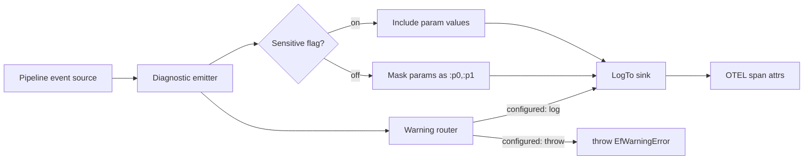

# Logging, Sensitive Data, Detailed Errors, ConfigureWarnings

## 1. Why (problem statement)

EF Core gives users fine-grained control over diagnostics: `LogTo` to direct events to any sink, `EnableSensitiveDataLogging` to opt in to parameter values in logs, `EnableDetailedErrors` for verbose stack info, and `ConfigureWarnings` to upgrade specific events to errors. `ts-linq` has a `@ts-linq/telemetry` package but no toggles for sensitive data or warning escalation. Production users need these knobs to comply with PII rules and to fail fast on dangerous patterns like client evaluation.

## 2. EF Core reference syntax (must be preserved verbatim)

```csharp
optionsBuilder
    .LogTo(Console.WriteLine, LogLevel.Information)
    .EnableSensitiveDataLogging()
    .EnableDetailedErrors()
    .ConfigureWarnings(w => w
        .Throw(RelationalEventId.MultipleCollectionIncludeWarning)
        .Log(CoreEventId.FirstWithoutOrderByAndFilterWarning));
```

TypeScript shape that `ts-linq` must mirror (signatures only, no implementation):

```ts
dbContextOptions
  .logTo(msg => console.log(msg), 'information')
  .enableSensitiveDataLogging()
  .enableDetailedErrors()
  .configureWarnings(w => w
    .throw('relational.multiple-collection-include')
    .log('core.first-without-order-by-and-filter'));
```

> Hard rule: the public TypeScript names, chaining order, and semantics MUST match EF Core. Internal implementation is free to deviate.

## 3. Architecture Decision Record (ADR)



- **Decision**: Funnel every diagnostic through one emitter that consults options flags and a warning route table; map output to the existing OTEL telemetry layer.
- **Context**: We already have a telemetry package — this task formalizes the *configuration* surface around it and adds the warning-routing concept.
- **Consequences**: (+) One control point. (-) Care needed so that sensitive-data masking is the default and explicit opt-in. (~) Adds an event-id taxonomy that mirrors EF Core's.

## 4. Technical & architectural description

- **Affected packages**: `@ts-linq/orm` (option-builder methods), `@ts-linq/telemetry` (emitter + masking + warning routing), `@ts-linq/core` (event-id catalog).
- **New types / files**:
  - `packages/telemetry/src/event-ids.ts` — string-id catalog mirroring `CoreEventId`/`RelationalEventId`
  - `packages/telemetry/src/diagnostic-emitter.ts`
  - `packages/telemetry/src/parameter-masker.ts`
  - `packages/telemetry/src/warning-router.ts`
  - `packages/orm/src/options/log-to.ts`, `enable-sensitive-data-logging.ts`, `configure-warnings.ts`
- **Touch-points**: All call-sites that currently log directly must funnel through the new emitter.
- **Data flow**: Pipeline emits event with payload → emitter checks sensitive flag and masks → warning router checks route table → routes to throw / log / suppress → log handlers fan out to user sink and OTEL.

## 5. Implementation options

### Option A — Unified emitter with route table
- Pros: Matches EF Core mental model; single audit point.
- Cons: Must replace ad-hoc `console.log` call sites.
- Effort: M

### Option B — Augment each call site individually
- Pros: Localized.
- Cons: Inconsistent; sensitive-data masking will leak.

### Recommendation
Option A — a single chokepoint is the only safe way to enforce sensitive-data masking.

## 6. Related problems / follow-up tasks

- `[P2-41](./P2-41-query-tags-call-site.md)` — query tags must flow through the same emitter.

## 7. Acceptance criteria

- [ ] Public API mirrors all four EF methods
- [ ] Default behavior masks parameter values (no opt-out by accident)
- [ ] Unit tests for warning router: throw / log / suppress
- [ ] Unit tests for sensitive-data toggle masking
- [ ] Integration test verifying OTEL span attributes
- [ ] Docs in `apps/docs/` updated, including a PII compliance note
- [ ] No regressions in `pnpm typecheck`, `pnpm arch:deps`, `pnpm arch:cycles`, `pnpm arch:dead`

## 8. Pre-PR sweep (mandatory)

Before opening the PR for this task:

1. Re-read every `dev-plans/*.md` whose `status != done`.
2. For each, decide whether assumptions changed because of this task. If yes — update the affected sections (especially **Implementation options**, **depends_on**, **ts_linq_packages_touched**).
3. Record sweep results in the PR description under `## Cross-task sweep` with the bullet list:
   - `P?-??` — no change / updated section X / status moved to `blocked` because Y
4. Only after the sweep is recorded, open the PR.
