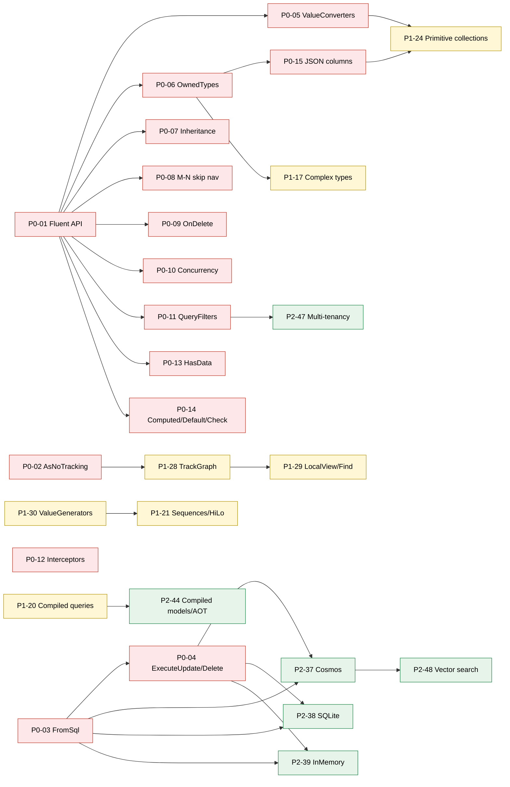

# EF Core Feature-Parity Roadmap

> **Scope**: close the gap between `ts-linq` and **Microsoft EF Core 9**.
> **Hard rule**: every public API mirrors EF Core verbatim (method names, chaining order, semantics). Internal implementation is free to deviate.
> **Deliverable mode**: every file in this folder is a *task plan*, not a feature. Implementation happens on follow-up PRs, one per task.

---

## 1. How to use this folder

- One Markdown file per missing feature, named `P{priority}-{seq}-{slug}.md`.
- Each task carries a YAML frontmatter (`status`, `priority`, `effort`, `depends_on`, `related`, `ts_linq_packages_touched`).
- Lifecycle: `not-started → in-progress → blocked → done`. Update the frontmatter `status` when you start, block, or finish a task.
- **Cross-task sweep (mandatory)** — before opening a PR for any task, walk every other task whose `status != done` and update assumptions that your change invalidates. Record the sweep in the PR body under `## Cross-task sweep`. The exact 4-step procedure is the last section of every task file.
- Use `_TEMPLATE.md` as the starting skeleton for any new task you discover.

---

## 2. Tier matrix

### P0 — Foundation (15 tasks)

Blocks EF parity baseline. Required before any non-trivial EF Core → ts-linq migration is meaningful.

| #     | Title                                                                       | EF Core API                                                                                                       | Status | Effort | Depends on |
|-------|-----------------------------------------------------------------------------|-------------------------------------------------------------------------------------------------------------------|:------:|:------:|------------|
| P0-01 | [Fluent API — ModelBuilder](./P0-01-fluent-api-modelbuilder.md)             | `OnModelCreating`, `ModelBuilder`, `EntityTypeBuilder<T>`, `IEntityTypeConfiguration<T>`                          | - [x]  | XL     | —          |
| P0-02 | [AsNoTracking / AsTracking](./P0-02-as-no-tracking.md)                      | `AsNoTracking`, `AsTracking`, `AsNoTrackingWithIdentityResolution`, `QueryTrackingBehavior`                       | - [x]  | M      | —          |
| P0-03 | [FromSql / FromSqlInterpolated](./P0-03-from-sql-interpolated.md)           | `FromSql`, `FromSqlRaw`, `FromSqlInterpolated`, `SqlQuery`, `Database.ExecuteSqlInterpolated`                     | - [x]  | M      | —          |
| P0-04 | [ExecuteUpdate / ExecuteDelete](./P0-04-execute-update-delete.md)           | `ExecuteUpdate(SetProperty...)`, `ExecuteDelete` + async                                                          | ✅     | L      | P0-03      |
| P0-05 | [Value converters](./P0-05-value-converters.md)                             | `HasConversion`, `ValueConverter<T,U>`, `ValueComparer`, bulk `Properties<T>().HaveConversion`                    | ✅      | M      | P0-01      |
| P0-06 | [Owned entity types](./P0-06-owned-entity-types.md)                         | `OwnsOne`, `OwnsMany`, table splitting, `ToJson()`                                                                | ✅      | L      | P0-01      |
| P0-07 | [Inheritance — TPH/TPT/TPC](./P0-07-inheritance-tph-tpt-tpc.md)             | `HasDiscriminator`, `UseTptMappingStrategy`, `UseTpcMappingStrategy`                                              | ✅      | XL     | P0-01      |
| P0-08 | [Many-to-many skip navigations](./P0-08-many-to-many-skip-navigations.md)   | `HasMany().WithMany()`, `UsingEntity<T>`                                                                          | ✅      | L      | P0-01      |
| P0-09 | [Cascade delete behaviors](./P0-09-cascade-delete-behaviors.md)             | `OnDelete(DeleteBehavior.{Cascade,Restrict,SetNull,ClientSetNull,NoAction,ClientCascade,ClientNoAction})`         | ✅      | M      | P0-01      |
| P0-10 | [Concurrency tokens / RowVersion](./P0-10-concurrency-tokens-rowversion.md) | `IsConcurrencyToken`, `IsRowVersion`, `[Timestamp]`, `DbUpdateConcurrencyException`                               | ✅      | M      | P0-01      |
| P0-11 | [Global query filters](./P0-11-global-query-filters.md)                     | `HasQueryFilter` (+ EF9 multiple named filters), `IgnoreQueryFilters`                                             | ✅     | M      | P0-01      |
| P0-12 | [Interceptors](./P0-12-interceptors.md)                                     | `IDbCommandInterceptor`, `IDbConnectionInterceptor`, `ISaveChangesInterceptor`, `IMaterializationInterceptor`     | - [x]  | L      | —          |
| P0-13 | [HasData seeding](./P0-13-has-data-seeding.md)                              | `modelBuilder.Entity<T>().HasData(...)`                                                                           | ✅      | M      | P0-01      |
| P0-14 | [Computed / default / check](./P0-14-computed-default-check.md)             | `HasDefaultValue(Sql)`, `HasComputedColumnSql`, `HasCheckConstraint`, `HasComment`                                | ✅      | M      | P0-01      |
| P0-15 | [JSON columns](./P0-15-json-columns.md)                                     | `OwnsOne(..., b => b.ToJson())`, LINQ over JSON paths                                                             | - [ ]  | L      | P0-06      |

### P1 — Important parity (17 tasks)

Lands after P0. Necessary for power users but not blocking baseline migration.

| #     | Title                                                                         | EF Core API                                                                                            | Status | Effort | Depends on   |
|-------|-------------------------------------------------------------------------------|--------------------------------------------------------------------------------------------------------|:------:|:------:|--------------|
| P1-16 | [Shadow properties](./P1-16-shadow-properties.md)                             | `Property<int>("Foo")` without CLR field, access via `EntityEntry`                                     | - [x]  | M      | P0-01        |
| P1-17 | [Complex types](./P1-17-complex-types.md)                                     | `ComplexProperty` (EF8) value-object semantics without identity                                        | - [ ]  | M      | P0-06        |
| P1-18 | [AsSplitQuery / AsSingleQuery](./P1-18-as-split-query.md)                     | `AsSplitQuery`, `AsSingleQuery`, `UseQuerySplittingBehavior`                                           | - [x]  | M      | —            |
| P1-19 | [Filtered Include](./P1-19-filtered-include.md)                               | `Include(b => b.Posts.Where(...).OrderBy(...).Take(n))`                                                | - [x]  | M      | —            |
| P1-20 | [Compiled queries](./P1-20-compiled-queries.md)                               | `EF.CompileQuery`, `EF.CompileAsyncQuery`                                                              | - [x]  | M      | —            |
| P1-21 | [Sequences / HiLo](./P1-21-sequences-hi-lo.md)                                | `HasSequence`, `UseHiLo`, `UseSequence`                                                                | - [ ]  | M      | P1-30        |
| P1-22 | [EF.Functions / DbFunctions](./P1-22-ef-functions.md)                         | `EF.Functions.Like/ILike/Random/DateDiff*/Greatest/Least/StDev/Variance`, `HasDbFunction`              | ✅      | L      | P2-37            |

### RF — Infrastructure / Engineering (1 task)

Internal engineering quality tasks. Not EF Core feature-parity items. Must complete before
any task that extends the affected package, to prevent compounding technical debt.

| #     | Title                                                                                     | Scope                                                    | Status | Effort | Depends on |
|-------|-------------------------------------------------------------------------------------------|----------------------------------------------------------|:------:|:------:|------------|
| RF-01 | [Transformer Refactor — Clean Architecture](./RF-01-transformer-refactor.md)              | `@ts-linq/transformer` internal structure & test coverage | - [x]  | L      | —          |

---

## 3. Dependency graph (high-level)

---

## 4. Glossary (for ts-linq contributors not coming from .NET)

- **DbContext** — the unit-of-work + identity-map root; owns `ChangeTracker` and transaction scope.
- **DbSet&lt;T&gt;** — a queryable + addable set for an entity type.
- **Fluent API** — chained configuration in `OnModelCreating(ModelBuilder mb)`; the canonical EF Core configuration surface.
- **Convention** — a built-in metadata rule applied to every entity (e.g. `Id` → primary key); overridable per-entity.
- **Owned type** — value-object aggregate that has no identity of its own; lifecycle is bound to its owner.
- **Complex type (EF8)** — value-object without identity, distinct from owned types (no owner-FK, lighter weight).
- **Shadow property** — a column known to the model but not exposed as a CLR property; accessed via `EntityEntry.Property("X")`.
- **TPH / TPT / TPC** — Table-per-Hierarchy / per-Type / per-Concrete-type inheritance strategies.
- **Skip navigation** — the collection navigation on either side of a many-to-many; the join entity is invisible to user code.
- **Query filter** — global `Where` predicate applied to every query for an entity (soft delete, multi-tenant).
- **Value converter** — bidirectional mapping between a CLR type and its storage representation.
- **Interceptor** — pluggable hook into the command / connection / transaction / save-changes / materialisation pipelines.
- **ExecuteUpdate / ExecuteDelete** — set-based UPDATE / DELETE that bypasses materialisation and change tracking.
- **AsNoTracking** — read-only query that does not register entities in the `ChangeTracker`.
- **AsSplitQuery** — strategy that splits cartesian-explosion `Include` joins into multiple queries.
- **HasData** — declarative seed data baked into migrations.
- **EF.Functions** — extension surface for SQL functions that have no direct C# (or here, TypeScript) analog.

---

## 5. Progress

`18 / 49 tasks done.`  (48 EF Core feature-parity + 1 RF infrastructure done)

Update this number when a task moves to `status: done`.

---

## 6. Out of scope (intentionally)

These are EF Core features we explicitly do **not** plan to chase right now. If a downstream consumer needs them, open a new task file.

- T4 / Razor-style template engine for scaffolding (we will ship code-driven templates only).
- `IDesignTimeDbContextFactory` design-time discovery via reflection of assemblies — instead, the CLI takes an explicit config file path.
- EF Core's `DbConnection`/`DbCommand` ADO.NET surface — `ts-linq` keeps its own provider abstraction.
- `Microsoft.Extensions.DependencyInjection` integration — DI in TypeScript-land is consumer choice (Nest, Tsyringe, plain factories); we provide tree-shakable factories instead.
- Visual Studio Package Manager Console parity (`Add-Migration` PowerShell). The pnpm/npx CLI is the only entry point.

---

## 7. Implementation order

Tasks within the same step have no mutual dependency and **can be worked in parallel**.  
Complete all tasks of a step before starting the next — or at least before starting any task
whose `depends_on` points into the current step.

### Step 1 — No prerequisites (start here)

> **Priority tip:** begin P0-01 first. 14 tasks across all tiers are directly or transitively blocked on it.  
> Begin RF-01 before P2-35 / P2-36 / P1-22 — those tasks add new expression kinds to the transformer and the refactored structure makes those additions safe.

| Task  | Title                          | Status    |
|-------|--------------------------------|-----------|
| P0-01 | Fluent API — ModelBuilder      | ✅ done   |
| P0-02 | AsNoTracking / AsTracking      | ✅ done   |
| P0-03 | FromSql / FromSqlInterpolated  | ✅ done   |
| P0-12 | Interceptors                   | ✅ done   |
| P1-18 | AsSplitQuery / AsSingleQuery   | ✅ done   |
| P1-19 | Filtered Include               | ✅ done   |
| P1-20 | Compiled queries               | ✅ done   |
| P1-23 | Savepoints + retry strategy    | ✅ done   |
| P1-27 | Async streaming                | ✅ done   |
| P2-34 | Spatial types                  | ✅ done   |
| RF-01 | Transformer Refactor — Clean Architecture     | ✅ done   |
| P2-35 | HierarchyId                    | ✅ done   |
| P2-36 | Temporal queries               | ✅ done   |
| P2-40 | DbContext pooling / factory    | ✅ done   |
| P2-41 | Query tags / TagWithCallSite   | ✅ done   |
| P2-42 | Migration bundles / idempotent | ✅ done   |
| P2-45 | Logging / diagnostics          | ✅ done   |
| P2-46 | Batching / MaxBatchSize        | ✅ done   |

### Step 2 — Unlocked after Step 1

| Task | Title | Unblocked by | Status |
|------|-------|--------------|--------|
| P0-04 | ExecuteUpdate / ExecuteDelete | P0-03 | ✅ done |
| P0-05 | Value converters | P0-01 | ✅ done |
| P0-06 | Owned entity types | P0-01 | ✅ done |
| P0-07 | Inheritance — TPH/TPT/TPC | P0-01 | ✅ done |
| P0-08 | Many-to-many skip navigations | P0-01 | ✅ done |
| P0-09 | Cascade delete behaviors | P0-01 | ✅ done |
| P0-10 | Concurrency tokens / RowVersion | P0-01 | ✅ done |
| P0-11 | Global query filters | P0-01 | ✅ done |
| P0-13 | HasData seeding | P0-01 | ✅ done |
| P0-14 | Computed / default / check | P0-01 | ✅ done |
| P1-16 | Shadow properties | P0-01 | ✅ done |
| P1-22 | EF.Functions / DbFunctions | P0-01 | ✅ done |
| P1-25 | Table / entity splitting | P0-01 | ✅ done |
| P1-26 | Views / keyless entities | P0-01 | ✅ done |
| P1-28 | TrackGraph / DetectChanges | P0-02 | ✅ done |
| P1-30 | Value generators / Sentinel | P0-01 |
| P1-31 | Alternate keys / advanced indexes | P0-01 |
| P1-32 | Backing fields / PropertyAccessMode | P0-01 |
| P2-33 | Stored procedure mapping | P0-01 |
| P2-43 | DB-first scaffolding | P0-01 |
| P2-44 | Compiled models / AOT prep | P1-20 |

### Step 3 — Unlocked after Step 2

| Task | Title | Unblocked by |
|------|-------|--------------|
| P0-15 | JSON columns | P0-06 |
| P1-17 | Complex types | P0-06 |
| P1-21 | Sequences / HiLo | P1-30 |
| P1-29 | LocalView / Find / FindAsync | P1-28 |
| P2-37 | Cosmos DB provider | P0-03 + P0-04 |
| P2-38 | SQLite provider | P0-03 + P0-04 |
| P2-39 | InMemory provider | P0-03 + P0-04 |
| P2-47 | Read replica / multi-tenancy | P0-11 |

### Step 4 — Unlocked after Step 3

| Task | Title | Unblocked by |
|------|-------|--------------|
| P1-24 | Primitive collections | P0-05 + P0-15 |
| P2-48 | Vector search | P2-37 |
