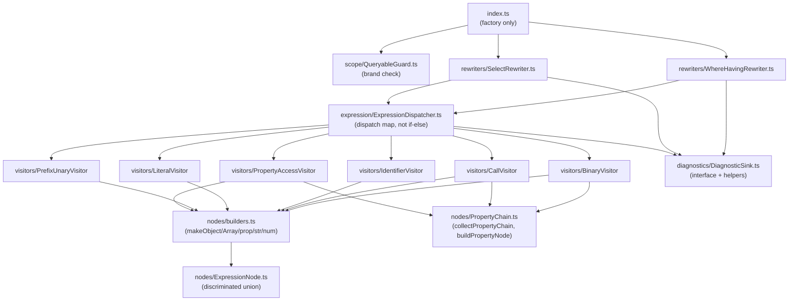

# Transformer Package Refactor — Clean Architecture & Production Readiness

## 1. Why (problem statement)

`@ts-linq/transformer` is the compile-time TypeScript AST rewriter that powers `.where()`,
`.having()`, and `.select()` lambda-to-AST compilation — the single most load-bearing piece of
infrastructure in the query pipeline. Every EF Core feature that introduces a new expression
kind (temporal, spatial method calls, EF.Functions, HierarchyId) must pass through this package.

The current implementation is **functionally correct but architecturally fragile**:

| Problem | Location | Risk |
|---|---|---|
| Monolithic `index.ts` (246 lines): factory + call-rewriting + diagnostic emission in one file | `src/index.ts` | SRP violation; hard to test, extend, or review |
| Duplicated diagnostic emission: `emitError` (index.ts) vs `emitDiagnostic` (utils.ts); both access `ctx` via `as unknown as` type coercion | Both files | Fragile contract; silent breakage if TS ever changes the TransformationContext shape |
| No formal `ExpressionNode` discriminated union: node shapes assembled from raw string literals (`str('binary')`) with no TypeScript enforcement | `expression.ts` | A typo produces a valid-but-wrong runtime object that fails silently at SQL generation time |
| Single flat `transformExpression` if-else dispatch (12 branches): adding a new expression kind requires editing a global function | `src/expression.ts` | OCP violation; high regression risk for future features (HierarchyId, temporals, EF.Functions) |
| `WhereTransformer.ts` uses `Object.assign(ctx, { addDiagnostic })` to mutate the immutable TS TransformationContext | `src/WhereTransformer.ts` | Mutating an opaque library object; breaks under `Object.freeze` or future TS API changes |
| Sparse unit tests: only one integration test file exists | `tests-new/` | Any refactor of internals is unguarded; confidence in correctness depends on a single test |
| `EFCompileQueryVisitor.ts` exports only a version constant | `src/visitors/EFCompileQueryVisitor.ts` | Dead file adds confusion; P2-44 (AOT) will need the real visitor |
| Architectural regression: `dist/` still ships `ExpressionParser.d.ts`, `diagnostics.d.ts`, `imports.d.ts`, `types.d.ts` with no corresponding source files | `dist/` | Old richer architecture was collapsed without replacement; the types it exposed are now gone from the public API |
| `utils.ts` is a grab-bag: AST builders + diagnostic helpers + property chain logic in one file | `src/utils.ts` | Multiple responsibilities; impossible to unit-test in isolation |

Without addressing these issues, every future feature that extends the transformer will make
the structural debt worse. This refactor pays down the debt at the lowest cost point —
before HierarchyId (P2-35), temporal queries (P2-36), and EF.Functions (P1-22) add more
expression kinds.

---

## 2. Target API surface (internal; no public breaking changes)

The package `@ts-linq/transformer` is `private: true` and not published to npm. The only
external contracts are:

1. The **ts-patch plugin entrypoint** — `default export` of `src/index.ts` — must remain a
   `ts.TransformerFactory<ts.SourceFile>` factory with the `(program, pluginConfig, extras)`
   signature.
2. `createWhereTransformer` exported from `src/WhereTransformer.ts` — must remain callable with
   `(program, { addDiagnostic })` and return a `ts.TransformerFactory<ts.SourceFile>`.
3. The **shape of emitted object literals** (`{ type: "binary", ... }` etc.) consumed by
   `@ts-linq/ast` at runtime — must not change.

All internal module structure, class names, and function signatures are free to change.

```ts
// Entrypoint contract (unchanged externally)
export default function tsLinqTransformer(
  program: ts.Program,
  _pluginConfig: unknown,
  _extras?: unknown
): ts.TransformerFactory<ts.SourceFile>;

// Adapter contract (unchanged externally)
export function createWhereTransformer(
  program: ts.Program,
  sink: { addDiagnostic: (d: ts.Diagnostic) => void }
): ts.TransformerFactory<ts.SourceFile>;
```

---

## 3. Architecture Decision Record (ADR)



**Decision**: decompose `src/` into five coherent subdirectories — `diagnostics/`, `expression/`,
`nodes/`, `rewriters/`, `scope/` — each with a single well-defined responsibility. The expression
dispatch switches from an if-else chain to an explicit dispatch map keyed by `ts.SyntaxKind`.

**Context**: The diagnostic sink is already partially abstracted (two implementations, both
doing `as unknown as` casts). Formalizing it as an interface with an `extractSinkFromCtx`
adapter is the minimum change needed to make the sink testable and remove the cast. The
dispatch map replaces branching with a data structure — adding a new `SyntaxKind` handler
becomes a one-line map entry instead of a new `else if` branch.

**Consequences**:
- (+) Each subdirectory is independently unit-testable.
- (+) Adding a new expression kind (e.g. temporal comparison) is a new visitor file + one map entry, not a modification of a shared function.
- (+) The `DiagnosticSink` interface makes test doubles trivial: `const sink: DiagnosticSink = { addDiagnostic: jest.fn() }`.
- (-) More files to navigate (mitigated by consistent naming).
- (~) No runtime behavior change — only internal structure.

---

## 4. Technical & architectural description

### 4.1 Target file tree

```
packages/transformer/src/
├── index.ts                              # factory entry only (< 40 lines)
├── WhereTransformer.ts                   # public adapter (cleaned up; no Object.assign)
│
├── diagnostics/
│   ├── DiagnosticSink.ts                 # interface DiagnosticSink; createDiagnostic; reportDiagnostic; extractSinkFromCtx
│   └── index.ts
│
├── nodes/
│   ├── ExpressionNode.ts                 # discriminated union matching runtime object shapes
│   ├── builders.ts                       # makeObject, makeArray, prop, str, num (from utils.ts)
│   ├── PropertyChain.ts                  # collectPropertyChain, buildPropertyNode, PropertyChain interface
│   └── index.ts
│
├── expression/
│   ├── TransformContext.ts               # interface TransformContext (extracted from expression.ts)
│   ├── ExpressionDispatcher.ts           # dispatch map: SyntaxKind → visitor handler
│   ├── transformExpression.ts            # public entry + depth guard (thin wrapper)
│   └── visitors/
│       ├── BinaryVisitor.ts              # transformBinaryExpression + transformComparisonExpression
│       ├── CallVisitor.ts                # transformCallExpression + array/identifier includes + string methods
│       ├── IdentifierVisitor.ts          # transformIdentifier
│       ├── LiteralVisitor.ts             # numeric, string, boolean, null literals
│       ├── PrefixUnaryVisitor.ts         # transformPrefixUnary (!, -, +)
│       └── PropertyAccessVisitor.ts      # transformPropertyAccess
│
├── rewriters/
│   ├── WhereHavingRewriter.ts            # rewriteCall for where / having
│   ├── SelectRewriter.ts                 # rewriteSelectCall
│   └── index.ts
│
└── scope/
    └── QueryableGuard.ts                 # receiverIsQueryable (brand check)
```

### 4.2 Key types to introduce

#### `DiagnosticSink` (restore from old `dist/diagnostics.d.ts`)

```ts
// src/diagnostics/DiagnosticSink.ts
export const TS_LINQ_DIAGNOSTIC_CODE = 90_001;

export interface DiagnosticSink {
  readonly addDiagnostic: (d: ts.Diagnostic) => void;
}

export function createDiagnostic(
  node: ts.Node,
  message: string,
  category: ts.DiagnosticCategory
): ts.Diagnostic;

export function reportDiagnostic(
  sink: DiagnosticSink | undefined,
  node: ts.Node,
  message: string,
  category?: ts.DiagnosticCategory
): void;

/** Extracts DiagnosticSink from ts-patch-augmented TransformationContext. */
export function extractSinkFromCtx(ctx: ts.TransformationContext): DiagnosticSink | undefined;
```

The `extractSinkFromCtx` function centralises the single `as unknown as` cast, which
currently appears twice (in `index.ts` and `utils.ts`). All downstream code receives a
typed `DiagnosticSink | undefined` — no raw context coercion outside this function.

#### `ExpressionNode` discriminated union (restore from old `dist/types.d.ts`)

```ts
// src/nodes/ExpressionNode.ts
export type ComparisonOperator = '==' | '===' | '!=' | '!==' | '>' | '<' | '>=' | '<=';
export type LogicalOperator = '&&' | '||';

export type ExpressionNodeKind =
  | 'binary' | 'logical' | 'not'
  | 'literal' | 'property' | 'parameterRef'
  | 'method' | 'in' | 'isNull' | 'isNotNull'
  | 'unsupported';

export type ExpressionNode =
  | BinaryNode | LogicalNode | NotNode
  | LiteralNode | PropertyNode | ParameterRefNode
  | MethodNode | InNode | IsNullNode | IsNotNullNode
  | UnsupportedNode;
```

This union is the TypeScript representation of the object literal shapes the transformer
emits. It documents the contract between `@ts-linq/transformer` and `@ts-linq/ast` and
allows internal helpers to be typed as `(node: ExpressionNode) => ts.ObjectLiteralExpression`
rather than plain `ts.Expression`.

#### `TransformContext` (extracted, not changed)

```ts
// src/expression/TransformContext.ts
export interface TransformContext {
  readonly ctx: ts.TransformationContext;
  readonly sink: DiagnosticSink | undefined;   // replaces ctx-level cast
  readonly methodName: string;
  readonly paramName: string;
  readonly parameters: ts.Expression[];         // mutable — captured refs
}
```

Note: `sink` replaces the current pattern where the sink is recovered from `ctx` via
`as unknown as` inside each helper. Passing it once at call-rewrite time and threading it
as a field is explicit and testable.

#### `ExpressionDispatcher` (replaces if-else chain)

```ts
// src/expression/ExpressionDispatcher.ts
type VisitorFn = (node: ts.Expression, tctx: TransformContext, depth: number) => ts.Expression;

const DISPATCH_MAP: Partial<Record<ts.SyntaxKind, VisitorFn>> = {
  [ts.SyntaxKind.ParenthesizedExpression]: visitParenthesized,
  [ts.SyntaxKind.PrefixUnaryExpression]:   PrefixUnaryVisitor.visit,
  [ts.SyntaxKind.CallExpression]:          CallVisitor.visit,
  [ts.SyntaxKind.BinaryExpression]:        BinaryVisitor.visit,
  [ts.SyntaxKind.PropertyAccessExpression]:PropertyAccessVisitor.visit,
  [ts.SyntaxKind.Identifier]:              IdentifierVisitor.visit,
  [ts.SyntaxKind.NumericLiteral]:          LiteralVisitor.visitNumeric,
  [ts.SyntaxKind.StringLiteral]:           LiteralVisitor.visitString,
  [ts.SyntaxKind.NoSubstitutionTemplateLiteral]: LiteralVisitor.visitString,
  [ts.SyntaxKind.TrueKeyword]:             LiteralVisitor.visitTrue,
  [ts.SyntaxKind.FalseKeyword]:            LiteralVisitor.visitFalse,
  [ts.SyntaxKind.NullKeyword]:             LiteralVisitor.visitNull,
};

export function dispatch(node: ts.Expression, tctx: TransformContext, depth: number): ts.Expression {
  const handler = DISPATCH_MAP[node.kind];
  return handler !== undefined ? handler(node, tctx, depth) : makeUnsupported(node, tctx.sink);
}
```

Adding support for a new expression kind (e.g. `ElementAccessExpression` for future
array-index support) becomes: add one entry to `DISPATCH_MAP`, add one file in `visitors/`.
No existing visitor changes required (OCP).

### 4.3 `WhereTransformer.ts` — removing the `Object.assign` hack

Current (fragile):
```ts
const augmented = Object.assign(ctx, { addDiagnostic: extraCtx.addDiagnostic });
return factory(augmented);
```

Target (explicit sink threading):
```ts
export function createWhereTransformer(
  program: ts.Program,
  sink: DiagnosticSink
): ts.TransformerFactory<ts.SourceFile> {
  return (ctx) => (sourceFile) => {
    if (sourceFile.isDeclarationFile) return sourceFile;
    return visitSourceFile(sourceFile, program.getTypeChecker(), ctx, sink);
  };
}
```

The `sink` is threaded explicitly through the call stack; the `TransformationContext` is never mutated.

### 4.4 Touch-points in existing code

| File | Change |
|------|--------|
| `src/index.ts` | Reduce to: extract sink via `extractSinkFromCtx`, delegate to `WhereHavingRewriter` + `SelectRewriter` |
| `src/WhereTransformer.ts` | Remove `Object.assign`; accept `DiagnosticSink` directly |
| `src/expression.ts` | Delete; content split across `expression/TransformContext.ts`, `expression/ExpressionDispatcher.ts`, `expression/visitors/*` |
| `src/utils.ts` | Delete; content split across `nodes/builders.ts`, `nodes/PropertyChain.ts`, `diagnostics/DiagnosticSink.ts` |
| `src/visitors/EFCompileQueryVisitor.ts` | Keep as placeholder per the comment referencing P2-44; add a `TODO(P2-44)` JSDoc; remove from active visitor registration if accidentally wired |

---

## 5. Implementation options

### Option A — Big-bang rewrite (single PR)
Move all files in one PR, full test suite added simultaneously.
- Pros: clean diff; no intermediate half-states.
- Cons: large PR; harder to review; blocks main longer.
- Effort: L

### Option B — Incremental PRs (recommended)

| PR | Scope |
|----|-------|
| PR 1 | Extract `diagnostics/DiagnosticSink.ts`; remove duplicated `emitError`; eliminate both `as unknown as` casts everywhere except `extractSinkFromCtx`. Add `DiagnosticSink` unit tests. |
| PR 2 | Extract `nodes/` (`ExpressionNode.ts`, `builders.ts`, `PropertyChain.ts`). Add `PropertyChain` unit tests. |
| PR 3 | Introduce `expression/ExpressionDispatcher.ts`; extract all visitor files. Add per-visitor unit tests. |
| PR 4 | Extract `rewriters/` and `scope/`; slim `index.ts` to factory only; clean up `WhereTransformer.ts`. Add `WhereHavingRewriter` + `SelectRewriter` unit tests. |
| PR 5 | Comprehensive integration test expansion + type-level tests. |

- Pros: reviewable PRs; immediate CI feedback; unblocks parallel EF feature work sooner.
- Cons: requires rebase discipline; slight overhead of 5 PRs.
- Effort: L total (same code, split across PRs)

### Recommendation
**Option B** — incremental PRs. Each PR is independently reviewable and keeps `main` green.
The diagnostic sink extraction (PR 1) delivers the highest safety improvement for the lowest
risk.

---

## 6. Testing strategy

### 6.1 Unit tests (new)

All unit tests live in `packages/transformer/tests-new/unit/`. Each test file covers exactly
one source module. Tests compile a minimal TypeScript AST in-memory using
`ts.createSourceFile` + `ts.factory` — **no temp-directory projects** (those are reserved for
integration tests).

| Test file | What it covers |
|-----------|----------------|
| `unit/DiagnosticSink.test.ts` | `createDiagnostic` produces correct `code/category/file/start/length`; `reportDiagnostic` calls sink when present; falls back to stderr when absent; `extractSinkFromCtx` extracts augmented ctx correctly and returns `undefined` for plain ctx |
| `unit/PropertyChain.test.ts` | `collectPropertyChain`: single segment, multi-segment, optional access (`?.`), depth > `MAX_CHAIN_DEPTH` → null, non-identifier root → null; `buildPropertyNode`: single segment → `name`, multi-segment → `path`, optional flag |
| `unit/visitors/LiteralVisitor.test.ts` | Numeric / string / boolean / null literals produce correct `{ type: "literal", value }` shape |
| `unit/visitors/PrefixUnaryVisitor.test.ts` | `!expr` → NotNode; `-42` → negative literal; `+42` → literal; unsupported unary → UnsupportedNode |
| `unit/visitors/BinaryVisitor.test.ts` | All 8 comparison ops; `&&`/`\|\|` logical ops; null-check detection (`=== null`, `!== null`); unsupported operator → diagnostic emitted + UnsupportedNode |
| `unit/visitors/CallVisitor.test.ts` | `["a","b"].includes(u.role)` → InNode with inline values; `roles.includes(u.role)` → InNode with `valuesRef`; `u.name.includes("foo")` → MethodNode; `startsWith`/`endsWith`; optional-chain call → UnsupportedNode |
| `unit/visitors/IdentifierVisitor.test.ts` | Bare param identifier → diagnostic + UnsupportedNode; external var → ParameterRefNode with correct index |
| `unit/visitors/PropertyAccessVisitor.test.ts` | `u.age` → PropertyNode; `u.profile.age` → PropertyNode with path; external dotted ref → ParameterRefNode |
| `unit/ExpressionDispatcher.test.ts` | Unknown SyntaxKind → UnsupportedNode; `MAX_DEPTH` exceeded → UnsupportedNode; dispatch delegates to correct visitor |
| `unit/WhereHavingRewriter.test.ts` | Non-arrow function arg → diagnostic; block body → diagnostic; no parameter → diagnostic; valid lambda → `whereCompiled` call emitted |
| `unit/SelectRewriter.test.ts` | Object literal projection → `selectCompiled`; single property → `selectCompiled`; block body → diagnostic; spread/computed prop → diagnostic |

### 6.2 Integration tests (extend existing)

Extend `tests-new/WhereTransformer.test.ts` with:
- `having()` rewrite (currently not tested).
- `select()` rewrite: object literal form and single-property form.
- Chained calls: `q.where(...).where(...)` — both rewrites fire.
- Deeply nested property access (depth 10+).
- External variable capture across multiple `where` args (index stability).
- Diagnostic code is always `90001`.

### 6.3 Type-level tests

Add `tests-new/types/ExpressionNode.type-test.ts` using `tsd` or `@ts-expect-error` patterns
to assert:
- Every `ExpressionNodeKind` string maps to a member of the `ExpressionNode` union.
- `ExpressionNode` is a closed discriminated union (exhaustiveness check via `switch`).

---

## 7. Acceptance criteria

- [ ] `src/index.ts` is ≤ 40 lines and contains only the transformer factory entry point.
- [ ] `src/utils.ts` is deleted; all helpers are in purpose-named modules.
- [ ] `src/expression.ts` is deleted; all expression logic is in `expression/`.
- [ ] `DiagnosticSink` interface exists in `diagnostics/DiagnosticSink.ts`; `as unknown as` cast appears in **exactly one place** (`extractSinkFromCtx`).
- [ ] `ExpressionNode` discriminated union is exported from `nodes/ExpressionNode.ts`; every emitted node shape maps to a union member.
- [ ] `ExpressionDispatcher` uses a `SyntaxKind → VisitorFn` map; no if-else chain.
- [ ] `WhereTransformer.ts` uses `DiagnosticSink` directly; no `Object.assign` on `ctx`.
- [ ] All visitor functions are in separate files under `expression/visitors/`.
- [ ] All unit tests listed in §6.1 pass.
- [ ] Integration tests in `tests-new/WhereTransformer.test.ts` are extended per §6.2.
- [ ] `pnpm typecheck`, `pnpm lint`, `pnpm tests:unit` all pass with zero errors.
- [ ] `pnpm arch:deps`, `pnpm arch:cycles`, `pnpm arch:dead` show no new violations.
- [ ] Existing integration tests and e2e tests that exercise `where()` / `having()` / `select()` continue to pass without modification.
- [ ] `EFCompileQueryVisitor.ts` retains its placeholder comment referencing P2-44 and is documented as a stub.

---

## 8. Related problems / follow-up tasks

- [`P1-20`](./P1-20-compiled-queries.md) — Compiled queries use the transformer; the `EFCompileQueryVisitor` stub scaffolded here will become the real visitor in P2-44.
- [`P2-35`](./P2-35-hierarchy-id.md) — HierarchyId adds `getAncestor()`, `isDescendantOf()` method calls; these will be new visitor entries in `CallVisitor.ts`.
- [`P2-36`](./P2-36-temporal-queries.md) — Temporal queries may require new expression kinds (e.g. date arithmetic); each becomes a new visitor file, not a branch in a shared function.
- [`P1-22`](./P1-22-ef-functions.md) — `EF.Functions.*` calls must be handled as a distinct call-expression visitor; the dispatch map makes this a safe, isolated addition.

---

## 9. Pre-PR sweep (mandatory)

Before opening any PR for this task:

1. Re-read every `dev-plans/*.md` whose `status != done`.
2. For each, decide whether assumptions changed because of this task. Tasks most likely affected:
   - `P2-35` — HierarchyId: update "transformer touch-points" if visitor structure changes.
   - `P2-36` — Temporal: same as above.
   - `P1-22` — EF.Functions: update if `rewriteCall` entry point signature changes.
   - `P2-44` — Compiled models: `EFCompileQueryVisitor.ts` stub must remain in place.
3. Record sweep results in the PR description under `## Cross-task sweep`:
   - `RF-01` — updated `ts_linq_packages_touched` for P2-35, P2-36, P1-22 if applicable.
4. Only after the sweep is recorded, open the PR.
